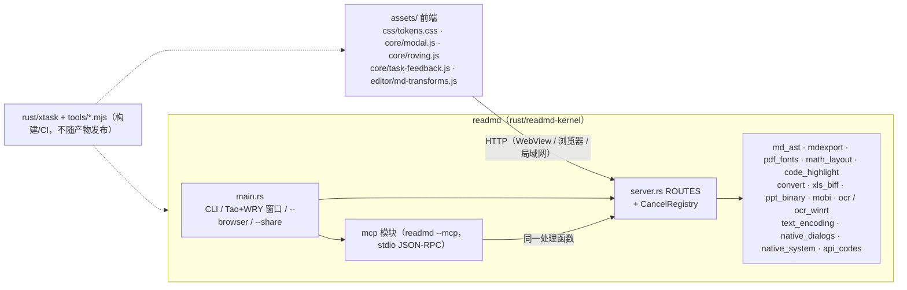

# Rust 核心功能补全与 Python 依赖移除 Bugfix Design

> 本文档分为 Part A、Part B、Part C 三部分，每部分各自包含 Bug Details、Expected Behavior、Hypothesized Root Cause、Fix Implementation 和 Testing Strategy。Correctness Properties 是全文唯一的属性来源，三部分的属性在其中连续编号。

## Overview

ReadMD 的目标架构是：**单一 Rust 可执行文件（`rust/readmd-kernel`，bin 名 `readmd`）+ 本地 HTTP API（`server.rs` 的 `ROUTES`）+ `assets/` Web 前端（桌面由 Tao/WRY 承载，浏览器/局域网模式直接访问）**。本次修复不改变这个架构，只修正它的实现缺陷，分三部分：

- **Part A：核心编辑、渲染、转换与导出**（1.1–1.15、1.24–1.37）。修复被降级或逐字复刻 Python 缺陷的 Rust 实现，并修复前端与桌面集成中的功能缺陷。
- **Part B：Python 依赖移除**（1.16–1.23）。用 `rust/xtask` 和零依赖 Node 脚本替换构建与发布中的 Python 工具，由内核提供 `readmd --mcp`，让 VS Code 扩展、Docker 镜像和 CI 不再需要 Python，按删除清单移除遗留 `.py`，并加入"无 Python"CI 检查。
- **Part C：UI/UX 设计系统与可访问性**（1.38–1.41）。把样式收敛到三主题设计令牌和组件原语上，统一为三个断点，由棘轮式样式检查守住；通过共享的模态框与漫游焦点模块修复键盘可访问性；为耗时任务提供界面内进度、取消和结果反馈；用接线检查和全点击冒烟测试消除孤儿控件。

执行方式是**小步增量**：每一步都是可以独立合入的改动，合入前必须满足 `cargo build --offline -p readmd-kernel` 和 `cargo test --offline -p readmd-kernel` 全绿（3.11）；涉及前端的步骤还要通过对应的 Node 单元测试。各部分的步骤顺序分别见 A.4.0、B.4.0 和 C.4.0。

## Glossary

- **C(X) / Bug_Condition**：判定输入 X 是否触发缺陷的条件。全文 `C(X) = C_A(X) ∨ C_B(X) ∨ C_C(X)`，`C_A`、`C_B`、`C_C` 分别在 A.1、B.1、C.1 中定义。
- **P(result) / Property**：对满足 C(X) 的输入，修复后结果必须满足的性质。
- **Preservation**：对 `¬C(X)` 的输入，修复后行为与修复前一致（对应 3.x 条款）。
- **F / F'**：修复前 / 修复后的实现。
- **渲染 AST（render JSON）**：`pdf_render::render` 消费的 `serde_json::Value` 块树（`{"type": "paragraph"|"heading"|"list"|"table"|"code"|"math"|...}`，行内节点 `{"t": "text"|"bold"|"link"|"math"|...}`）。目前由 `mdexport::md_block_to_ast` 从 `md_parse` 的 `MdBlock` 生成。
- **`md_ast`**：本设计新增的共享 Markdown 解析模块（基于已有依赖 `pulldown-cmark 0.13.4`），DOCX、PDF、EPUB 共用。
- **三种错误形态**：`ApiCode`（`{ok:false, error_code}`）、`LegacyError`（`{error}`）、`PlainText`（纯文本 body），见 `lib.rs` 的 `ApiError`。3.10 要求保持。
- **`error_code` / `note_code` / `warn_items`**：本设计新增的稳定机器码字段，与原有中文 `error` / `note` / `warns` 并存，前端按码映射到 i18n。
- **KERNEL BRIDGE**：`ROUTES` 中不对应 `readmd.py` 路由、只为注入的兼容层服务的行（如 `/api/export`）。
- **离线构建约束**：新增依赖必须已在 `rust/Cargo.lock` 中且源码已缓存于 `~/.cargo/registry`，`Cargo.lock` 的 `[[package]]` 集合不得新增。

## 方法论：Bug Condition / Fix Checking / Preservation Checking

对每一类缺陷都按同一套流程验证：

1. **探索（Exploration）**：在未修复的代码 F 上编写针对 C(X) 的测试，预期失败，用反例确认或推翻 A.3 的根因。推翻时先修正根因再动手。
2. **Fix Checking**：`FOR ALL X WHERE C(X): ASSERT P(F'(X))`。能随机化的用确定性随机生成（见 A.5.4），不能随机化的用覆盖各分支的具体用例。
3. **Preservation Checking**：`FOR ALL X WHERE ¬C(X): ASSERT F(X) = F'(X)`。做法是先在 F 上**观察并固化**现有输出（golden 快照或现有测试），再在 F' 上断言一致。现有 1670 项 `cargo test -p readmd-kernel --lib` 是最基本的 preservation 基线；只有断言被 bugfix.md 判定为缺陷的旧行为的测试，才允许随修复一起修改，并在提交说明中逐条注明对应条款。

## Architecture

本节只概括整体结构和新模块的挂载位置，细节以 Part A/B/C 为准。架构本身不变：一个 Rust 可执行文件同时承载桌面窗口、本地 HTTP API 和 MCP stdio 模式，前端是 `assets/` 下的静态 Web 应用；构建与发布工具由 `rust/xtask` 和零依赖 Node 脚本承担（B.4.0）。



- **导出链路**：`md_ast.rs`（A.4.4）是 DOCX、PDF、EPUB 共用的解析层；PDF 另接 `pdf_fonts.rs`（A.4.7）、`math_layout.rs`（A.4.8），`code_highlight.rs` 同时服务 PDF 与 DOCX（A.4.6）。
- **转换链路**：`convert_triple` 新增 `xls_biff.rs`、`ppt_binary.rs`、`mobi.rs`（A.4.10）；Windows OCR 由 `ocr_winrt.rs` 提供（A.4.11）。
- **系统集成**：`text_encoding.rs`（A.4.2）、`native_dialogs.rs` 与 `native_system` 的打开/显示（A.4.12）、`api_codes.rs` 稳定码表（A.4.17）。
- **MCP 与任务取消**：`readmd --mcp` 复用 HTTP 路由处理函数（B.4.4）；`CancelRegistry` 挂在 `server.rs`，由导出、转换、批量/OCR 任务注册（C.4.6）。
- **前端**：`tokens.css` 在所有样式表之前加载（C.4.1）；`core/*.js` 排在 boot bundle 的 `core/` 段开头（C.4.0）；`md-transforms.js` 供编辑器工具栏使用（A.4.16）。

## Components and Interfaces

下表只列新增或行为改变的组件和接口，签名与参数细节见对应小节。所有路由改动均为增量（3.10），不删改现有字段。

| 组件 / 接口 | 关键接口 | 小节 |
|---|---|---|
| panic 兜底 | `server.rs::handle_connection` 捕获 panic → `500 {ok:false, error_code:"internal_error"}` | A.4.1 |
| 编码保留 | `text_encoding.rs`；`/api/file` 响应带 `encoding`，保存请求接受 `encoding` | A.4.2 |
| 共享 AST | `md_ast::parse(&str) -> Vec<Block>`、`to_render_json(&[Block]) -> Value` | A.4.4 |
| DOCX / LaTeX / PDF | `export_docx`（签名不变）、`export_tex`（增加 `base_dir`）、`export_pdf` 改走 `md_ast` | A.4.4–A.4.8 |
| EPUB / 演示文稿 | `/api/export` 新增 `presentation` 格式，经保存对话框写出 | A.4.9 |
| 旧格式转换 | `convert_triple` 支持 HTML / XLS / PPT / MOBI | A.4.10 |
| Windows OCR | `ocr_winrt.rs`（`cfg(windows)`）；`/api/ocr` 新增 `save`、`on_exists` | A.4.11、A.4.15 |
| 对话框与系统 | `native_dialogs::run`；`open_path(p)` / `reveal_path(p) -> Result<(), &'static str>`；另存为新增 `backup`/`mtime`/`warns` | A.4.12 |
| 原生拖放 | `__readmdNativeDrop(paths)` → `handleDroppedEntries(entries)` | A.4.13 |
| 导出预设 | `GET /api/export/presets`、`POST /api/export/presets {custom?, last?}`（KERNEL BRIDGE） | A.4.14 |
| 转换覆盖策略 | `/api/convert?on_exists=skip\|overwrite\|rename`（默认 `skip`），响应 `out_exists` | A.4.15 |
| 编辑器变换 | `assets/js/editor/md-transforms.js`；`applyCmTheme` 支持 sepia | A.4.16 |
| 错误码 | `api_codes.rs` 常量表；前端 `apiMessage(d, fallbackKey)` | A.4.17 |
| 构建工具 | `cargo xtask bundle-boot / sync-version / release-asset-sync / hashes / pet-package` | B.4.1、B.4.3 |
| Node 检查 | `validate-website.mjs`、`check-i18n.mjs`、`check-no-python.mjs::scan(files, allow) -> Hit[]` | B.4.2、B.6 |
| MCP | `readmd --mcp`（stdio，按行 JSON-RPC 2.0，20 个工具不变） | B.4.4 |
| VS Code 扩展 | `binaryFinder.ts::candidates(platform, env, config)` | B.4.5 |
| 插件中心 | `CAPABILITIES` 常量表，`/api/plugins/list` 顶层形态不变 | B.4.8 |
| 设计系统 | `assets/css/tokens.css`、`rm-` 组件原语、`tools/check-styles.mjs` | C.4.1–C.4.4 |
| 模态与焦点 | `core/modal.js`、`core/roving.js` | C.4.5 |
| 任务反馈与取消 | `createTask(hostEl, {kind, stages, trigger, cancel, retry})`；`POST /api/task/cancel {id}`；导出/转换请求可选 `task_id` | C.4.6 |
| 接线检查 | `tools/check-wiring.mjs` | C.4.7 |

## Data Models

以下均为增量数据结构；未列出的现有字段保持不变（3.10）。

- **响应新增字段**：
  - `encoding`：打开/保存时的实际编码（A.4.2）。
  - `error_code` / `note_code`：稳定机器码，与中文 `error` / `note` 并存（A.4.17）。
  - `warn_items: [{code, params, text}]`：与 `warns` 并存的结构化警告（A.4.17）。
  - `out_exists`：转换目标是否已存在（A.4.15）；OCR 保存结果按 `out` / `saved` / `skipped` / `empty` 汇报（A.4.15）。
  - 另存为：`backup`、`mtime`、`warns`（A.4.12）。
  - 任务：请求可选 `task_id`；job 状态新增 `done`、`total`、`stage` 和状态值 `cancelled`（C.4.6）。
- **`DATA_DIR/export_presets.json`**：`{custom, last}`，`custom` 中每项经 `export_styles::sanitize`，最多 100 项，原子写入（A.4.14）。
- **`md_ast`**：`Block`（`Heading`、`Paragraph`、`List{ordered, start, items}`、`Quote`、`Code{lang, text}`、`Math`、`Table{aligns, header, rows}`、`Hr`、`PageBreak`、`Html`、`FootnoteDef`）与 `Inline`（`Text`、`Code`、`Strong`、`Emph`、`Strike`、`Link`、`Image`、`Math`、`SoftBreak/HardBreak`、`FootnoteRef`），完整定义见 A.4.4。
- **`CAPABILITIES` 条目**：`{id, kind: builtin|external, capability, detect?（仅 external）, i18n_key, homepage}`（B.4.8）。
- **任务反馈状态机**：`running → {succeeded | failed | cancelled}`，每个任务只进入一次终止状态，之后的迟到事件被忽略（C.4.6，Property 19）。

## Error Handling

- **panic 不断连**：HTTP 处理器 panic 被捕获并返回 `500 {ok:false, error_code:"internal_error"}`（A.4.1，Property 4）。
- **错误形态不变**：`ApiCode`、`LegacyError`、`PlainText` 三种形态保留，只新增 `error_code` / `note_code` / `warn_items` 字段（A.4.17，3.10）。
- **编码不静默替换**：无法表示的字符返回 `encoding_unrepresentable` 且不改动目标文件，由用户确认是否改用 UTF-8（A.4.2，Property 3）。
- **解析器有界**：新增的 XLS/PPT/MOBI 解析器检查记录长度，解压输出不超过 64 MiB（A.4.10）。
- **对话框与系统调用**：对话框不可用时返回 `canceled` 加 `dialog_unavailable`；打开/显示失败返回 `path_not_found` / `open_failed`（A.4.12）。
- **预设冲突**：自定义预设与内置名称冲突时返回 `409 preset_name_conflict`（A.4.14）。
- **取消**：导出在提交点前取消时删除临时文件并返回 `cancelled`；提交点之后返回 `finished`（C.4.6）。
- **降级带警告**：找不到可嵌入字体或公式无法排版时按现有方式回退，但必须在 `warns` / `warn_items` 中逐条说明（`font_fallback`、`glyph_missing`、`formula_fallback`；A.4.7、A.4.8）。

## Testing Strategy

各部分的测试方案分别见 A.5、B.7、C.5，均遵循上文的方法论：先在 F 上做探索测试获取反例，再做 Fix Checking 和 Preservation Checking。

- **Rust**：`cargo test --offline -p readmd-kernel` 与 `-p xtask`；属性测试使用固定种子的 splitmix64 确定性生成器，不新增 PBT 依赖（A.5.4）。
- **Node**：零依赖脚本和前端纯函数用 `node --test` 测试，前端随机化测试使用 mulberry32 固定种子（A.5、B.7、C.5）。
- **UI**：Playwright 端到端与全点击冒烟测试，`@axe-core/playwright` 做可访问性扫描（C.5）。
- **CI 门禁**：`repo-quality.yml` 运行 i18n、无 Python、样式与接线检查（B.4.2、B.6、C.4.7）。
- **手动检查**：无法自动化的平台行为（macOS/Linux 原生对话框、Windows OCR、屏幕阅读器播报等）按 A.5、B.7、C.5 中的手动检查清单执行。
- Correctness Properties 1–21 与测试的对应关系见下文 Correctness Properties 一节。

---

## Part A：核心编辑、渲染、转换与导出

### A.1 Bug Details

#### Bug Condition

Part A 的缺陷分布在内核的保存/读取、导出、转换、OCR、桌面桥接路由，以及前端的导出面板、转换流程、编辑器、主题和文案上。共同点是：输入落在某个"被降级实现"的分支上，或者跨平台/桌面集成分支根本没有实现。

**Formal Specification:**

```
FUNCTION isBugCondition_A(X)
  INPUT: X = { op, doc, fmt, ext, enc, os, mode, args, ui }
         op   ∈ 操作类型；doc 为文档内容或源文件；os ∈ {windows, macos, linux}
         mode ∈ {desktop, browser}；ui 为界面语言与前端状态
  OUTPUT: boolean

  RETURN
       (op = OPEN_OR_SAVE  AND enc(doc) ∉ {utf-8, utf-8-sig})                        -- 1.1
    OR (op = OPEN          AND ext = ".txt")                                         -- 1.2
    OR (op = EXPORT        AND fmt ∈ {docx, tex})                                    -- 1.3, 1.4
    OR (op = HTTP_REQUEST  AND handlerPanics(X))                                     -- 1.5（含 LaTeX 非 ASCII 切片）
    OR (op = EXPORT        AND fmt = epub AND (hasLocalImage(doc) OR args.out_path = ∅))   -- 1.6, 1.27
    OR (op = EXPORT        AND fmt = pdf  AND (hasNonWinAnsi(doc) OR hasMath(doc)
                                               OR hasFenceLang(doc) OR hasAlignedTable(doc)))  -- 1.7, 1.8
    OR (op = CONVERT       AND ext ∈ {".html", ".htm", ".xls", ".ppt", ".mobi"})      -- 1.9–1.11
    OR (op ∈ {OCR, PDF_OCR_FALLBACK} AND os = windows)                               -- 1.12
    OR (op ∈ {OCR, TRANSCRIBE} AND noEngine(X))                                      -- 1.12, 1.13（文案含 Python/pip）
    OR (op ∈ {DIALOG, EXPORT_DIALOG, REVEAL} AND os ∈ {macos, linux})                 -- 1.14, 1.33
    OR (op = LAUNCH        AND layout ∈ {deb, app_bundle})                           -- 1.15
    OR (op ∈ {OPEN_EXPORT_PANEL, SAVE_PRESET} AND mode = desktop)                    -- 1.24
    OR (op = EXPORT        AND result.ok AND |result.warns| > 0)                     -- 1.25
    OR (op = EXPORT        AND fmt = presentation)                                   -- 1.26
    OR (op ∈ {CONVERT_SINGLE, DROP_CONVERT} AND exists(mdOutputPath(doc)))           -- 1.28
    OR (op = BATCH_OCR)                                                              -- 1.29
    OR (op = BATCH_DONE    AND outputs ≥ 1)                                          -- 1.30
    OR (op = DROP_ZIP      AND extractFails(X))                                      -- 1.31
    OR (op = DROP_FILES    AND mode = desktop)                                       -- 1.32
    OR (op = OPEN_PATH     AND openFails(X))                                         -- 1.33
    OR (op = SAVE_AS       AND (exists(target) OR assetCopyFails(X) OR ui.lang ≠ zh-CN)) -- 1.34
    OR (op = TOOLBAR       AND toolbarDefective(X))                                  -- 1.35
    OR (op = THEME         AND (ui.theme = auto AND systemSchemeChanged
                                OR clickedThemeButton OR ui.theme = sepia))          -- 1.36
    OR (op = SHOW_MESSAGE  AND (msg ∈ HARDCODED_ZH OR responseHasOnlyErrorCode(X))) -- 1.37
END FUNCTION

FUNCTION toolbarDefective(X)
  RETURN (X.kind ∈ {h2, quote, list, ordered, task}
            AND (cursorNotAtLineStart OR selectionSpansLines OR lineHasSamePrefix))
      OR (X.kind ∈ {hr, codeblock} AND adjacentLineNotBlank)
      OR (X.kind ∈ {bold, italic, strike, code} AND selectionAlreadyWrappedBy(X.kind))
END FUNCTION
```

**Expected behavior（P_A）**，与 bugfix.md 2.x 一一对应：

```
FUNCTION expectedBehavior_A(X, r)
  CASE X.op OF
    OPEN_OR_SAVE: bytes(savedFile) = encode(enc(doc), text)
                  AND (unrepresentable(text, enc) ⇒ r.status = 422 AND r.error_code = "encoding_unrepresentable"
                                                   AND fileUnchanged)                      -- 2.1
    OPEN(.txt):   r.structured = true AND r.content = convert::txt_to_markdown(raw).0     -- 2.2
    EXPORT:       noPanic AND r ⊇ {ok, path, size, warns, error, canceled}
                  AND structure(output) ⊇ structure(md_ast(doc))                          -- 2.3, 2.4, 2.6, 2.8
                  AND (fmt = pdf ⇒ ∀ glyph used: embedded(glyph) ∨ reportedInWarns)       -- 2.7
    HTTP_REQUEST: handlerPanics ⇒ r.status = 500 AND r = {ok:false, error_code:"internal_error"}  -- 2.5
    CONVERT:      r.engine ∈ {"html", "xls", "ppt", "mobi"} AND r.content is Markdown
                  AND errorText contains no Python package name                           -- 2.9–2.11
    OCR:          os = windows ⇒ WinRT OCR result laid out by xy_cut_lines
                  os ≠ windows ⇒ r.error_code = "ocr_no_engine"                           -- 2.12
    ...           （其余操作见 A.4 各小节的"期望结果"）
  END CASE
END FUNCTION
```

#### Examples

- 打开 GBK 编码的 `笔记.txt`（`b"\xc4\xe3\xba\xc3"` = "你好"）：F 用 `content::read_text` 按 UTF-8 有损解码，界面显示乱码；即使解码正确，保存时 `h_save` 也会丢弃 `encoding`，以 UTF-8 写回。F' 打开时报告 `encoding: "gb18030"`，保存后字节仍是 GB18030。
- 导出含 `中文**加粗**` 的 LaTeX：F 的 `mdexport::format_inline_latex` 用字符下标切字节串 `s[idx + 2..]`，panic，连接线程终止，前端只看到网络错误。F' 走 `texmd::md_to_latex`（按 `Vec<char>` 处理），输出 `中文\textbf{加粗}`。
- 导出含 `$$\frac{a}{b}$$` 和 `` ```python `` 代码块的 PDF：F 输出 LaTeX 源码文本并追加"公式无法渲染"警告，代码块 `lang` 恒为空（`md_block_to_ast` 写死 `""`）。F' 画出矢量公式，代码块显示语言标签并着色。
- 导出含 `` 的 EPUB：F 的 `epub_build_bytes` 没有 `base_dir` 参数，`` 指向包内不存在的路径。F' 打包为 `OEBPS/images/img_1.png` 并改写引用。
- 在 macOS 上点"打开文件"：F 的 `/api/dialog/*` 只有 PowerShell 实现，返回空。F' 弹出 `NSOpenPanel`。
- 对 `report.docx` 单文件转换，旁边已有手写的 `report.md`：F 以 `overwrite=1` 调用（`render.js:3032`），静默覆盖。F' 默认不覆盖，让用户选择"覆盖 / 另存为 `report (1).md` / 仅预览"。
- 光标在 `abc|def` 中间点"H2"：F 得到 `abc## def`。F' 得到 `## abcdef`，再点一次恢复为 `abcdef`。
- 边界情况：在 `文字` 末尾插入分隔线，F 得到 `文字\n---`（上一行变成 setext 二级标题）。F' 得到 `文字\n\n---\n`。

### A.2 Expected Behavior

#### Preservation Requirements

**Unchanged Behaviors:**

- UTF-8 / UTF-8 BOM 文档的保存语义：原子写入、首次保存生成 `<path>.bak`、`expected_mtime` 冲突返回 409，成功响应字段仍为 `ok/path/backup/mtime`（3.1）；保存授权规则和 loopback Host / Origin / App Token 校验不变（3.2）。
- HTML 导出（`mdexport::export_html`）的输出和警告条目不变，文案允许本地化（3.4）；应用内演示模式不变（3.5）。
- 只含 WinAnsi 字符、没有公式的 PDF：页面几何、颜色、标题、列表、引用、表格、本地图片、原子落盘和 `{ok, path, size, warns, error, canceled}` 响应不变（3.6）。仍使用 base-14 字体，不嵌入字体。
- 已由 Rust 原生支持的转换格式（`.docx/.pdf/.pptx/.xlsx/.doc/.csv/.tsv/.tex/.rtf/.odt/.epub`、代码/配置、`.txt`、ZIP 批量）输出和 engine 标识不变（3.7）。
- Windows 上继续使用现有 PowerShell 对话框，返回格式不变（3.8）；Windows 便携/NSIS 布局、`cargo run` 开发布局、`READMD_ASSETS_DIR` 的资源定位优先级不变（3.9）。
- 路由表、请求参数、响应结构和三种错误形态不变；本设计只**新增**字段、查询参数和路由（3.10）。
- 离线构建，现有测试全部通过（3.11）；浏览器/局域网模式的 `/api/upload` 上传兜底和 `lan_guard` 授权不变（3.20）；已有快捷键和设置键不变（3.17、3.18）。

**Scope:**

所有 `¬C_A(X)` 的输入都不受影响，包括：UTF-8 文档的打开和保存；HTML 导出与应用内演示；纯 WinAnsi、无公式的 PDF；表中已原生支持格式的转换；Windows 上的全部对话框；通过显式 `out_path` 调用 `/api/export/epub` 的现有 409 / `overwrite` 语义；浏览器模式下的上传与拖放。

### A.3 Hypothesized Root Cause

以下根因都已通过阅读代码确认（"已确认"），探索测试的作用是用反例把它们固化下来。

| 条款 | 根因（文件 / 函数） |
|---|---|
| 1.1 | 读取端：`server.rs::h_file` 调用 `content::describe`，后者用 `content::read_text`（BOM 剥离 + `from_utf8_lossy`），响应里**没有** `encoding` 字段，前端 `state.encoding` 始终为空并回退为 `utf-8`。写入端：`h_save` 读取 `encoding` 后丢弃，`py_save_text_atomic` 调用只支持 UTF-8 的 `content::write_text_atomic`。另一个未接线的 `content::save_text_atomic_parity` / `encode_for` 对 latin-1/cp1252 用 `?` **静默替换**非 ASCII 字符。`codecs.rs` 只有解码表，没有 GB18030/GBK/Big5 编码器。 |
| 1.2 | `server.rs::PENDING` 登记了 `/api/file.txt-md-structuring`；`content::describe` 对 `.txt` 直接返回原文。`convert::txt_to_markdown` 已存在，但只在 `batch2::convert_txt_lane` 中调用。 |
| 1.3 | `mdexport::export_docx` 的 `_base_dir`、`_options`、`_source_name` 参数全部未使用，按 `content.lines()` 逐行匹配前缀生成 XML。 |
| 1.4, 1.5 | `mdexport::export_tex` 自带一个逐行转换器和固定导言区（只有 `inputenc`）。`format_inline_latex` 对 `Vec<char>` 下标 `idx` 做 `s[idx + 2..]` 字节切片，遇到多字节字符后的 `**` 或 `` ` `` 就 panic。`server.rs::handle_connection` 直接调用 `dispatch`，没有 `catch_unwind`（`convert.rs` 的注释也记录了这一点）。 |
| 1.6, 1.27 | `mdexport::epub_build_bytes` 没有 `base_dir` 参数，也不处理图片；`batch2::h_export_epub` 在 `out_path` 为假值时写入 `DATA_DIR/exports/readmd_export_<ms>.epub`，前端又总是传空。 |
| 1.7 | `pdf_render.rs` 模块文档写明"没有 TTF 读取器和 CIDFontType0/2 子集化"，非 WinAnsi 字符走 `Face::Cjk`，即不嵌入的 `STSong-Light` + `/UniGB-UCS2-H`。`register_fonts` 只记录字体名。 |
| 1.8 | `md_parse` 丢弃了围栏语言、表格分隔行对齐和任务标记（`md_block_to_ast` 中 `lang` 写死 `""`、不输出 `aligns`、`task:false`）；`md_inline_to_ast` 对公式恒输出 `fallback:true`，`pdf_math_fallback_warns` 对每个公式都发警告。`pdf_render` 本身已经支持 `aligns`、`lang`、`task/checked` 字段，只是前端解析没有提供。 |
| 1.9 | `convert::convert_triple` 对 `.html/.htm` 落到末尾的 `markitdown_text`（按文本读取后 `trim`），engine 为 `markitdown`。`headless_renderer::html_to_markdown`（markdownify 的移植）已存在但未使用。 |
| 1.10 | `.xls/.ppt` 分支只尝试 `markitdown_text`，失败时返回"需安装 MarkItDown"。`ole2::extract_ole2_streams` 可以直接取 `Workbook`/`PowerPoint Document` 流。 |
| 1.11 | `.mobi` 没有专门分支，被二进制判定拦截，返回 `unsupported_format`。 |
| 1.12 | `ocr::pick_engine` 恒为 `None`；`ocr_bytes` 返回提到 PyObjC/RapidOCR 的文案。 |
| 1.13 | `transcribe::make_whisper_notice` 逐字复刻了 `pip install openai-whisper` 的指引。 |
| 1.14 | `h_dialog_*`、`h_export` 的对话框只在 `cfg(windows)` 下执行 PowerShell 脚本；`win_dialogs.rs` 已抽象出 `DialogShape/DialogRequest/DialogOutcome`，但服务端没有接线，也没有其他平台的后端。 |
| 1.15 | `lib.rs::paths::assets_dir` 的候选路径只有 `<exe>/assets`、`<exe>/../(×1..5)/assets`、CWD 和开发目录，没有 `<exe>/../share/readmd/assets` 和 `<exe>/../Resources/assets`。 |
| 1.24 | `main.rs` 注入的兼容层中，`get_export_presets` 返回 `{}`，`save_export_presets` 返回 `true`，并且没有对应的 HTTP 路由；`export.js::loadExportPresets` 因此得到空的 `defaults`。 |
| 1.25 | `export.js` 导出成功后只调用 `showToast(toast.exportCompleteWarns)`。 |
| 1.26 | 导出面板没有 `presentation` 页签；`batch2::h_export_presentation` 以 `standalone=false` 调用 `render_presentation_html` 且不落盘。 |
| 1.28 | 后端 `batch2::autosave_md` 已经实现了"已存在则跳过"；是前端（`render.js:3032` 的 `&overwrite=1`，拖放多文档的 `overwrite: true`）绕开了它。 |
| 1.29, 1.30 | `batch.js` 的 OCR 通道只读取 `d.content`，不保存也不设置 `dataset.out`；`convert.js` 和 `batch.js` 只会给 `#convert-open-dir` 加上 `hidden`。 |
| 1.31 | `dragdrop.js` 的 ZIP 循环在 `catch` 中只 `console.error`，`res.ok === false` 的情况也被静默忽略。 |
| 1.32 | `main.rs::build_webview` 没有调用 `with_drag_drop_handler`，WebView 里的 `File` 对象没有 `path`，只能走上传。 |
| 1.33 | `h_system_reveal_path` 只调用 `native_system::windows_reveal_path`，并且丢弃返回值；`h_system_open_path` 无论成败都返回 `{ok:true}`。 |
| 1.34 | `h_dialog_save_as` 用 `std::fs::write` 写入，`let _ = std::fs::copy(...)` 忽略资源复制失败；对话框标题和过滤器是硬编码中文。 |
| 1.35 | `editor.js::cmInsertSyntax` 把块级前缀插入在 `sel.from`，只处理一次插入，不检测已有标记。 |
| 1.36 | `settings.js::applySettings` 只在调用时计算一次 `auto`，没有注册 `matchMedia(...).addEventListener('change')`；`toggleTheme` 在 dark→sepia→light 之间循环；按钮只有两种图标；`editor.js::applyCmTheme` 只区分 dark。 |
| 1.37 | 后端 `note`/`error` 字段直接写中文，前端只读 `d.error`；部分转换/OCR 失败只有 `error_code`，没有映射。 |

### A.4 Fix Implementation

#### A.4.0 依赖决策与执行顺序

**依赖**：不新增任何 `Cargo.lock` 中没有的包。下表所列的包都已在 `rust/Cargo.lock` 中（作为 lopdf、tao、wry 的传递依赖），且源码已缓存于 `~/.cargo/registry/src/index.crates.io-*/`（已逐个核对）。本设计只是把它们提升为 `readmd-kernel` 的直接依赖，并打开所需的 feature。feature 只是编译开关，不会引入新的包；每一步合入时都要执行 `cargo build --offline`，并确认 `Cargo.lock` 的 `[[package]]` 集合没有增加。

| 依赖（精确版本） | 平台 | 用途 | 为什么选它 |
|---|---|---|---|
| `encoding_rs = "=0.8.41"` | 全部 | GB18030/GBK/Big5/windows-1252 的编码（和编辑器路径上的解码） | lopdf 已经依赖它；`codecs.rs` 只有解码表，手写 GB18030 编码表成本高 |
| `ttf-parser = "=0.25.1"`（默认 feature，含 `opentype-layout`，即 MATH 表） | 全部 | 读取 TTF/TTC/OTF：cmap、hmtx、glyf/loca、字形轮廓、MATH 常量 | lopdf 已经依赖它；纯 Rust、零分配 |
| `windows = { version = "=0.62.2", features = ["Foundation", "Foundation_Collections", "Globalization", "Graphics_Imaging", "Media_Ocr", "Storage", "Storage_Streams", "Data_Pdf", "Win32_System_WinRT"] }` | `cfg(windows)` | Windows.Media.Ocr；用 Windows.Data.Pdf 把扫描版 PDF 页面栅格化 | tao/wry 已经依赖同一版本；feature 名以 0.62.2 的 `Cargo.toml` 为准（`Media_Ocr`、`Data_Pdf` 等已核对存在） |
| `gtk = "=0.18.2"` | `cfg(target_os = "linux")` | 原生文件对话框（`FileChooserNative`） | tao/wry 在 Linux 上已经依赖它；使用 `gtk::glib` 的再导出，不单独引入 glib |
| `objc2 = "=0.6.4"`、`objc2-foundation = "=0.3.2"`、`objc2-app-kit = "=0.3.2"`（feature：`NSOpenPanel`、`NSSavePanel`、`NSPanel`、`NSWindow`、`NSResponder`、`NSApplication`）、`dispatch2 = "=0.3.1"` | `cfg(target_os = "macos")` | `NSOpenPanel` / `NSSavePanel`，并切换到主线程执行 | tao/wry 在 macOS 上已经依赖它们 |

不采用的方案：`dom_query` / `html5ever` 虽然出现在 lock 中，但源码**没有缓存**（已核对），离线构建会失败，因此 HTML→Markdown 复用 `headless_renderer`。`rfd`、`syntect`、`zip`、`proptest` 都不在 lock 中。随机化测试沿用仓库已有的 `splitmix64` 做法（`pet_queue.rs`）。

**执行顺序**（每一步都要让 build/test 保持绿色；括号中是对应条款）：

1. A.4.1 HTTP panic 兜底（2.5 后半）
2. A.4.2 编码保存/读取（2.1）→ A.4.3 `.txt` 结构化（2.2）
3. A.4.4 `md_ast` + DOCX（2.3）→ A.4.5 LaTeX（2.4、2.5 前半）
4. A.4.6 PDF 前端解析换为 `md_ast` + 代码高亮 + 表格对齐（2.8 部分）→ A.4.7 PDF 字体子集嵌入（2.7）→ A.4.8 PDF 公式排版（2.8）
5. A.4.9 EPUB 图片与保存对话框、演示文稿文件导出（2.6、2.26、2.27）
6. A.4.10 HTML / XLS / PPT / MOBI 转换（2.9–2.11）→ A.4.11 Windows OCR 与转写文案（2.12、2.13）
7. A.4.12 跨平台对话框、打开/显示、另存为、资源目录（2.14、2.15、2.33、2.34）→ A.4.13 WRY 原生拖放（2.32）
8. A.4.14 导出预设与警告（2.24、2.25）→ A.4.15 转换流程（2.28–2.31）→ A.4.16 编辑器与主题（2.35、2.36）→ A.4.17 错误码与 i18n（2.37）

#### A.4.1 HTTP 处理器 panic 兜底（2.5）

**File**: `rust/readmd-kernel/src/server.rs` — **Function**: `handle_connection`

- 把 `dispatch(&app, &req, peer_is_loopback)` 包进 `std::panic::catch_unwind(AssertUnwindSafe(..))`。发生 panic 时返回 `500` 的 `ApiCode` 形态 `{ok:false, error_code:"internal_error"}`（`/api/save` 这类 LegacyError 路由同样返回这个形态，因为原先根本没有响应），并通过 `log::error!` 记录路由和 panic 信息（不含请求体）。连接在响应后关闭（`keep_alive=false`），避免复用状态不明的连接。
- `batch2` 的转换任务线程（`start_convert_job` 的 worker）在处理每个条目时也用 `catch_unwind` 包住，单项 panic 记为 `status:"error", error_code:"internal_error"`，后续条目继续处理。
- 共享状态的 `Mutex` 已普遍使用 `unwrap_or_else(|e| e.into_inner())`，不需要额外处理锁中毒。

#### A.4.2 保留编码的打开与保存（2.1）

**新文件**：`rust/readmd-kernel/src/text_encoding.rs`

- `detect_and_decode(bytes) -> (String, &'static str)`，检测顺序为：UTF-8 BOM → `utf-8-sig`；UTF-16 LE/BE BOM → `utf-16-le` / `utf-16-be`；严格 UTF-8 → `utf-8`；`encoding_rs::GB18030` 无替换解码成功 → `gb18030`；`BIG5` 无替换解码成功 → `big5`；否则 `windows-1252` → `cp1252`（与 `read_text_with_encoding` 的"最后一级是单字节编码"一致）。编辑器路径的解码和编码都用 `encoding_rs`，保证往返一致；`codecs.rs` 仍服务于转换路径，不改动（3.7）。
- `encode(text, name) -> Result<Vec<u8>, Unrepresentable { ch, char_index }>`。名称先经过 `codecs::normalize_encoding_name` / `lookup_codec_name` 归一（支持 `gbk`、`gb2312`→GBK、`cp936` 等别名）。`utf-8`/`utf-8-sig` 直接写出（后者补 BOM）；`utf-16-le/be` 使用 `str::encode_utf16` 并补 BOM；GB18030/GBK/Big5/cp1252 使用 `Encoder::encode_from_utf8_without_replacement`，遇到无法编码的字符返回 `Unrepresentable`；latin-1 只接受 U+0000–U+00FF。**任何情况下都不做静默替换。**

**File**: `content.rs` — **Function**: `describe`

- 可读文本改用 `detect_and_decode`，响应中**新增** `encoding` 字段（前端 `render.js:166` 已经在读取）。UTF-8 文件的 `content` 与原先相同（3.1）。

**File**: `server.rs` — **Functions**: `h_save`、`py_save_text_atomic`

- `py_save_text_atomic` 增加 `encoding` 参数。先调用 `encode`，失败时**在创建 `.bak` 之前**返回 `422 {ok:false, error:"<本地化前的中文说明>", error_code:"encoding_unrepresentable", encoding, char, offset}`，文件保持不动。成功路径改为调用 `content::write_bytes_atomic`。原有的 `ok/path/backup/mtime` 字段、409 冲突、授权检查顺序都不变（3.1、3.2）。未知编码名返回 `500 {ok:false, error_code:"encoding_unknown"}`，与原先的 LookupError 语义一致。
- 删除未被调用的 `content::save_text_atomic_parity` / `encode_for`（其中的 `?` 替换本身就是缺陷），相关测试随之迁移到 `text_encoding` 的测试中。

**前端**：`assets/js/editor/preview.js` 的保存逻辑收到 `encoding_unrepresentable` 时，弹出本地化确认框"该编码无法表示字符 X，是否改用 UTF-8 保存？"；用户确认后以 `encoding:'utf-8'` 重试，并更新 `state.encoding`。

#### A.4.3 阅读器打开 `.txt` 时结构化（2.2）

**File**: `content.rs::describe`（`.txt` 分支）、`server.rs::PENDING`

- 对 `ext == "txt"`：`raw` 为解码后的原文，`(md, _) = convert::txt_to_markdown(&raw)`；响应中 `content = md`，`original = raw`，`structured = true`，`is_markdown = true`，其他元数据照常输出。这与 `batch2::convert_txt_lane` 调用的是同一个函数，结果一致。
- 编辑器对 `structured` 文档编辑的是 `original`（原文），保存时写回的仍是纯文本，不会把用户的 `.txt` 静默改写成 Markdown；想要 Markdown 版本时走现有的"保存修复版"（`/api/file/save-fixed`）或"另存为"。
- 从 `PENDING` 中删除 `/api/file.txt-md-structuring`。`PENDING` 因此变为空，`p1_pending_surface_is_declared_and_nonempty` 断言的是缺陷状态，按 3.11 改为断言"`PENDING` 与路由表不相交"。

#### A.4.4 共享 Markdown AST 与 DOCX 导出（2.3）

**新文件**：`rust/readmd-kernel/src/md_ast.rs`

- 基于 `pulldown-cmark 0.13.4`（已是依赖，已核对支持 `ENABLE_TABLES | ENABLE_STRIKETHROUGH | ENABLE_TASKLISTS | ENABLE_MATH | ENABLE_FOOTNOTES | ENABLE_GFM`、`Tag::Table(Vec<Alignment>)`、`Event::InlineMath/DisplayMath`、`Event::TaskListMarker`）构建强类型树：
  - `Block`：`Heading{level, id, inlines}`、`Paragraph`、`List{ordered, start, items: Vec<ListItem{task: Option<bool>, blocks}>}`（支持嵌套）、`Quote(Vec<Block>)`、`Code{lang, text}`、`Math(String)`、`Table{aligns, header, rows}`、`Hr`、`PageBreak`（识别 `mdexport` 中已有的 `PAGEBREAKS` 标记）、`Html(String)`、`FootnoteDef`。
  - `Inline`：`Text`、`Code`、`Strong`、`Emph`、`Strike`、`Link{href, title, children}`、`Image{src, alt, title}`、`Math(String)`、`SoftBreak/HardBreak`、`FootnoteRef`。
  - 预处理与预览保持一致：先剥离 YAML front matter（复用 `content::front_matter` 的边界判定），`$…$` / `$$…$$` 与 marked + KaTeX 的定界规则一致。
- `to_render_json(&[Block]) -> Value`：输出 `pdf_render` 现有的 JSON 形态，并**补充** `lang`、`aligns`、`task/checked`，以及列表项的 `level`（嵌套列表拍平并带缩进层级，`pdf_render` 的列表分支据此计算缩进）。

**File**: `mdexport.rs` — **Function**: `export_docx`（重写，签名不变）

- 输入为 `md_ast::parse(content)` 和 `export_styles::sanitize_options(Some(options))`；新增 `docx_writer` 子模块，输出 `[Content_Types].xml`、`_rels/.rels`、`word/document.xml`、`word/styles.xml`、`word/numbering.xml`、`word/settings.xml`、`word/_rels/document.xml.rels`、`word/media/*`、`docProps/core.xml`（`meta.title/author/subject`）。ZIP 使用现有的 `mdexport::write_zip`。
- 样式映射：
  - `page.size/orientation/margin*`（毫米）→ `w:sectPr` 的 `w:pgSz`/`w:pgMar`（1 mm = 56.6929 twip），横向时交换宽高并设置 `w:orient="landscape"`。
  - `typography.font/size/color/lineHeight/spacing/align` → `styles.xml` 的 `docDefaults` 与 `Normal` 样式（`w:rFonts` 的 ascii/hAnsi/eastAsia，`w:sz` 半磅，`w:spacing line=240×lineHeight`）。
  - `headings.h1..h6` → `Heading1..6` 样式（字号、颜色、粗体、对齐、段前段后、`w:outlineLvl`），标题生成 `w:bookmarkStart`，供 `#锚点` 链接跳转。
  - `table.*` → 表格边框（`borderColor/borderWidth`）、表头底色与字色、`banded` 隔行底色、`cellSize`、`cellPadding`（`w:tblCellMar`）、`widthPct`；单元格段落的 `w:jc` 按列对齐（未指定对齐时用 `table.align`）。
  - `code.*` → `Code` 段落样式（底纹、边框、等宽字体、字号），行内代码使用 `CodeChar` 字符样式；代码块按 A.4.6 的高亮器输出着色的 run。
  - `quote.*` → 左边框和底纹；`link.color` → `Hyperlink` 字符样式；`hr.color` → 段落下边框；`header.text`、`footer.text/pageNumbers` → `header1.xml`/`footer1.xml`（`PAGE` 域）。
- 块与行内元素：有序、无序、嵌套和任务列表通过 `numbering.xml`（项目符号和十进制各一个 `abstractNum`，9 级；每个有序列表分配新的 `w:num` 从 `start` 开始编号；任务项前加 ☐/☑）；粗体、斜体、删除线（`w:strike`）；外部超链接用 `r:id` 关系，内部链接用 `w:anchor`；H5/H6 使用对应样式；分隔线；分页符（`w:br w:type="page"`）。
- 公式：行内公式用 `latex2omml::latex_to_omml(latex, false)`，块级公式沿用 `docx_display_math`（`m:oMathPara`）。
- 图片：用与 PDF 相同的解析规则（`PdfImageResolver` 的查找顺序：相对 `base_dir`、百分号解码、`data:` URI）找到本地图片，写入 `word/media/imageN.<ext>`。PNG/JPEG/GIF/BMP 的像素尺寸从文件头读取（复用 `pdf_render` 中已有的图片头解析）；宽度按 `images.widthPct` 限制在版心宽度以内，高度按 `images.maxHeightPct` 限制，换算为 EMU 写入 `wp:inline`。远程图片、缺失图片和不支持的格式各写入一条 `warns`（沿用 PDF 通道的警告文案，并附 `warn_items`，见 A.4.17）。

#### A.4.5 LaTeX 导出（2.4、2.5 前半）

**File**: `mdexport.rs` — **Function**: `export_tex`（重写，签名增加 `base_dir`）

- 改为调用 `texmd::md_to_latex(content, title, author, true, &texmd::parse_options(&options_json))`，其中 `title`/`author` 的取值规则与现在相同（`meta.*` → `tex.*` → 源文件名）。删除 `format_inline_latex` 和 `escape_latex`，这也就从根上消除了 1.5 中的字节切片。
- `texmd::build_latex_template` 的修正（这些修正同样惠及 MCP 的 Markdown→LaTeX 工具）：
  - 第一行加 `% !TEX program = xelatex`；把 `\usepackage[utf8]{inputenc}` 改为 `\usepackage{iftex}\ifPDFTeX\usepackage[utf8]{inputenc}\fi`。
  - CJK：`useCtex` 显式给出时照用；未给出时，**正文含 CJK 字符就启用** `ctex`（当前 `use_ctex` 在 `tex_opts` 为空映射时计算为 `false`，与代码注释"默认 True"矛盾，这里一并修正）；`docClass` 以 `ctex` 开头时不重复引入。
  - 补齐正文实际用到的宏包：`\usepackage[export]{adjustbox}`（`md_to_latex` 生成的 `\includegraphics[max width=\linewidth]` 依赖它）；删除线用 `\usepackage[normalem]{ulem}`；任务列表符号用 `amssymb`（已引入）。由测试断言：输出中出现的每一个非内核命令，都能在导言区找到对应的宏包。
- 图片：对 `base_dir` 下能找到的本地图片，复制到 `<输出名>.assets/` 并把路径改写为相对路径（与另存为的 `{stem}.assets` 约定一致）；远程或缺失的图片写入 `warns`。
- 如果结构测试（A.5.4 的 T-A3）发现 `md_to_latex` 在嵌套列表或表格对齐上仍有缺口，就在 `texmd` 中修正对应的规则，不再另写一套转换器。

#### A.4.6 PDF：前端解析、代码高亮、表格对齐（2.8 部分）

**File**: `mdexport.rs::export_pdf`

- 把 `md_blocks_to_ast(&md_parse(content, 0))` 替换为 `md_ast::to_render_json(&md_ast::parse(content))`。这样 `lang`、`aligns`、`task/checked` 和嵌套层级都能进入 `pdf_render`，而后者已经支持这些字段（`pdf_render.rs` 中 `blk.get("aligns")`、`LangTag`、`it.get("task")`）。`md_parse` 继续服务于 HTML 和 EPUB 通道（3.4），不改动。
- `pdf_math_fallback_warns` 只对**真正排版失败**的公式发警告（见 A.4.8）。

**新文件**：`rust/readmd-kernel/src/code_highlight.rs`

- 规则驱动的轻量词法器，把代码切成 `(TokenKind, &str)`，`TokenKind` 包括 keyword / string / comment / number / type / function / punctuation / plain。覆盖 rust、python、js/ts、json、c/cpp/c#/java/go、bash/sh/powershell、sql、html/xml、css、yaml/toml；未知语言按 C 风格的通用规则处理（字符串、数字、`//`/`#` 注释）。
- 配色来自 `code.color` 派生的一个固定浅色调色板。`pdf_render` 的代码块分支按 token 生成不同颜色的 `Run`，DOCX 也复用同一个高亮器。所有切分都在 `char_indices` 边界上进行。

#### A.4.7 PDF：CJK / 非 WinAnsi 字体子集嵌入（2.7）

**新文件**：`rust/readmd-kernel/src/pdf_fonts.rs`

- **字体发现**：`export_styles::FONTS` 中每个族名映射到各平台的候选文件，例如 `MicrosoftYaHei` → `C:\Windows\Fonts\msyh.ttc`；macOS `PingFang.ttc` / `STHeiti Medium.ttc` / `Arial Unicode.ttf`；Linux `wqy-zenhei.ttc` / `DroidSansFallbackFull.ttf` / `NotoSansCJK-Regular.ttc`。另有一条覆盖韩文、日文和符号的通用回退链（`malgun.ttf`、`YuGothM.ttc`、`seguisym.ttf`、`AppleSDGothicNeo.ttc`、`NotoSansCJK`、`DejaVuSans.ttf`）。用 `ttf_parser::Face::parse(data, index)` 打开，TTC 需要遍历 face index，按 name 表选择对应的字面。
- **字形路由**：WinAnsi 字符继续使用 base-14 字体（3.6：纯 WinAnsi 文档的输出与现在相同）。非 WinAnsi 字符依次尝试"用户所选字体 → 回退链"，使用第一个 cmap 中有该字符的字体。所有字体都不支持的字符画 `.notdef`，并按码位去重写入一条 `warns`。字体发生降级时（所选字体不存在或不覆盖该字符）写入"字体降级：X → Y"。
- **子集化（glyf 轮廓）**：保持 GID 不变，把未使用的字形清空。收集用到的 GID 和复合字形的组件闭包（手动解析 glyf 复合字形的 flags），重建 `glyf` 和 `loca`（统一使用长 loca），复制 `head`（更新 `indexToLocFormat` 和 `checkSumAdjustment`）、`hhea`、`maxp`、`hmtx`、`cvt `、`fpgm`、`prep`、`OS/2`，并写入 format 3 的最小 `post`。输出为 Flate 压缩的 `FontFile2`，PDF 端为 `Type0` + `CIDFontType2`，`/Encoding /Identity-H`，`/CIDToGIDMap /Identity`，`/W` 数组按 `hmtx` 换算到 1000 单位/em，`/ToUnicode` CMap 由"GID→字符"反向表生成（保证可复制、可搜索），字体名加 6 位子集前缀（`ABCDEF+MicrosoftYaHei`）。
- **CFF 轮廓（OTTO）**：不做 CFF 子集化。字体文件不超过 12 MiB 时整体嵌入为 `FontFile3 /Subtype /OpenType`（PDF 1.6），并写入一条体积提示；超过时跳到下一个候选字体。
- **排版度量**：`pdf_render::Face` 新增 `Embedded(u16)` 变体，`Face::Cjk` 保留，作为"找不到任何可嵌入字体"时的最后一级回退（原样保留现在的非嵌入 STSong 行为，并写入明确的降级警告）。文本宽度改为从 `hmtx` 读取，换行时按真实字宽计算。
- **回退方案**：如果某个平台上候选字体都不可用，行为与现在一致（STSong-Light 非嵌入），但 `warns` 中会说明"未找到可嵌入的 CJK 字体，显示依赖阅读器"。

#### A.4.8 PDF：公式矢量排版（2.8）

**新文件**：`rust/readmd-kernel/src/math_layout.rs`

- **解析**：不再单独写一个 LaTeX 解析器，而是复用已经过充分测试的 `latex2omml::latex_to_omml` 输出。先解析这份 OMML（`m:f`、`m:sSup/sSub/sSubSup`、`m:rad`、`m:nary`、`m:d`、`m:m`、`m:eqArr`、`m:acc`、`m:bar`、`m:func`、`m:limLow/limUpp`、`m:groupChr`、`m:box`、`m:r/m:t`），得到一棵盒子树。这样 DOCX 和 PDF 对同一公式的理解完全一致。
- **排版**：简化的 TeX 盒模型（display/text/script/scriptscript 四种样式；分数线、上下标位移、根号、大型运算符的上下限、可伸缩定界符、矩阵行列间距）。常量取自数学字体的 OpenType MATH 表（`ttf_parser` 的 `math` 模块：`FractionRuleThickness`、`SuperscriptShiftUp`、`RadicalVerticalGap` 等）。可伸缩定界符优先使用 MATH 表的尺寸变体和字形组装，没有时按比例纵向缩放。
- **绘制**：字形轮廓通过 `ttf_parser::OutlineBuilder` 直接转成 PDF 路径（`m/l/c/h f`），分数线和根号横线画成矩形，不需要嵌入数学字体。每个公式包在 `/Span <</ActualText (LaTeX 源码)>> BDC … EMC` 中，便于复制和辅助技术读取。行内公式按基线对齐嵌入行内（作为 `Atom`，宽、高、深已知）；块级公式居中。
- **数学字体**：Windows `cambria.ttc`（Cambria Math face）；macOS `STIXTwoMath.otf`；Linux `latinmodern-math.otf`、`STIXTwoMath-Regular.otf`、`texgyre*-math.otf`。CFF 字体同样可以取轮廓。`\text{中文}` 使用 A.4.7 的 CJK 字体轮廓绘制。
- **回退**：`latex_to_omml` 产生无法识别的节点，或找不到任何数学字体时，该公式按现在的方式以文本输出，并**只对这个公式**写入"公式无法渲染，已按文本保留：…"（保留现有文案）。

#### A.4.9 EPUB 与演示文稿文件导出（2.6、2.26、2.27）

**File**: `mdexport.rs` — **Functions**: `epub_build_bytes`、`export_epub`

- `epub_build_bytes` 增加 `base_dir: &str` 参数，并把图片警告追加到返回的 `warns` 中。遍历章节 XHTML 中的 ``，按 `HtmlImageResolver` 的规则解析本地路径和 `data:` URI，写入 `OEBPS/images/img_N.<ext>`，加入 OPF manifest（`media-type` 按扩展名或文件头确定），并把 `src` 改写为包内相对路径。相同源路径去重。远程或缺失的图片逐条写入 `warns`。
- `batch2::h_export_epub` 新增可选请求字段 `baseDir`，响应新增 `warns`。`out_path` 显式给出时，现有的 409 `output_exists` / `overwrite` 语义不变；`out_path` 为空时仍写入 `DATA_DIR/exports`（保留 API 兼容，供 MCP 等调用方使用）。

**File**: `server.rs::h_export`

- 格式集合新增 `presentation`（过滤器"演示文稿 (*.html)"）。`epub` 已在集合中，但 `export_document("epub")` 目前忽略 `base_dir`，这里改为调用带 `base_dir` 的 `epub_build_bytes`，并接收 `options.epub` 中的元数据（标题、作者、语言、分章级别）。
- `presentation`：调用 `render_presentation_html(content, title, theme, transition, standalone=true, assets_dir)`，然后用 `HtmlImageResolver` 把本地图片内联为 data URI，通过 `content::write_bytes_atomic` 落盘，返回 `{ok, path, size, warns, error, canceled}`。`/api/export/presentation`（应用内放映）不变（3.5）。
- 前端：`export.js` 的 EPUB 分支和新的"演示文稿（HTML）"页签都改为调用 `py.export_doc(fmt, payload)` / `/api/export`，统一经过保存对话框，默认文件名为 `<文档名>.epub` / `<文档名>.html`。取消时返回 `canceled:true`，不写文件。

#### A.4.10 HTML / XLS / PPT / MOBI 转换（2.9–2.11）

**File**: `convert.rs` — **Function**: `convert_triple`

- `.html/.htm`：用 `convert::read_text_smart` 解码；如果文档中声明的 `<meta charset>` 与检测结果不同，按声明的编码重新解码。然后依次调用 `headless_renderer::html_to_markdown` → `headless_renderer::sanitize_markdown(md, "")` → `normalize_markdown`，engine 为 `"html"`。先移除 `script/style/form/iframe`（markdownify 移植中已有的 strip 列表）。
- `.xls`：新文件 `xls_biff.rs`，在 `ole2::extract_ole2_streams(data, &["Workbook", "Book"])` 的基础上解析 BIFF8：`BOF/EOF`、`BOUNDSHEET`、`CODEPAGE`、`SST`（含 `CONTINUE` 跨记录的富文本/扩展字符串）、`LABELSST`、`LABEL`、`NUMBER`、`RK`、`MULRK`、`BOOLERR`、`FORMULA`（缓存结果及随后的 `STRING` 记录）、`MERGEDCELLS`（取左上角的值）。每个工作表输出 `## <表名>` 和一张 GFM 表格，表格格式与 `xlsx_to_md` 一致。数字按 `FORMAT/XF` 中的日期格式识别日期（识别不了就输出数值）。BIFF5 的 8 位字符串用 `codecs::decode` 按 `CODEPAGE` 解码。engine 为 `"xls"`。
- `.ppt`：新文件 `ppt_binary.rs`，读取 `PowerPoint Document` 流，递归遍历记录头（`recVer/recInstance/recType/recLen`）。`SlideListWithText`（0x0FF0）中的 `SlidePersistAtom`（0x03F3）用来划分幻灯片，`TextCharsAtom`（0x0FA0，UTF-16LE，用 `ole2::decode_utf16le_replace`）和 `TextBytesAtom`（0x0FA8，cp1252）是文本；`TextHeaderAtom` 的类型区分标题和正文，标题作为 `## 幻灯片 N：<标题>`，其余作为段落和列表（与 `pptx_to_md` 的分节格式一致）。备注页文本放在"备注"小节中。engine 为 `"ppt"`。
- 上述两者解析失败时返回 `legacy_office_parse_failed`，中文说明为"旧版 Office 文件解析失败：<原因>"，不出现任何 Python 包名。删除 `legacy_markitdown_failure` 中的 MarkItDown 文案（`.docx/.xlsx/.pptx` 的兜底也同步改为不提 MarkItDown，内容和 engine 不变，符合 3.7）。
- `.mobi`（以及 `.azw`/`.prc`，扩展名表保持不变）：新文件 `mobi.rs`。解析 PalmDB 头和记录表、记录 0 的 PalmDOC 头（`compression`：1 = 不压缩，2 = PalmDOC LZ77，17480 = HUFF/CDIC；`encryption`）和 MOBI 头（`text_encoding` 1252/65001、`extra_data_flags`、`first_image_index`）。去掉每条文本记录尾部的 trailing entries 后解压（LZ77 按字节实现，所有长度和偏移都做边界检查），拼接得到 MOBI HTML。把 `<mbp:pagebreak/>` 换成分页标记，把 `` 解析为图片记录，写出到 `<源文件名>.assets/`，然后交给 `html_to_markdown`。`encryption ≠ 0` 返回 `unsupported_format`，`reason:"mobi_drm"`；HUFF/CDIC 返回 `reason:"mobi_huffcdic"`。engine 为 `"mobi"`。
- 所有新解析器都要检查输入长度：单个记录不超过流的长度，解压输出不超过 64 MiB，与 `ole2.rs` 已有的分配上限策略一致，防止恶意文件导致进程 abort。

#### A.4.11 Windows OCR 与转写降级文案（2.12、2.13）

**File**: `ocr.rs`；新文件 `ocr_winrt.rs`（`cfg(windows)`）

- `pick_engine()`：在 Windows 上，如果 `OcrEngine::TryCreateFromUserProfileLanguages()` 成功（失败时依次尝试 `zh-Hans`、`en-US` 语言包），返回 `OcrEngine::WinRt`；其他平台返回 `None`。
- `ocr_bytes`：在当前线程调用 `RoInitialize(RO_INIT_MULTITHREADED)`，通过 `DataWriter` 把字节写入 `InMemoryRandomAccessStream`，然后 `BitmapDecoder::CreateAsync` → `GetSoftwareBitmapAsync`。尺寸超过 `OcrEngine::MaxImageDimension` 时用 `BitmapTransform` 等比缩小。`RecognizeAsync` 的结果中，每个 `OcrWord.BoundingRect` 转成 `LayoutItem`，交给现有的 `xy_cut_lines` 进行版面分析，再经 `normalize_ocr_text` 处理。所有 `IAsyncOperation` 都用 `.get()` 同步等待（`/api/ocr` 本身在连接线程中运行）。
- 扫描版 PDF：`ocr_pdf_to_md` 中文本层为空的页面，用 `Windows.Data.Pdf.PdfDocument::LoadFromStreamAsync` → `GetPage(i)` → `RenderToStreamAsync`（`DestinationWidth` 相当于 200 DPI）栅格化后识别。每页之后检查批量任务的取消标志（进度字段按 2.40 在 Part C 中使用）。
- 非 Windows 平台：`ocr_bytes` 返回 `error_code:"ocr_no_engine"`，中文说明为"当前平台暂无可用的 OCR 引擎"，不提任何 Python 组件。
- `transcribe::make_whisper_notice`：删除"方式二（pip install）"和"插件中心安装"两段，只保留 ReadMD 自身可用的途径（例如"可先用系统工具导出字幕或文本后再导入"）。响应中新增 `note_code:"transcribe_unavailable"`。

#### A.4.12 跨平台对话框、打开/显示、另存为、资源目录（2.14、2.15、2.33、2.34）

**新文件**：`rust/readmd-kernel/src/native_dialogs.rs`

- 从 `win_dialogs.rs` 中提取与平台无关的 `DialogShape`、`DialogRequest`（增加 `title`、`filters: Vec<(label, patterns)>` 的覆盖）和 `DialogOutcome`，提供 `pub fn run(req) -> DialogOutcome`：
  - **Windows**：继续使用现有的 PowerShell 脚本（3.8），只是把标题和过滤器从请求中传入（`-EncodedCommand` 本身支持 Unicode；标签中的 `'` 转义为 `''`，拒绝包含 `|`、换行和控制字符的标签）。`win_dialogs.rs` 的 COM 实现暂不启用。
  - **macOS**：通过 `dispatch2` 在主队列上同步执行 `NSOpenPanel`（`canChooseFiles/Directories`、`allowsMultipleSelection`、`allowedContentTypes` 由扩展名生成）或 `NSSavePanel`（`nameFieldStringValue`，覆盖确认由系统处理），然后 `runModal`。没有 `NSApp` 时（浏览器模式）返回 `Unavailable`。
  - **Linux**：在 GTK 已初始化时，通过 `gtk::glib::MainContext::default().invoke` 把 `gtk::FileChooserNative` 放到主线程运行（沙箱环境下会自动走 xdg-desktop-portal；保存时 `set_do_overwrite_confirmation(true)`），结果通过 `std::sync::mpsc` 传回 HTTP 线程。GTK 未初始化时，尝试 PATH 中的 `zenity` / `kdialog`（参数通过 argv 传入，不经过 shell），都没有时返回 `Unavailable`。
- `h_dialog_*`、`h_export`、`h_dialog_save_as` 全部改为调用 `native_dialogs::run`，返回的字段格式与 Windows 版一致。`Unavailable` 映射为原有的 `canceled`，并**新增** `error_code:"dialog_unavailable"`，方便前端给出提示。请求中新增可选字段 `title`、`filters`，由前端用当前界面语言填写；缺省时使用内核内置的英文/中文默认值。

**File**: `native_system.rs`；`server.rs` — **Functions**: `h_system_open_path`、`h_system_reveal_path`

- 新增 `open_path(p) -> Result<(), &'static str>` 和 `reveal_path(p) -> Result<(), &'static str>`：路径不存在时返回 `path_not_found`。Windows 使用现有的 `windows_open_path`/`windows_reveal_path`，并采用它们的布尔返回值；macOS 使用 `open` / `open -R`；Linux 打开用 `xdg-open`，显示先尝试 `gdbus call --session --dest org.freedesktop.FileManager1 … ShowItems ['file://…']`，失败再对父目录执行 `xdg-open`。全部用 `Command::arg` 传参，并用 5 秒超时等待退出码。
- 失败时返回 `{ok:false, error_code}`（`path_not_found` / `open_failed`），成功时仍为 `{ok:true}`。按 bugfix.md 2.33，这是被修正的行为。**实现时核对** `lan_guard` 仍然不向局域网客户端开放 `/api/system/*` 和 `/api/dialog/*`。

**File**: `server.rs::h_dialog_save_as`

- 对话框返回后，用 `content::write_text_atomic` 写入（或在支持编码时走 A.4.2 的编码写入）；目标文件已存在且 `<path>.bak` 不存在时先复制为 `.bak`（与 3.1 的规则相同）。资源复制失败时**不改写**该引用，并把 `{name, error}` 写入 `warns`。写入成功后调用 `remember_authorized_save(target)`。响应新增 `backup`、`mtime`、`warns` 字段；`ok`、`path`、`canceled` 不变。

**File**: `lib.rs` — **Function**: `paths::assets_dir`

- 在 `exe_dir.join("assets")` 之后、`..` 循环之前插入 `exe_dir/../share/readmd/assets` 和 `exe_dir/../Resources/assets`。`READMD_ASSETS_DIR` 和 `<exe>/assets` 的优先级不变（3.9）。把候选列表的构造抽成纯函数 `assets_candidates(exe_dir, env, cwd)`，便于测试。

#### A.4.13 WRY 原生拖放（2.32）

**File**: `main.rs` — **Functions**: `build_webview`、`run_window`

- `build_webview` 调用 `.with_drag_drop_handler(..)`：`Enter{paths}` 且 `paths` 非空时通知前端显示遮罩；`Leave` 时隐藏遮罩；`Drop{paths}` 把路径（`dunce::simplified` 后的字符串）推入 `NATIVE_DROPS: Mutex<VecDeque<Vec<String>>>`，然后通过 `EventLoopProxy<()>::send_event(())` 唤醒事件循环（事件循环当前是 `ControlFlow::Wait`，必须主动唤醒）。只有 `paths` 非空时回调才返回 `true`（阻止默认处理），这样应用内的标签拖动（`application/x-readmd-tab`）仍走 DOM 事件。
- 事件循环收到 `Event::UserEvent(())` 后取出队列，执行 `webview.evaluate_script(&format!("window.__readmdNativeDrop && window.__readmdNativeDrop({})", serde_json::to_string(&payload)?))`。payload 由 `serde_json` 序列化，不做字符串拼接，防止注入。
- 前端 `dragdrop.js`：把现有的 drop 处理抽成 `handleDroppedEntries(entries)`，其中 `entry = {name, path?, file?}`。`__readmdNativeDrop(paths)` 构造只带 `path` 的条目，复用现有的 `zf.path` / `path` 分支。文本和 Markdown 调用 `loadFile(path)`，经 `/api/file` 读取（从而获得保存授权，符合 3.1/3.2）；文档转换输出写在源文件旁边；ZIP 走 `extract_zip_batch(path)`。桌面模式下 DOM 的 drop 事件如果没有路径（例如从浏览器拖入的 blob），仍走上传兜底；浏览器模式完全不变（3.20）。

#### A.4.14 导出预设与警告列表（2.24、2.25）

**新路由（KERNEL BRIDGE）**：`/api/export/presets`，处理函数写在 `server.rs`，并在 `ROUTES` 上标注 `KERNEL BRIDGE`。

- `GET` 返回 `{defaults: export_styles::default_style(), presets: {minimal, classic, business: export_styles::preset(name)}, custom, last}`。
- `POST {custom?, last?}`：`custom` 中每一项都经过 `export_styles::sanitize` 处理；名称与 `preset_names()` 冲突时返回 `409 {ok:false, error_code:"preset_name_conflict"}`；最多 100 个自定义预设，请求体不超过 1 MiB。数据持久化到 `DATA_DIR/export_presets.json`（`content::write_bytes_atomic`），响应为 `{ok:true}`。
- `main.rs` 的兼容层：`get_export_presets` 改为 `fetch('/api/export/presets')`，`save_export_presets(p)` 改为 POST。浏览器模式下 `export.js::loadExportPresets` 直接调用同一路由。
- `export.js`：`applyExportOptionsToDom` 对缺失的键回退到 `defaults` 中的值；预设下拉框的名称用 `getExportPresetNames()` 做本地化；保存自定义预设时，处理 409 并提示。
- 警告列表：导出结果区新增一个可折叠列表，逐条显示 `warn_items`（按 `_t('exportWarn.' + code, params)` 本地化，没有对应键时显示 `text`）。原有的"打开 / 在文件夹中显示"按钮保留。

#### A.4.15 转换流程（2.28–2.31）

- **后端**（`batch2::h_convert`、`convert_txt_lane`、`autosave_md`）：新增查询参数 `on_exists=skip|overwrite|rename`，默认 `skip`（`overwrite=1` 仍等价于 `overwrite`，3.10）。`rename` 时复用 `convert::batch_output_paths` 的无冲突命名规则得到 `report (1).md`，并在规则中额外排除磁盘上已存在的文件名。响应新增 `out_exists: bool`。上传目录中的文件仍然自动覆盖（`is_upload_path`，因为它们是临时副本）。
- **前端**：`render.js` 的单文件转换去掉 `&overwrite=1`。收到 `skipped:true` 时弹出三选一对话框：覆盖（以 `on_exists=overwrite` 重试）、另存为新文件名（`on_exists=rename`）、仅预览（现有的 `renderVirtual`）。拖放多个文档时改用 `$('convert-overwrite').checked`（默认不勾选），被跳过的行显示"已跳过"。
- **批量 OCR**：`/api/ocr` 新增可选参数 `save=1`（以及 `on_exists`）。设置时把结果写入 `convert::md_output_path(src)`，响应新增 `out`、`saved`、`skipped`、`empty`；识别结果为空时返回 `note_code:"ocr_no_text"` 且不写文件。`batch.js::runBatchOcrLane` 传 `save=1&on_exists=<复选框状态>`，设置 `dataset.out`，点击该行打开结果；空结果标记为"无文字"。
- **打开结果目录**：批量任务结束后收集所有 `out`，按文件夹批量时取所选目录，否则取所有输出的最长公共父目录，没有公共父目录时取第一个输出所在目录。至少有一个输出时显示 `#convert-open-dir`，点击调用 `/api/system/open-path`，失败时按 `error_code` 提示。
- **ZIP 失败**：`dragdrop.js` 对 `catch` 和 `res.ok === false` 两种情况都显示本地化提示 `batch.zipFailed`（参数为文件名和原因类别：`zip_corrupt` / `zip_too_large` / `zip_unsupported` / `server_error`，由 `error_code` 映射），其余压缩包继续处理。

#### A.4.16 编辑器工具栏与主题（2.35、2.36）

**新文件**：`assets/js/editor/md-transforms.js`

- 纯函数 `computeSyntaxEdit(doc, from, to, kind) -> { changes: [{from, to, insert}], selection: {anchor, head} }`，不依赖 DOM 和 CodeMirror，通过 `if (typeof module !== 'undefined') module.exports = …` 导出，供 Node 测试使用。它要加入 boot bundle 的拼接清单（Part B 的 bundle 工具负责），并排在 `editor.js` 之前。
  - 块级（`h2/quote/list/ordered/task`）：把选区扩展到完整的行。如果每一行都已有同类前缀，就全部移除；否则每行在行首（保留原有缩进）加上前缀。有序列表按 `1..n` 编号，已有的 `- `、`1. ` 等前缀会被替换，而不是叠加。
  - `hr`/`codeblock`：保证前后各有一个空行（在文档开头或结尾时不补）；代码块的围栏总是独占一行。
  - 行内（`bold/italic/strike/code`）：选区正好被同一标记包裹（在选区内侧或紧贴外侧）时移除标记，否则添加。`italic` 判断时排除 `**`。
- `editor.js::cmInsertSyntax` 改为调用 `computeSyntaxEdit`，并用**一次** `cmView.dispatch({changes, selection, userEvent: 'input.syntax'})` 提交，因此一次撤销就能完整还原。

**File**: `assets/js/core/settings.js`

- 模块加载时注册 `matchMedia('(prefers-color-scheme: dark)').addEventListener('change', ...)`，在 `state.theme === 'auto'` 时调用 `applySettings()` 和 `applyCmTheme()`。
- `toggleTheme` 按 `auto → light → dark → sepia → auto` 循环（`state.theme` 仍然保存 `'auto'`，满足 3.18）。按钮图标分为四种（auto 用半圆图标，light ☀，dark ☾，sepia 用书本图标），`aria-label`/`title` 为 `_t('theme.current', {name: _t('theme.' + state.theme)})`。
- `editor.js::applyCmTheme` 按实际生效的主题（`document.body.dataset.theme`）选择 light / dark / sepia 三种编辑器主题。sepia 主题用 `EditorView.theme` 基于 CSS 变量定义；如果 `window.ReadMDCodeMirror` 没有导出 `EditorView.theme`，就在 vendor 包装层补充导出。

#### A.4.17 错误码、提示码与 i18n（2.37）

- **内核**：在保留原有中文 `error`/`note`/`warns` 的前提下，新增稳定码。
  - `error_code`：`file_not_found`（`/api/ocr`、`/api/file` 的 404 LegacyError 响应中**新增**该字段）、`conversion_failed`、`unsupported_format`（附 `reason`）、`legacy_office_parse_failed`、`ocr_failed`、`ocr_no_engine`、`encoding_unrepresentable`、`encoding_unknown`、`dialog_unavailable`、`path_not_found`、`open_failed`、`preset_name_conflict`、`internal_error`、`zip_*`。
  - `note_code`：`convert_no_text`（即"未提取到文字…"）、`ocr_no_text`、`transcribe_unavailable`。
  - `warn_items: [{code, params, text}]`：`image_missing`、`image_remote`、`image_unsupported`、`font_fallback`、`glyph_missing`、`formula_fallback`、`asset_copy_failed`。
  - 所有码集中定义在新文件 `api_codes.rs` 的常量表中，便于 Node 检查解析。
- **前端**：新增 `apiMessage(d, fallbackKey)`，按 `error.<error_code>`、`note.<note_code>`、`d.error`、`_t(fallbackKey)` 的顺序取第一个可用的文案。转换、OCR、导出和保存的失败提示都改为调用它。替换 bugfix.md 1.37 点名的硬编码文案：`editor.js` 的"图片保存失败"、`render.js` 的"正在打开文档"和 `title="双链跳转"`、`pet-batch.js` 的"正在下载更新"。
- **语言包**：新增的键同时加入 `assets/i18n/` 下全部 46 个语言包（3.19）。非中英文的语言包先填英文文案，并由 CI 检查确认键集合一致。
- **检查**：新增 `tools/check-i18n.mjs`（零依赖 Node 脚本，在 Part B 中接入 CI），断言：`api_codes.rs` 中的每个码在 `en.json`、`zh-CN` 语言包中都有对应键；46 个语言包的键集合一致；`showToast(`、`title=`、`aria-label` 中没有未经 `_t()` 包裹的中文字面量（`_t(k) || '回退'` 的回退形式除外）。

### A.5 Testing Strategy

#### A.5.1 Validation Approach

两个阶段：先在未修复的代码上跑探索测试，拿到反例、确认 A.3 的根因；再逐步修复，每一步用 Fix Checking 和 Preservation Checking 验证。Rust 测试放在对应模块的 `#[cfg(test)]` 中，跨模块的端到端用例放在 `rust/readmd-kernel/tests/`。前端纯逻辑测试放在 `tests/frontend/*.test.mjs`，用 `node --test` 运行（Node ≥ 18 自带，零依赖）。

#### A.5.2 Exploratory Bug Condition Checking

**Goal**：在修复**之前**找到能说明缺陷的反例，确认或推翻根因；如果被推翻，需要重新提出假设。

**Test Plan**：下面每个用例都针对未修复的 F 编写，并断言**期望行为**，因此在 F 上应当失败。失败信息就是反例。

**Test Cases**：
1. **GBK 往返**：写入 GB18030 字节 → `/api/file`（未返回 `encoding`，内容乱码）→ `/api/save`（`encoding:"gb18030"`）→ 读回的字节 ≠ 原字节（在 F 上失败）
2. **LaTeX panic**：`/api/export` 传入 `format:"tex"`、`content:"中文**粗**"`，经 `dispatch` 调用。F 中 `dispatch` 本身会 panic，用 `catch_unwind` 包住测试即可观察到（在 F 上失败）
3. **DOCX 结构**：导出包含 H5、有序列表、嵌套列表、任务列表、斜体、删除线、链接、对齐表格和本地图片的文档，解压后检查 `document.xml` 中是否存在 `w:numPr`、`w:strike`、`w:hyperlink`、`w:drawing`、`w:jc`，以及 `word/media/` 是否非空（在 F 上失败）
4. **PDF CJK 嵌入**：导出"中文한국어"，用 `lopdf` 解析输出，断言存在 `FontFile2` 或 `FontFile3`（在 F 上失败）
5. **PDF 语言与对齐**：检查 `md_ast::to_render_json` 与 `md_block_to_ast` 对同一文档的 `lang`/`aligns` 字段（F 中 `lang == ""`、没有 `aligns`，失败）
6. **EPUB 图片**：带 `baseDir` 导出，检查 ZIP 中是否有 `OEBPS/images/*`（在 F 上失败）
7. **HTML/XLS/PPT/MOBI**：用最小夹具（在测试中用字节构造 BIFF8 / PPT 记录流 / PalmDOC 记录）检查 engine 和内容（在 F 上失败）
8. **assets 候选**：对 `/usr/bin/readmd` 调用 `assets_candidates`，结果应包含 `/usr/share/readmd/assets`（在 F 上失败）
9. **reveal 返回值**：对不存在的路径调用 `/api/system/reveal-path`，期望 `ok:false`（F 返回 `true`，失败）
10. **工具栏**（Node）：`computeSyntaxEdit("abc def", 3, 3, "h2")`。F 中的逻辑同样抽取成可比较的纯函数形式，结果为 `abc## def`（在 F 上失败）
11. **边界情况**：`cmInsertSyntax('hr')` 作用于 `"文字"` 末尾（在 F 上失败）；一个 12 MiB 以上的 CFF 字体（可能在 F 上失败，用于验证回退路径）

**Expected Counterexamples**：F 中保存丢弃编码、字节切片导致 panic、DOCX 缺少样式和图片、PDF 使用非嵌入字体、解析阶段丢失字段。这些都应与 A.3 的表格一一对应；如果出现表格之外的反例，先更新 A.3 再修复。

#### A.5.3 Fix Checking 与 Preservation Checking

**Fix Checking — Pseudocode:**
```
FOR ALL X WHERE isBugCondition_A(X) DO
  r := F'(X)
  ASSERT expectedBehavior_A(X, r)
END FOR
```

**Preservation Checking — Pseudocode:**
```
FOR ALL X WHERE NOT isBugCondition_A(X) DO
  ASSERT F(X) = F'(X)
END FOR
```

**Testing Approach**：Preservation 优先使用随机化测试，因为它能自动覆盖大量输入，发现手写用例遗漏的边界。具体做法是：修复前先在 F 上运行生成器，把输出固化为 golden 快照（提交到 `rust/readmd-kernel/tests/golden/`），修复后断言 F' 的输出与之一致。

**Test Cases**：
1. **UTF-8 保存（3.1、3.2）**：随机 UTF-8 文本（含 BOM 和不含 BOM）经 `/api/save` 保存，断言字节、`.bak` 生成时机、409 冲突和响应键集合与 F 相同；未授权路径返回 403 的行为不变
2. **WinAnsi PDF（3.6）**：随机生成只含 WinAnsi 字符、没有公式的文档（标题、列表、引用、表格、本地图片），断言 F' 与 golden 在页数、每页 `pdf-extract` 文本、字体资源（只有 base-14）和响应结构上一致
3. **原生转换（3.7）**：对现有全部转换夹具断言内容和 engine 与 F 相同（现有测试 + golden 快照）
4. **路由与形态（3.10）**：`ROUTES` 的集合只增不减；对 `/api/save`、`/api/file`、`/api/ocr`、`/api/export` 的错误响应断言原有键仍存在（新增键允许出现）；Windows 对话框的 PowerShell 脚本文本在默认参数下与 F 相同（3.8）；`assets_candidates` 在便携布局、开发布局和 `READMD_ASSETS_DIR` 下的前几项顺序与 F 相同（3.9）

#### A.5.4 Unit Tests

- `text_encoding`：各编码的 BOM 检测、别名归一、不可表示字符的位置、未知编码
- `md_ast`：front matter 剥离、`$` 定界、嵌套列表、任务项、表格对齐、分页标记
- `docx_writer`：页面尺寸和边距的 twip 换算、图片 EMU 尺寸、编号实例在每个有序列表重新开始
- `pdf_fonts`：glyf 复合字形闭包、loca 重建、`checkSumAdjustment`、ToUnicode 与 W 数组；用系统字体的测试在字体不存在时跳过，并打印原因
- `math_layout`：分数、上下标、根号、矩阵的盒子尺寸为正且有限；找不到数学字体时走回退并产生一条警告
- `xls_biff` / `ppt_binary` / `mobi`：记录跨 `CONTINUE`、RK 数值解码、LZ77 回溯偏移越界、DRM 标志
- `native_system::open_path/reveal_path`：路径不存在时返回 `path_not_found`（不真正启动进程）
- `/api/export/presets`：重名返回 409、`sanitize` 被应用、持久化后重新读取一致

#### A.5.5 Property-Based Tests

随机化测试使用确定性的 `splitmix64` 生成器（固定种子，默认迭代 500 次，`READMD_PBT_ITERS` 环境变量可调），失败时打印种子和最小化后的输入。不引入新的 crate。

- **T-A1 UTF-8 字符边界安全**：从"CJK / emoji / 组合字符 / 零宽字符 / Markdown 定界符 `*_~`$[]()!#>|-` / 换行"的字母表中随机生成字符串，对 `md_ast::parse`、`export_docx`、`export_tex`、`export_pdf`（输出到临时目录）、`epub_build_bytes`、`html_to_markdown`、`txt_to_markdown`、`code_highlight`、`math_layout` 分别调用，并用 `catch_unwind` 断言**不 panic**。再对 `dispatch` 随机构造 `/api/export` 请求体，断言状态码 ≠ 连接中断，且 5xx 响应都是合法的 JSON 或纯文本
- **T-A2 编码往返**：对每种编码 E，从 E 可表示的字符集中生成随机文本 t，断言 `decode(encode(t, E)) = t`，并且对 `encode(t, E)` 的字节执行 `detect_and_decode` 后，再用检测到的编码 E' 编码，结果等于原字节。对包含 E 不可表示字符的文本，断言返回 `Unrepresentable`，且目标文件字节不变
- **T-A3 结构保留（DOCX / PDF / LaTeX）**：随机生成 `md_ast` 树（标题 1–6 级、深度 ≤ 3 的有序/无序/任务列表、引用、带语言的代码块、带对齐的表格、行内和块级公式、本地图片夹具、链接），序列化为 Markdown 后导出。断言：DOCX 的 `w:pStyle=HeadingN` 数量、`w:numPr` 段落数、`w:tbl` 数量及每列 `w:jc`、`w:drawing` 数量、`m:oMath` 数量、`w:hyperlink` 数量与 AST 统计一致；PDF 的 `to_render_json` 保留全部 `lang`、`aligns`、`task`，并且 `lopdf` 能解析输出；LaTeX 的 `\section`/`\subsection` 等分节命令、`\item`、`tabular`（列格式与对齐一致）、`\includegraphics`、`\href`、`lstlisting`、数学环境的数量与 AST 一致，且导言区覆盖正文用到的宏包
- **T-A4 工具栏变换（Node）**：随机生成多行文档和选区，对每种 kind 断言：块级操作后，选区覆盖的每一行都以前缀开头，再执行一次恢复原文（对合法 Markdown 行满足对合性）；行内标记加上再取消后恢复原文；`hr` 前一行为空行或位于文档开头（因此不会形成 setext 标题）；代码块的围栏行只包含围栏标记和语言；未被选区覆盖的行不变
- **T-A5 覆盖保护**：随机的"已存在 / 不存在"输出组合下，`on_exists=skip` 从不修改已存在的文件，`rename` 生成的新名称从不与现有文件冲突

#### A.5.6 Integration Tests

- **HTTP 端到端**（`tests/`，启动 `App` 并调用 `dispatch`）：打开 GBK 文件 → 编辑 → 保存 → 字节校验；把 `.txt` 作为结构化文档打开后保存，原文字节不变；导出 DOCX/PDF/TeX/EPUB/演示文稿（通过显式 `out_path` 绕过对话框）并校验文件；转换 HTML/XLS/PPT/MOBI 夹具；带 `save=1` 的批量 OCR（非 Windows 上断言 `ocr_no_engine`）
- **Windows OCR**（`#[cfg(windows)]`，在 CI 的 Windows runner 上运行；没有 OCR 语言包时跳过并说明原因）：用测试中渲染的"ReadMD 测试"位图识别，断言结果包含 ASCII 部分
- **桌面手动验证清单**（写入 PR 描述）：三个平台的打开/另存为/导出对话框、原生拖放后以原路径保存、reveal/open 失败提示、`.deb`/`.app` 启动加载界面。这些依赖真实窗口系统，无法在无头 CI 中完整自动化，需要如实标注为手动验证项
- **Playwright**（Part B 提供由 Rust 内核启动的测试服务器，Part C 负责扩展）：导出面板默认值与 `default_style()` 一致、警告列表可展开、单文件转换已存在时的三选一、主题四态循环及跟随系统（`page.emulateMedia({colorScheme})`）、工具栏操作一次撤销即可还原

---

## Part B：Python 依赖移除

覆盖 1.16–1.23 / 2.16–2.23，保持 3.12、3.13、3.16（以及与之相关的 3.10、3.11、3.14）。

### B.1 Bug Details

#### Bug Condition

Part B 的输入 X 是一个**构建 / CI / 运行时 / 分发步骤**，或者一次**仓库状态检查**。缺陷在于：步骤需要 Python 解释器或 pip，或者引用了已删除的 Python 宿主文件（`src/`、`readmd.py`、`config/`、`tools/ui_server.py`）；插件中心列出 pip 插件；仓库仍跟踪只服务于已退役 Python 宿主的 `.py` 文件。

**Formal Specification:**
```
FUNCTION isBugCondition_B(X)
  INPUT: X —— 一个步骤（workflow run、package.json 脚本、Dockerfile/compose、
         shell/ps1/bat 脚本、Node/TS 进程启动、Rust Command::new、MCP 客户端配置），
         或 X.kind = "plugin_center"，或 X.kind = "repo_state"
  OUTPUT: boolean

  RETURN invokesPython(X)                       // python / python3 / py - / pip / pip3 / 执行 *.py / import src.*
      OR referencesMissingHostPath(X)           // src/、readmd.py、config/requirements.txt、tools/ui_server.py
      OR (X.kind = "mcp_client"    AND NOT kernelSupportsFlag("--mcp"))
      OR (X.kind = "plugin_center" AND ∃ p ∈ catalog : p.installer = "pip")
      OR (X.kind = "repo_state"    AND ∃ f ∈ gitTrackedFiles : f ENDS WITH ".py" AND NOT isUserContent(f))
END FUNCTION

FUNCTION isUserContent(f)            // 3.13
  RETURN f STARTS WITH "assets/upstream/" OR f STARTS WITH "assets/skills/"
END FUNCTION
```

3.12 中"用户在文档里运行 Python 代码块"不属于 `invokesPython`：它执行的是用户内容，由代码块运行器按语言选择解释器，在 B.6 的检查中通过白名单排除。

#### Examples

- 修改 `assets/js/editor/editor.js` 后，只能运行 `python tools/sync_version.py` 才能重新生成 `assets/readmd.boot.js`，没有 Python 的机器无法产出可发布的前端（1.16）。
- MCP 客户端按模板配置 `"command": "python"` 启动 `readmd_mcp_server.py`，脚本 `import src.readmd_core` 时报 `ModuleNotFoundError`；`readmd --mcp` 的结果是 `unrecognized arguments: --mcp`，退出码 2（1.17）。
- `npm run package`（VSIX）执行 `scripts/stage-core.mjs`，因仓库根 `src/` 不存在而失败；即使旧的 `core/` 还在本地，扩展运行时也要通过 `pythonFinder` 找解释器（1.18）。
- `docker build .` 在 `COPY readmd.py` 一步失败，基础镜像是 `python:3.11-alpine`（1.19）。
- `website-cloudflare.yml` 执行 `python3 showcase/scripts/validate_website.py --release`；`release-sync.yml` 执行 `python tools/release_asset_sync.py`（1.20）。
- `npx playwright test` 的 webServer 命令是 `python ../tools/ui_server.py`，文件不存在，测试在启动阶段超时（1.21）。
- 插件中心点击"安装 rapidocr"，任务状态总是 `pip_unavailable`（1.22）。
- 边界情况：`packages/vscode-extension/src/extension.ts` 中把 `'python'` 作为代码块语言标签，这不是缺陷（3.12）；`assets/upstream/**` 里的 `.py` 是技能包数据，也不是缺陷（3.13）。

### B.2 Expected Behavior

#### Preservation Requirements

**Unchanged Behaviors:**
- 代码块运行器继续按语言选择本机解释器（包括 Python），超时和安全规则不变（3.12）。
- 技能包中的 `.py` 继续作为数据导入和展示，ReadMD 自身不执行（3.13）。
- `npm run build` 生成的官网 `dist/` 目录结构不变；`release.yml` 的 Cargo 构建、打包步骤、产物名称和目录结构不变（3.16）。
- `assets/readmd.boot.js` 与现有 Python 拼接规则逐字节一致；版本同步改动的文件集合和替换结果与 `sync_version.py` 一致。
- MCP 工具名称和 `inputSchema` 与现有 Python 服务器一致，已有的 MCP 客户端只需把 `command` 改为 `readmd`、`args` 改为 `["--mcp"]`。
- `ROUTES` 集合只增不减；`/api/plugins/list` 保持 `{ok, plugins, ffmpeg, sandbox_dir}` 结构（条目只新增字段）（3.10）。
- 可选外部工具（PlantUML/Java、Node、`antiword`、`pdftotext`）的检测和降级错误码不变（3.14）。
- `cargo build --offline` 继续可用，现有 `cargo test -p readmd-kernel` 继续通过，只有断言缺陷行为的测试（例如断言 `pip_unavailable`）随修复更新（3.11）。

**Scope:**
所有 `¬C_B(X)` 的输入都不受影响，包括：已经不依赖 Python 的 workflow 步骤（`release.yml` 的 Cargo 构建与打包、`pet-rust-quality.yml`）；官网 `npm run build`；内核的 HTTP API 与桌面窗口；用户文档中的代码块运行；技能包导入。

### B.3 Hypothesized Root Cause

以下根因都已通过阅读仓库确认。Rust 迁移只替换了运行时内核，外围的构建、发布、分发和开发工具仍停留在 Python 宿主时代。

| 缺陷 | 根因 |
|------|------|
| 1.16 | `tools/sync_version.py` 是 `readmd.boot.js` 和全平台版本号的唯一生成器（`bundle_readmd_boot` 用固定源列表按 `b"\n;\n"` 拼接；`sync_all` 用约 40 条正则改写 README、官网、鸿蒙、VS Code、`release.yml`、`_headers` CSP 哈希等），没有非 Python 实现。 |
| 1.17 | MCP 服务器只有 `packages/mcp-server/readmd_mcp_server.py`（20 个工具 + `readmd://` 资源，协议 `2024-11-05`），依赖已删除的 `src/`；内核 CLI 没有 `--mcp`；`mcp_config_templates.json` 全部写死 `"command": "python"`。 |
| 1.18 | `scripts/stage-core.mjs` 复制 `readmd_mcp_server.py` 和仓库根 `src/` 到 `core/`；`src/bridge.ts:52-54` 定位 `core/mcp-server/readmd_mcp_server.py`；`src/pythonFinder.ts` 查找解释器；`extension.ts:918` 生成 `command: 'python'`。 |
| 1.19 | `Dockerfile` 仍是 Python 宿主时代的写法（`python:3.11-alpine`、`pip install -r config/requirements.txt`、`COPY readmd.py`）；`docker-compose.yml` 设置 `PYTHONUNBUFFERED`。 |
| 1.20 | `release-sync.yml:56` 调用 `tools/release_asset_sync.py`（通过 `gh api` 分阶段上传并替换 Release 资产）；`website-cloudflare.yml:27` 和 `website/package.json` 的 `verify`、`verify:release` 调用 `showcase/scripts/validate_website.py`（约 18 个校验函数）。 |
| 1.21 | `showcase/playwright.config.js:19`、`ui-tests/playwright.config.js:18` 的 webServer 指向不存在的 `tools/ui_server.py`；录制脚本通过 `python -c "from src.readmd_modules.convert import …"` 获取转换产物。 |
| 1.22 | `plugin_manager.rs` 按 Python 语义逐字移植了 `PLUGIN_SPECS`（全部为 pip 包），`install_plugin_async` 只会发布 `pip_unavailable`，目录中没有 Rust 原生能力或外部工具。 |
| 1.23 | 仓库仍跟踪约 90 个只服务于 Python 宿主或一次性迁移的 `.py`（清单见 B.5）；`showcase/package.json`、`publish_approved_latest.ps1` 仍调用它们；文档仍描述 "Python PetRuntimeOrchestrator"；没有任何 CI 检查阻止 Python 调用重新出现。 |

### B.4 Fix Implementation

#### B.4.0 工具归属、依赖与执行顺序

**工具归属**（每个仍有价值的 Python 工具只有一个替代，映射见 B.5）：

- **Rust `rust/xtask`**（新工作区成员，bin 名 `xtask`）：需要逐字节确定性或与 Rust 构建强相关的工作，包括 `bundle-boot`、`sync-version`、`release-asset-sync`、`hashes`、`pet-package`。调用方式为 `cargo xtask <cmd>`，由 `rust/.cargo/config.toml` 中的 alias `xtask = "run --offline -q -p xtask --"` 提供；完整写法 `cargo run --manifest-path rust/Cargo.toml -p xtask -- <cmd>` 同样可用。
- **Node 零依赖脚本**（Node ≥ 18，只用标准库，不新增 npm 依赖）：文本、JSON、HTML 类校验，包括 `website/scripts/validate-website.mjs`、`tools/check-i18n.mjs`（Part A 已定义）、`tools/i18n-sync.mjs`、`tools/privacy-scan.mjs`、`tools/check-assets.mjs`、`tools/check-no-python.mjs`。每个脚本导出纯函数，便于 `node --test` 测试；CLI 入口只负责读取文件和设置退出码。

**依赖**：`xtask` 只依赖 `rust/Cargo.lock` 中已有的 `regex`（1.11.1）、`serde_json`（1.0.151）、`sha2`（0.10.9）。base64 编码（CSP 哈希）在 `xtask` 内手写，约 20 行。`Cargo.lock` 只会新增 `xtask` 本身这一条**本地路径包**（没有 `source` 字段），不新增任何 registry 包；全文 Glossary 中"`[[package]]` 集合不得新增"的约束按"registry 包集合不得新增"执行，每一步都用 `cargo build --offline` 验证。

**执行顺序（替换先于删除）**：每一步都能独立合入。合入前必须满足：`cargo build --offline --workspace`、`cargo test --offline -p readmd-kernel -p xtask`、`node --test tests/frontend tests/repo` 全绿；涉及官网或扩展的步骤还要通过 `npm --prefix website run build` 或 `npm --prefix packages/vscode-extension run package`；`check-no-python --report` 的命中数不增加。

1. B.4.1 `xtask` 骨架、`bundle-boot`、`sync-version`（此时 Python 仍在，用于一次性对照）
2. B.4.2 Node 校验脚本，官网 `verify` / `verify:release` 与两个官网 workflow 切换过去；`check-no-python.mjs` 以 `--report`（不阻断）模式接入新的 `repo-quality.yml`
3. B.4.3 `xtask release-asset-sync`，`release-sync.yml` 切换
4. B.4.4 `readmd --mcp`，配置模板与 README 切换（删除 Python 服务器之前先提交 MCP 工具快照）
5. B.4.5 VS Code 扩展改走 `readmd --mcp`，删除 `pythonFinder`、`stage-core.mjs`
6. B.4.6 `desktop` feature 与 Docker 多阶段构建
7. B.4.7 Playwright 测试服务器与录制脚本
8. B.4.8 插件中心新目录
9. B.4.9 桌宠打包、文档与注释
10. B.5 删除清单；B.6 检查切换为阻断模式

#### B.4.1 `xtask bundle-boot` 与 `xtask sync-version`（2.16）

**新文件**：`rust/xtask/Cargo.toml`、`rust/xtask/src/{main.rs, boot.rs, version.rs, release_sync.rs, hashes.rs, pet_package.rs}`；`rust/Cargo.toml` 的 `members` 改为 `["readmd-kernel", "xtask"]`。

**`bundle-boot [--check]`**：
- 源列表逐项照抄 `bundle_readmd_boot()`，共 32 项，从 `vendor/marked.min.js` 到 `app.js`，定义为常量 `BOOT_SOURCES`。
- 规则逐字节一致：按顺序以字节方式读取 `assets/<src>`，不存在的文件跳过（与 `os.path.isfile` 一致，同时向 stderr 输出警告）；用 `b"\n;\n"` 连接；结果不以 `\n` 或 `\r` 结尾时追加一个 `\n`。不做任何换行归一或编码转换。
- `--check`：只在内存中生成，与磁盘上的 `assets/readmd.boot.js` 比较；不一致时输出第一个差异的字节偏移和源文件名，退出码 1。
- 拼接逻辑写成纯函数 `bundle(chunks: &[Option<Vec<u8>>]) -> Vec<u8>`，供 PBT 使用。

**`sync-version [<ver>] [--check]`**：
- 逐条移植 `sync_all`：版本号来源（参数，否则读取 `.env` / 环境变量，与 `load_env_version` 相同）、`parse_semver`、`generate_env_block`（保留自定义键），以及每个目标文件的替换规则。
- 规则写成数据表 `RULES: &[Rule { path_or_glob, pattern, template, must_hit }]`。Python 的 `\g<1>` / `\g<name>` 改写为 regex crate 的 `${1}` / `${name}`；现有模式只用到普通分组、命名分组和字符类，没有环视，regex crate 都支持。`re.subn` 未命中即报告的行为由 `must_hit` 保留。
- 比较 `.env` 时忽略 `BUILD_DATE` 行（与 `_env_for_compare` 一致）；`_headers` 的 CSP `sha256-` 哈希用 `sha2` 计算。
- 原来改写 `readmd_mcp_server.py` 的规则删除：MCP `serverInfo.version` 改为取 `env!("CARGO_PKG_VERSION")`，也就是工作区的 `version`。工作区版本 `rust/Cargo.toml [workspace.package] version` 加入规则表，由 `sync-version` 统一改写。
- 写入完成后调用 `bundle-boot`（与原脚本的末尾步骤一致）。
- `--check`：不写文件，列出会被改动的文件，有差异时退出码 1。它替代 `test_version_sync.py`、`test_harmony_version_sync.py`、`test_vscode_readme.py` 的版本一致性部分。

**一次性对照（第 1 步内完成，结果记录在 PR 中）**：在两个临时工作树副本上分别运行 `python tools/sync_version.py 9.9.9-rc.1` 和 `cargo xtask sync-version 9.9.9-rc.1`，然后执行 `git diff --no-index` 比较，要求两边完全一致。此外，在当前提交上运行 `cargo xtask bundle-boot --check` 和 `cargo xtask sync-version --check`，都必须通过（当前的 `readmd.boot.js` 就是 Python 生成的，因此这一步证明了逐字节一致）。

#### B.4.2 Node 校验脚本与官网流程（2.20、2.23）

- **`website/scripts/validate-website.mjs`**：逐个移植 `validate_website.py` 的校验函数（`audit_page`、`validate_llms`、`validate_robots_and_sitemap`、`validate_language_crosslinks`、`validate_approval`、`validate_rights`、`validate_motion_experience`、`validate_capability_cinema`、`validate_security_headers`、`validate_growth_homepages`、两个内链校验、`validate_release_asset_links`、`validate_release_build`、`validate_indexnow`、`validate_feed`、`validate_security_txt`、`validate_404`），错误文本保持一致；`--release` 语义不变。`validate_website_pinned.py` 并入为 `--pinned`。HTML 检查使用现有 Python 版本同样的正则或子串策略，不引入 HTML 解析库。
- **`website/package.json`**：`"verify": "node scripts/validate-website.mjs"`，`"verify:release": "npm run build && node scripts/validate-website.mjs --release"`。
- **`website-cloudflare.yml:27`** 改为 `node website/scripts/validate-website.mjs --release`（沿用该 job 已有的 Node 环境）；**`website-github-pages.yml`** 的 `paths` 过滤把 `showcase/scripts/validate_website.py` 替换为 `website/scripts/validate-website.mjs`。
- **`tools/check-i18n.mjs`**：沿用 A.4.17 的定义，并吸收 `check_i18n_keys.py`、`check_js_i18n_keys.py` 和相关 `tests/*.py` 中仍有价值的断言：键集合一致、JS 中使用的 `_t('…')` 键都存在、技能/动作的 i18n 覆盖、前端文案中不出现 emoji（原 `test_no_frontend_emojis.py`）。
- **`tools/i18n-sync.mjs`**：替代 `i18n_sync.py`，把 `en.json` 中新增的键以英文回退值补到其余语言包，保持键顺序和 2 空格缩进，支持 `--check`。
- **`tools/privacy-scan.mjs`**：替代 `privacy_scan.py`，规则集和白名单照搬。
- **`tools/check-assets.mjs`**：合并 `check_prompt_sources.py`、`verify_registry_integrity.py`、`build_upstream_manifest.py`（`--check` 校验，`--write` 重新生成）、`build_provider_catalog.py`（同上），它们都是对 `assets/` 下数据文件的一致性检查或生成。
- **新 workflow `.github/workflows/repo-quality.yml`**（push / PR 触发，ubuntu，不使用 `setup-python`）：依次运行 `cargo xtask bundle-boot --check`、`cargo xtask sync-version --check`、`cargo test --offline -p xtask`、`node tools/check-i18n.mjs`、`node tools/i18n-sync.mjs --check`、`node tools/check-assets.mjs --check`、`node tools/privacy-scan.mjs`、`node tools/check-no-python.mjs`（第 2–9 步使用 `--report`）、`node --test tests/frontend tests/repo`。

#### B.4.3 `xtask release-asset-sync`（2.20）

- 移植 `release_asset_sync.py`：`expected_assets(version)`、`payload_assets`、`prepare_assets`（校验目录中的文件集合与期望一致）、`clean_commit` / `staging_prefix`、`upload_staged_assets`、`swap_staged_assets`；参数 `--assets-dir --tag --commit [--repo]`，`--repo` 默认读取 `GH_REPO`。
- 通过 `std::process::Command` 调用 `gh api`（与原脚本相同的 `gh` 子命令、`--method`、`--input -`，JSON 用 `serde_json` 构造）。`gh` 的调用抽象为 `trait Runner`，测试中用记录调用的假实现替代，原 `tests/test_release_asset_sync.py` 的用例移植为 `release_sync.rs` 的单元测试。HTTP 404 判定（stderr 含 `HTTP 404`）保持不变。
- `release-sync.yml:56` 改为 `cargo run --manifest-path rust/Cargo.toml --release -p xtask -- release-asset-sync --assets-dir release-assets --tag … --commit …`，工具链安装步骤与 `pet-rust-quality.yml` 一致。资产名称来自 `expected_assets`，与 `release.yml` 的产物一致（3.16），由 `tests/repo/release-contract.test.mjs` 交叉校验。
- `xtask hashes`：替代 `compute_hashes.py`，对目录下的文件输出 `sha256  name` 行（格式与原脚本一致）。

#### B.4.4 `readmd --mcp`（2.17）

**CLI**（`main.rs` 的 `Action` 表）：新增 `--mcp`（`takes_value: false`，`dest: "mcp"`）。它与 `--browser`、`--startup-probe`、`--selftest`、`--webview-selftest`、`--share` 互斥，冲突时按现有格式报错并以退出码 2 退出。新增长选项会改变前缀解析：`--m` 原来唯一匹配 `--mods`，之后会报 "ambiguous option"。这是 2.17 的直接后果；完整选项名的行为不变。枚举全部长选项的测试（`main.rs:1696`、`:1747` 附近的列表）加入 `--mcp`，依据 3.11 更新。

**新文件**：`rust/readmd-kernel/src/mcp.rs`，手写 JSON-RPC 2.0 over stdio，不引入 MCP SDK：
- **传输**：按行读取 stdin，每行一个 JSON 消息（MCP stdio 传输格式）；单行上限 16 MiB，超出时返回 `-32600` 并丢弃该行。stdout 只写协议消息，每条响应一行并立即 flush；所有日志写到 stderr。进入 MCP 模式时设置全局标志 `STDOUT_RESERVED`，内核中现有的 `println!` 诊断输出在该标志下改走 `eprintln!`（集成测试会断言 stdout 的每一行都能解析为 JSON-RPC）。
- **方法**：
  - `initialize`：如果客户端的 `protocolVersion` 在 `{"2025-06-18", "2025-03-26", "2024-11-05"}` 中，就回显该版本，否则返回 `"2024-11-05"`（与 Python 服务器相同）。返回 `capabilities: {tools: {listChanged: false}, resources: {listChanged: false}}` 和 `serverInfo: {name: "readmd-mcp-server", version: CARGO_PKG_VERSION}`。
  - `notifications/initialized` 及其他没有 `id` 的通知：不回复。
  - `ping` → `{}`。
  - `tools/list` → 下表中的 20 个工具，`name`、`description`、`inputSchema` 与快照 `tests/repo/fixtures/mcp-tools.snapshot.json` 一致。快照在第 4 步删除 Python 服务器**之前**从 `TOOLS` 常量导出并提交。
  - `tools/call` → `{content: [{type: "text", text}], isError}`。工具执行失败时返回 `isError: true`，`text` 为 `{error_code, error}` 的 JSON，不作为协议错误。
  - `resources/list`、`resources/read` → 与 Python 服务器相同的 `readmd://sessions`、`readmd://providers`、`readmd://upstream/<id>`。
  - 协议错误：解析失败 `-32700`，结构无效（包括 JSON 数组批量请求）`-32600`，未知方法 `-32601`，参数无效 `-32602`。任何 panic 都用 `catch_unwind` 转换为 `-32603`，进程继续运行（与 A.4.1 相同的策略）。
- **执行方式**：进程内构造 `App` 和 `Request`，调用 `server::dispatch` 访问对应路由，复用路由的参数校验、路径处理和错误码，不复制业务逻辑。没有路由的能力直接调用内核函数。MCP 客户端是以同一用户身份运行的本地进程，因此不经过 `lan_guard`，但保留每个工具原有的确认约束（`confirm: true`），AI 工具只接受 `credential_id`，任何响应都不返回 API Key。

| MCP 工具 | 内核入口 |
|----------|----------|
| `readmd_convert_to_markdown` | `/api/convert` |
| `readmd_web_to_markdown` | `/api/web/extract`（或 `/api/url`） |
| `readmd_ocr_to_markdown` | `/api/ocr` |
| `readmd_export_document` | `/api/export`（A.4.4–A.4.8 修复后的 DOCX/PDF/HTML/TeX） |
| `readmd_export_epub` | `/api/export/epub` |
| `readmd_export_presentation` | `/api/export/presentation` |
| `readmd_process_imports` | `/api/import/process` |
| `readmd_parse_bibtex` | `/api/bibtex` |
| `readmd_run_code_chunk` | `/api/code/run`（超时与安全规则不变，3.12） |
| `readmd_ai_assistant` / `readmd_ai_providers` / `readmd_ai_chat` | `/api/ai/prompts` 与技能注册表 / `/api/ai/config`（脱敏）/ `/api/ai/chat` |
| `readmd_md_to_latex` / `readmd_latex_to_md` | `texmd` 模块（A.4.5 使用的同一实现） |
| `readmd_latex_to_omml` | `latex_to_omml`（A.4.8 使用的同一实现） |
| `readmd_generate_toc` | `md_ast::parse` 的标题列表（A.4.4）+ 与前端 `toc.js` 相同的 slug 规则 |
| `readmd_fix_markdown` | **新增** `md_fix.rs`：移植前端 `assets/js/reader/fixes.js` 的规则（前端是权威实现） |
| `readmd_pdf_audit` | **新增** `pdf_tools.rs::audit`（lopdf） |
| `readmd_pdf_preview_edit` / `readmd_pdf_apply_edit` / `readmd_pdf_rollback` | **新增** `pdf_tools.rs::{preview_edit, apply_edit, rollback}` |

**新增实现的范围（如实降级，不伪造结果）**：
- `md_fix.rs`：用 `tests/frontend/fixtures/fix-markdown/*.md` 做差分测试，在 Node 中运行 `fixes.js` 得到期望输出，Rust 输出必须完全一致。
- `pdf_tools::audit`：页数、各页 MediaBox 尺寸、旋转角度、图片 XObject 的像素尺寸与按放置尺寸估算的 DPI、加密与只读属性、文件是否被其他进程占用（Windows 上以独占方式尝试打开）。"区域底色与噪点采样"需要栅格化，内核没有渲染器，因此返回 `sampling: {available: false, note_code: "pdf_sampling_unavailable"}`。
- `preview_edit`：在临时副本上以追加内容流的方式应用编辑（遮盖矩形 + 文本），返回结构差分（只允许目标页的内容流发生变化，其他对象的字节不变，这就是"零污染"检查的判据），并附 `render_preview: false`。`apply_edit`：要求 `confirm: true`，先写入 `.bak`（已存在时不覆盖），Windows 上清除只读属性，写入前后都执行同一套零污染检查。`rollback`：要求 `confirm: true`，从 `.bak` 恢复。
- 新增的 `error_code` / `note_code` 登记到 `api_codes.rs`，并纳入 Property 9 的检查。

**配置模板与 README**：`packages/mcp-server/mcp_config_templates.json` 的所有模板改为 `"command": "readmd", "args": ["--mcp"]`，并为 Windows 和 macOS 各附一条使用绝对路径的写法（`%LOCALAPPDATA%\\Programs\\ReadMD\\readmd.exe`、`/Applications/ReadMD.app/Contents/MacOS/readmd`）。`packages/mcp-server/README*.md` 按新的启动方式重写。该目录保留 README 和模板，删除 `.py`。

#### B.4.5 VS Code 扩展（2.18）

- **新文件** `src/binaryFinder.ts`（替代 `pythonFinder.ts`），查找顺序：设置项 `readmd.executablePath` → `PATH` 中的 `readmd` / `readmd.exe` → 各平台默认安装位置（Windows `%LOCALAPPDATA%\Programs\ReadMD\readmd.exe`、`%ProgramFiles%\ReadMD\readmd.exe`；Linux `/usr/bin/readmd`、`/opt/readmd/readmd`；macOS `/Applications/ReadMD.app/Contents/MacOS/readmd`）。候选路径的计算写成纯函数 `candidates(platform, env, config)`，I/O 与之分离。找到后执行一次 `readmd --version` 并设 3 秒超时，确认可用。都找不到时显示本地化通知，提供"下载 ReadMD"和"设置路径"两个按钮，扩展不崩溃。
- **`src/bridge.ts`**：启动 `[<readmd>, "--mcp"]`（`spawn` 参数数组，不经过 shell），其余 JSON-RPC 客户端逻辑不变；删除 `:52-54` 查找 `core/mcp-server/readmd_mcp_server.py` 的代码。子进程的 stderr 写入扩展的输出通道。
- **`extension.ts:918`**：生成 MCP 配置时写入 `command: <解析出的 readmd 绝对路径>, args: ['--mcp']`。`extension.ts`、`sidebarProvider.ts` 中作为代码块语言标签的 `'python'` 保持不变（3.12）。
- **`package.json`**：删除 `readmd.pythonPath` 配置项，新增 `readmd.executablePath`；从 `vscode:prepublish` / `package` 脚本中去掉 `stage-core` 步骤；`.vscodeignore` 不再包含 `core/`。
- **删除**：`src/pythonFinder.ts`、`scripts/stage-core.mjs`。本地已有的 `packages/vscode-extension/core/**` 是 gitignored 的旧产物，不会再生成，开发者可以直接删除本地目录。
- VSIX 不打包 `readmd` 二进制，保持平台无关，产物名称不变（3.16）。
- **验证**：在没有 Python 的容器中执行 `npm ci && npm run package` 必须成功（B.7 集成测试）。

#### B.4.6 `desktop` feature 与 Docker（2.19）

- **`readmd-kernel/Cargo.toml`**：新增 `[features] default = ["desktop"]`、`desktop = ["dep:tao", "dep:wry"]`，`tao`、`wry` 改为 `optional = true`。`main.rs` 中的窗口和 WebView 代码以 `#[cfg(feature = "desktop")]` 包裹；没有该 feature 时，不带 `--browser` 的启动等价于 `--browser`，并在 stderr 提示"此构建不含桌面窗口"。`release.yml` 使用默认 feature，产物不变（3.16）。可选依赖不改变 `Cargo.lock`。`repo-quality.yml` 增加 `cargo build --offline -p readmd-kernel --no-default-features`，确保该配置持续可编译。
- **`Dockerfile`**：
  ```dockerfile
  # syntax=docker/dockerfile:1
  FROM rust:1.85-slim-bookworm@sha256:<pinned> AS build
  WORKDIR /src
  COPY rust/ rust/
  RUN cargo build --release --locked --manifest-path rust/Cargo.toml \
        -p readmd-kernel --no-default-features

  FROM debian:bookworm-slim@sha256:<pinned>
  RUN apt-get update && apt-get install -y --no-install-recommends ca-certificates \
      && rm -rf /var/lib/apt/lists/* \
      && useradd --system --create-home --uid 10001 readmd
  COPY --from=build /src/rust/target/release/readmd /usr/bin/readmd
  COPY assets/ /usr/share/readmd/assets/
  ENV READMD_ASSETS_DIR=/usr/share/readmd/assets
  USER readmd
  EXPOSE 8080
  ENTRYPOINT ["readmd"]
  CMD ["--browser", "--port", "8080", "--share"]
  ```
  这里沿用原 ENTRYPOINT 的参数（`--browser`、`--port`、`--share` 都已在 `main.rs` 的 `Action` 表中确认）。如果冒烟测试发现 `--share` 在容器内没有监听 `0.0.0.0`，就在 `CMD` 中加入 `--host 0.0.0.0`。`/usr/share/readmd/assets` 与 A.4.12 新增的 `exe_dir/../share/readmd/assets` 候选路径一致；显式设置 `READMD_ASSETS_DIR` 使镜像不依赖 A.4.12 的合入顺序。基础镜像以 digest 固定，Rust 版本取工作区的 `rust-version = "1.85"`。
- **`docker-compose.yml`**：删除 `PYTHONUNBUFFERED`；端口映射默认写为 `127.0.0.1:8080:8080`，需要局域网访问时由用户显式改为 `8080:8080`。
- **新增 `.dockerignore`**：`rust/target`、`**/node_modules`、`.git`、`website/dist`、`docs/dev`。
- **安全说明**（写入 README 的 Docker 小节）：`--share` 会把 HTTP API 暴露给网络。敏感路由（插件安装/卸载、更新应用、桌宠更新等，见 `lan_guard.rs` 的列表）仍由 `lan_guard` 拒绝非本机请求，分享访问依赖现有的 token 机制；镜像本身不增加认证层，因此只应在可信网络中发布端口。

#### B.4.7 Playwright 测试服务器与录制脚本（2.21）

- `ui-tests/playwright.config.js` 和 `showcase/playwright.config.js` 的 `webServer` 改为：
  ```js
  const PORT = Number(process.env.READMD_TEST_PORT || 8765);
  const BIN = process.env.READMD_BIN; // 预编译的二进制；CI 中设置
  webServer: {
    command: BIN
      ? `"${BIN}" --browser --port ${PORT}`
      : `cargo run --offline --release --manifest-path ../rust/Cargo.toml -p readmd-kernel -- --browser --port ${PORT}`,
    url: `http://127.0.0.1:${PORT}/`,
    reuseExistingServer: !process.env.CI,
    timeout: 600_000, // 首次编译
    env: { READMD_NO_OPEN: '1', READMD_HOME: '<测试临时目录>' },
  },
  ```
- 如果 `--browser` 会自动打开系统浏览器，就新增环境变量 `READMD_NO_OPEN=1` 来抑制，不改变 CLI 表面，argparse 一致性测试不受影响。测试数据目录的隔离使用内核现有的数据目录覆盖机制；如果没有这样的机制，就新增 `READMD_HOME`，只影响设置、历史和插件沙箱的根目录。
- 录制脚本中的 `python -c "from src.readmd_modules.convert import …"` 改为 `fetch(\`${baseURL}/api/convert?path=…\`)`，从同一个测试服务器取得转换产物。
- `showcase/package.json` 中调用 Python 的 `audit:capture`、`film-frames` 两个条目删除（对应脚本已判定为过时，见 B.5）。

#### B.4.8 插件中心（2.22）

**目录位置**：仍在 `plugin_manager.rs`。`PLUGIN_SPECS` 替换为新的 `CAPABILITIES` 常量表，`plugin_catalog.extend_catalog` 的扩展点保留。每一项包含 `id`、`kind`（`builtin` | `external`）、`capability`（互斥能力组，沿用现有的激活规则）、`detect`（仅 `external`）、`i18n_key`、`homepage`。

**新目录（只列 ReadMD 实际使用的能力）**：
- `builtin`（随程序提供，状态恒为 `builtin`，无需安装）：DOCX/PDF/EPUB/LaTeX/演示文稿导出；DOCX/PPTX/XLSX/XLS/PPT/HTML/EPUB/MOBI/TXT → Markdown 转换；Markdown 修复、目录与 `@import`；LaTeX↔Markdown 与 LaTeX→OMML；BibTeX；代码高亮（替代原 pygments 插件）；Windows 原生 OCR（仅 `cfg(windows)`，A.4.11）。
- `external`（检测本机工具，只在内核确实会调用时列出）：PlantUML（`java` + `plantuml.jar`）、Node（Vega 渲染）、`antiword`、`pdftotext`、`ffmpeg`（沿用现有 `ffmpeg` 字段的检测逻辑）。检测方式与 3.14 现有的引擎探测相同（`PATH` 查找 + `--version`，3 秒超时）；结果在会话内缓存，`/api/plugins/list?refresh=1` 强制重新检测。`whisper.cpp` 这类内核尚未接入的工具不列出。

**接口（路由集合与响应结构不变，3.10）**：
- `/api/plugins/list`：仍返回 `{ok, plugins, ffmpeg, sandbox_dir}`；每个条目新增 `kind`、`status`（`builtin` | `available` | `missing`）、`detected_path`、`version`。
- `/api/plugins/install`：`builtin` 返回 `{ok:false, error_code:"plugin_builtin"}`；`external` 返回 `{ok:false, error_code:"plugin_external_manual", homepage}`，由前端引导用户通过系统安装；未知 id 仍返回 `plugin_not_integrated`。不再产生 `pip_unavailable`，删除 `report_pip_unavailable`。
- `/api/plugins/toggle`：只对 `status = available` 的 `external` 项生效，互斥能力规则不变。
- `/api/plugins/uninstall`：旧 `plugins.json` 中的 pip 条目在加载时被忽略，不在列表中显示；卸载请求只清理沙箱中遗留的文件，返回值语义不变。
- **前端**（`assets/js/features/convert.js` 的插件中心）：分"内置能力"和"可选外部工具"两组显示；`missing` 显示本地化的安装说明和主页链接，不显示"安装"按钮。`PLUGIN_ERROR_TEXT` 删除 `pip_unavailable`，新增 `plugin_builtin`、`plugin_external_manual`；新键加入全部 46 个语言包（由 `check-i18n.mjs` 校验，对应 Property 9）。
- **测试更新（3.11）**：`install_reports_pythons_pip_unavailable_task_state` 断言的正是缺陷行为，改为断言新的 `plugin_builtin` / `plugin_external_manual`。其余路由测试（405、`plugin_not_integrated`、首尾空白 id）保留。

#### B.4.9 桌宠打包、文档与注释（2.23）

- `xtask pet-package` 替代 `packages/readmd-pet-rust/scripts/build-package.py`：调用 `cargo build --release --manifest-path packages/readmd-pet-rust/Cargo.toml`，按原脚本的目录布局和文件名组装运行时包。一次性对照（与 B.4.1 相同的方法）：比较两者产物的文件列表和 SHA-256，只允许包含时间戳的清单字段不同。
- `README*.md`、`CONTRIBUTING.md` 和已跟踪的开发文档：把 `python tools/sync_version.py` 改为 `cargo xtask sync-version`，把 "Python PetRuntimeOrchestrator" 改为 Rust 内核启动 `readmd-pet-rust` 的实际流程，MCP 与 Docker 小节按 B.4.4 / B.4.6 重写。
- `rust/readmd-kernel/Cargo.toml:49` 的注释删去对 `src/readmd_modules/crypto.py` 的引用，改为说明当前 Rust 实现本身。
- `scripts/windows/uninstall.bat:14` 删除注册表键 `Applications\readmd.py`，这是对旧安装的清理，不调用 Python，保留，并登记到 B.6 的白名单。

### B.5 删除清单

删除在第 10 步统一进行，此时表中每个"替代"都已合入并在 CI 中执行。"过时"表示该文件只服务于已退役的 Python 宿主、一次性迁移，或者不在构建、发布、运行时路径上的营销内容流程。表中路径为 `git ls-files` 中已跟踪的文件。

| 路径 | 处置 | 替代 / 过时理由 |
|------|------|-----------------|
| `packages/mcp-server/readmd_mcp_server.py` | 替代 | `readmd --mcp`（B.4.4）；工具快照 `tests/repo/fixtures/mcp-tools.snapshot.json` |
| `packages/readmd-pet-rust/scripts/build-package.py` | 替代 | `cargo xtask pet-package`（B.4.9） |
| `release/release.py` | 过时 | 本地发版辅助脚本；构建与打包由 `release.yml` 完成，版本号由 `xtask sync-version` 处理 |
| `rust/tools/endpoint_live_probe.py`、`endpoint_parity_gate.py` | 过时 | 与 Python 宿主做端点对照，宿主已退役；路由覆盖由 `server.rs` 中 `ROUTES` 的 cargo 测试保证 |
| `tools/sync_version.py` | 替代 | `xtask sync-version` / `bundle-boot`（B.4.1） |
| `tools/release_asset_sync.py` | 替代 | `xtask release-asset-sync`（B.4.3） |
| `tools/compute_hashes.py` | 替代 | `xtask hashes` |
| `tools/check_i18n_keys.py`、`check_js_i18n_keys.py` | 替代 | `tools/check-i18n.mjs` |
| `tools/i18n_sync.py` | 替代 | `tools/i18n-sync.mjs` |
| `tools/privacy_scan.py` | 替代 | `tools/privacy-scan.mjs` |
| `tools/check_prompt_sources.py`、`verify_registry_integrity.py`、`build_upstream_manifest.py`、`build_provider_catalog.py` | 替代 | `tools/check-assets.mjs`（`--check` / `--write`） |
| `tools/validate_website_pinned.py` | 替代 | `validate-website.mjs --pinned` |
| `tools/readmd_startup_probe.py` | 替代 | 内核已有的 `readmd --startup-probe`；在 `repo-quality.yml` 中运行 |
| `tools/verify_golden_contract.py`、`tests/pet-golden/run.py` | 替代 | `packages/readmd-pet-rust/tests/golden.rs`：读取同一批 golden 文件，由 `pet-rust-quality.yml` 执行 |
| `tools/apply_i18n_pet_plugin.py`、`apply_plugin_i18n_all.py`、`i18n_backfill.py`、`translate_skills_i18n.py`、`update_fixtures_v146.py` | 过时 | 一次性迁移或回填，结果已提交；后续新增键由 `i18n-sync.mjs` 处理 |
| `tools/make_icon.py`、`make_file_icon.py` | 过时 | 图标产物已提交，不在构建路径上；重绘图标属于设计工作 |
| `tools/package_local_rc.py` | 过时 | 本地 RC 打包，已由 `release.yml` 替代 |
| `tools/record_mcp_evidence.py` | 过时 | 针对 Python MCP 服务器的取证记录；由 B.7 的 MCP 端到端测试替代 |
| `tools/generate_pet_arch_report.py`、`update_platform_claims.py`、`update_tuple_registry.py`、`verify_report_consistency.py`、`verify_spec_consistency.py`、`tests/spec_linter/test_runner.py` | 过时 | Python→Rust 迁移期的报告、对照表和规格一致性工具；平台矩阵的断言由 `tests/repo/release-contract.test.mjs` 承担 |
| `showcase/scripts/validate_website.py` | 替代 | `website/scripts/validate-website.mjs`（B.4.2） |
| `showcase/scripts/` 中的发布类：`export_wechat`、`export_xhs_package`、`prep_xhs_v238`、`publish_approved_batch`、`publish_current_note`、`publish_xhs_v238`、`watch_and_publish`、`import_comment_capture`、`import_feedback_workbook`、`resolve_previous_release`；以及 `showcase/scripts/publish_approved_latest.ps1` | 过时 | 小红书/微信营销发布流程，依赖第三方平台账号，不属于构建/发布/运行时；`*_v238` 为一次性版本脚本 |
| `showcase/scripts/` 中的内容生产类：`approve_poster_review`、`build_poster_review`、`build_package`、`build_story`、`content_memory`、`copy_profiles`、`copy_variants`、`package_content`、`poster_style`、`review_dashboard`、`write_copy`、`validate_package`、`validate_repair_batch` | 过时 | 营销文案与海报的生产和审稿流程，产物已提交，不在任何 workflow 中 |
| `showcase/scripts/` 中的素材审计类：`audit_capture_pixels`、`audit_copy`、`convert_webp`、`generate_film_frames`、`pattern_audit`、`performance_report`、`style_audit` | 过时 | 营销素材处理，产物已提交；`showcase/package.json` 中的 `audit:capture`、`film-frames` 一并删除；官网动效与性能的发布前断言保留在 `validate-website.mjs` 中 |
| `tests/test_i18n_coverage_test.py`、`test_i18n_sync_tool.py`、`test_js_i18n_gate.py`、`test_skills_and_actions_i18n.py`、`test_v238_i18n_regressions.py`、`test_no_frontend_emojis.py` | 替代 | `tools/check-i18n.mjs` + `tests/repo/check-i18n.test.mjs`；v238 回归中仍然成立的断言作为固定用例保留 |
| `tests/test_privacy_scan.py` | 替代 | `tests/repo/privacy-scan.test.mjs` |
| `tests/test_release_asset_sync.py` | 替代 | `xtask` 的 `release_sync.rs` 单元测试 |
| `tests/test_release_sync_workflow.py`、`test_release_packaging_contract.py`、`test_release_platform_matrix.py` | 替代 | `tests/repo/release-contract.test.mjs`：断言 `release.yml` 的产物名称和平台矩阵（3.16）、`release-sync.yml` 调用 `xtask` |
| `tests/test_version_sync.py`、`test_harmony_version_sync.py`、`test_vscode_readme.py` | 替代 | `xtask sync-version --check` + `version.rs` 单元测试 |
| `tests/test_harmony_project_integrity.py` | 替代 | `tests/repo/harmony-integrity.test.mjs`（检查 JSON5 清单文件，原样移植） |
| `tests/test_website_pipeline.py` | 替代 | `tests/repo/validate-website.test.mjs` |
| `tests/test_startup_probe_gate.py` | 替代 | `readmd --startup-probe` 的 cargo 测试 + CI 步骤 |
| `tests/test_ai_entrypoint_contract.py`、`test_pagination_test.py`、`test_diagrams_rendering.py`、`create_diagram_fixture.py` | 替代 | 按断言对象移植：断言前端或清单的改为 `tests/frontend/*.test.mjs`，断言内核行为的改为 `readmd-kernel` 的 cargo 测试；图表渲染改为 `ui-tests/diagrams.spec.js`，夹具在测试内生成 |
| `tests/test_showcase_pipeline.py` | 过时 | 对应的 showcase 营销流程已删除 |
| `tests/browser_socratic_audit.py` | 过时 | 一次性的界面审计脚本；UI 回归由 `ui-tests/` 的 Playwright 测试覆盖 |
| `tests/verify_pure_rust_standalone.py` | 替代 | `tools/check-no-python.mjs`（B.6）+ Docker 冒烟测试（镜像中没有 Python） |
| `packages/vscode-extension/src/pythonFinder.ts`、`scripts/stage-core.mjs` | 替代 | `binaryFinder.ts` + `readmd --mcp`（B.4.5） |

**未跟踪 / gitignored 的本地目录**：`docs/dev/**`（84 个 `.py`）、`packages/vscode-extension/core/**`（71 个 `.py`）和 `tools/migration/` 都不在 `git ls-files` 中。本设计停止生成 `core/`（删除 `stage-core.mjs`）；这些本地目录可以由开发者自行删除，B.6 的检查只扫描已跟踪文件，不受它们影响。

### B.6 "无 Python" CI 检查（2.23）

**新文件**：`tools/check-no-python.mjs`（零依赖），导出纯函数 `scan(files: Map<path, text>, allow) -> Hit[]`；CLI 通过 `git ls-files -z` 获取已跟踪文件。

**规则 R1：已跟踪的 `.py` 文件**只允许出现在 `assets/upstream/**`、`assets/skills/**` 下（3.13）。

**规则 R2：可执行上下文中的 Python 调用**。扫描范围和匹配方式：

| 上下文 | 文件 | 匹配 |
|--------|------|------|
| Shell 命令 | `.github/workflows/*.yml` 的 `run:` 块；`**/package.json` 的 `scripts`；`Dockerfile*`、`docker-compose*.yml`；`**/*.{sh,ps1,bat,cmd}` | 下方 `SHELL_CMD`；作为命令参数的 `*.py` 路径 |
| Workflow 声明 | `.github/workflows/*.yml` | `uses: actions/setup-python`、`shell: python` |
| Node / TS 进程启动 | `**/*.{js,mjs,cjs,ts}`（排除 `vendor/`、`node_modules/`、`dist/`、生成的 `assets/readmd.boot.js`） | `(spawn\|spawnSync\|exec\|execSync\|execFile\|execFileSync)\(\s*['"\`](python3?\|py\|pip3?)\b`；`command:\s*['"](python3?\|pip3?)['"]`；字符串中的 `\.py['"\`]` |
| Rust | `rust/**/*.rs`、`**/build.rs`、`**/Cargo.toml` | `Command::new\(\s*"(python3?\|py\|pip3?)"`；`\.py\b`（包括注释，因此会命中 `Cargo.toml:49`，通过修正注释解决） |
| MCP / 扩展配置 | `packages/**/*.json` | `"command"\s*:\s*"(python3?\|py)"` |
| 已删除宿主的引用 | 以上全部 | `(from\|import)\s+src\.`、`readmd\.py\b`、`tools/ui_server` |

```js
// 命令词出现在行首或分隔符之后，后面跟空白、引号、右括号或行尾
const SHELL_CMD = /(^|[\s;&|("'`])(python3?|pip3?|pipx|py(?=\s+-))(\.exe)?(?=[\s"'`)]|$)/m;
```

Markdown 文档和 `.kiro/**` 不在扫描范围内（文档中可以描述"支持运行 Python 代码块"）。

**白名单** `tools/no-python.allow.json`：每项包含 `{path, pattern?, reason, requirement}`，`pattern` 用于把豁免限定到具体行。初始条目：
- 代码块运行器的 Rust 源文件（`/api/code/run` 所在的 `parity_code` 模块），按语言选择 `python` 解释器，属于 3.12；
- `packages/vscode-extension/src/extension.ts`、`sidebarProvider.ts` 中作为语言标签的 `'python'`，属于 3.12，`pattern` 只匹配语言映射所在的行；
- `scripts/windows/uninstall.bat` 中注册表键 `Applications\readmd.py` 的旧安装清理；
- `tools/check-no-python.mjs` 自身和 `tests/repo/check-no-python.test.mjs` 的夹具。

每个白名单条目都必须至少命中一次，否则检查失败并报告"过期的白名单条目"，防止白名单膨胀。

**输出与模式**：每个命中输出为 `path:line: R2/<上下文>: <行文本>`。默认模式下有未豁免的命中即以退出码 1 退出；`--report` 模式只输出、退出码为 0，用于第 2–9 步。第 10 步把 `repo-quality.yml` 切换为默认模式，从此成为阻断检查。

**运行时补充**：Docker 冒烟测试执行 `docker run --rm --entrypoint sh <image> -c '! command -v python3 && ! command -v python'`，在构建产物层面确认镜像中没有 Python。

### B.7 Testing Strategy

#### B.7.1 Validation Approach

两个阶段：先在未修复的仓库上运行探索测试，得到反例并确认 B.3 的根因；再按 B.4.0 的顺序逐步替换，每一步都用 Fix Checking 和 Preservation Checking 验证，最后删除并启用阻断检查。Rust 测试放在 `xtask` 和 `readmd-kernel` 中；仓库级 Node 测试放在 `tests/repo/*.test.mjs`，用 `node --test` 运行。

#### B.7.2 Exploratory Bug Condition Checking

**Goal**：在修复之前找到反例，确认或推翻根因；如果被推翻，需要重新提出假设。

**Test Plan**：在一个没有 Python 的容器（`node:20-bookworm-slim` + rustup 安装的 1.85 工具链，并确认 `command -v python3` 为空）中，对未修复的仓库执行下列命令。

**Test Cases**：
1. **T-B1 静态扫描**：`node tools/check-no-python.mjs --report`（该脚本在第 2 步先行提交）。预期命中 B.3 列出的全部位置，R1 命中约 90 个已跟踪的 `.py`（将在未修复代码上失败）
2. **T-B2 前端构建**：修改任意 `assets/js/**` 后，没有 Python 就无法重新生成 `readmd.boot.js`（将在未修复代码上失败）
3. **T-B3 MCP**：`readmd --mcp` 以退出码 2 退出并报 `unrecognized arguments: --mcp`；`python readmd_mcp_server.py` 报 `ModuleNotFoundError: src`（将在未修复代码上失败）
4. **T-B4 VSIX**：`npm run package` 在 `stage-core.mjs` 失败（将在未修复代码上失败）
5. **T-B5 Docker**：`docker build .` 在 `COPY readmd.py` 失败（将在未修复代码上失败）
6. **T-B6 官网与发布**：`npm --prefix website run verify` 报 `python: not found`（将在未修复代码上失败）
7. **T-B7 Playwright**：webServer 启动失败，找不到 `tools/ui_server.py`（将在未修复代码上失败）
8. **T-B8 插件中心**：对任意插件 id 调用 `/api/plugins/install`，任务最终为 `pip_unavailable`，现有测试 `install_reports_pythons_pip_unavailable_task_state` 本身就断言了这一点（将在未修复代码上失败）

**Expected Counterexamples**：每条都应对应 B.3 表中的一行；如果出现表外的 Python 调用，先补充 B.3 和 B.5，再继续修复。

#### B.7.3 Fix Checking 与 Preservation Checking

**Fix Checking — Pseudocode:**
```
FOR ALL X WHERE isBugCondition_B(X) DO
  r := run_fixed(X)                       // 在无 Python 的容器中执行
  ASSERT r.exit_code = 0
     AND NOT r.spawned_any_of({python, python3, py, pip, pip3})
     AND (X.kind = "mcp_client"    ⇒ mcpHandshakeOk(r) AND toolNames(r) = SNAPSHOT_TOOL_NAMES)
     AND (X.kind = "plugin_center" ⇒ ∀ p ∈ r.plugins : p.kind ∈ {builtin, external}
                                        AND p.status = detect(p))
     AND (X.kind = "repo_state"    ⇒ checkNoPython(repo) = [])
END FOR
```

**Preservation Checking — Pseudocode:**
```
FOR ALL X WHERE NOT isBugCondition_B(X) DO
  ASSERT run_original(X) = run_fixed(X)
END FOR
```

**Test Plan**：先在未修复的仓库上记录基线（Python 仍可用时），再在每一步之后与基线比较。

**Test Cases**：
1. **Boot bundle 逐字节一致**：在当前提交上 `bundle-boot --check` 通过；PBT T-B-P1 验证拼接规则
2. **版本同步一致**：B.4.1 的一次性双树对照结果为零差异；此后 `sync-version --check` 在每次提交上都通过
3. **MCP 工具表面**：`tools/list` 的 `name`、`inputSchema` 与快照完全相等；每个通过路由实现的工具，其 `tools/call` 结果与直接调用该 HTTP 路由的 JSON 结果相等
4. **官网产物（3.16）**：`npm run build` 前后比较 `website/dist` 的相对路径列表，必须完全一致；`validate-website.mjs` 与 `validate_website.py` 在当前树上都通过，在同一组负例夹具上报告相同的错误集合（第 2 步删除 Python 版本之前对照一次）
5. **发布产物（3.16）**：`release-contract.test.mjs` 断言 `release.yml` 的产物名称和平台矩阵与基线快照一致
6. **代码块运行（3.12）**：在装有 Python 的开发机上，现有 `/api/code/run` 的 Python 用例继续通过；B.6 白名单中必须有代码块运行器的条目
7. **技能包（3.13）**：导入 `assets/upstream/**` 中含 `.py` 的技能包，展示内容不变，且没有子进程被启动
8. **路由与插件列表结构（3.10）**：`ROUTES` 集合与基线相同或为其超集；`/api/plugins/list` 的顶层键不变

#### B.7.4 Unit Tests

- `xtask::boot`：缺失源文件、CRLF 结尾、空文件、末尾换行规则；`--check` 报告的差异偏移
- `xtask::version`：每条 `Rule` 在固定夹具上的替换结果；`must_hit` 未命中时报错；`BUILD_DATE` 被忽略；CSP 哈希与已知值一致
- `xtask::release_sync`：以假 `Runner` 移植原 Python 用例（404 视为新建 Release、分阶段前缀、先上传后替换、资产集合不符时中止）
- `mcp`：`initialize` 的版本协商、通知不回复、错误码 `-32700` / `-32600` / `-32601` / `-32602` / `-32603`、`confirm: true` 约束、AI 工具响应不含密钥
- `md_fix`：与 `fixes.js` 的差分夹具；`pdf_tools`：审计字段、零污染判据、`.bak` 不覆盖、回滚
- `binaryFinder.candidates`：三个平台下的查找顺序，设置项优先
- `plugin_manager`：`builtin` / `external` 的安装、切换、卸载返回值；旧 pip 条目被忽略
- `check-no-python.scan`：每类上下文的正例和反例，白名单的 `pattern` 限定，过期条目报错

#### B.7.5 Property-Based Tests

Rust 侧与 A.5.5 相同，使用确定性的 `splitmix64` 生成器；Node 侧在 `tests/repo/_prng.mjs` 中实现同一算法（固定种子，迭代次数由 `READMD_PBT_ITERS` 控制，默认 500，失败时打印种子）。不引入 fast-check 等新依赖。

- **T-B-P1 bundle 模型等价**：随机生成源文件集合（任意字节、随机 `\n` / `\r\n` / 无结尾、随机缺失），`xtask::boot::bundle` 与规格模型（`join(b"\n;\n")` + EOF 规则）的输出逐字节相等
- **T-B-P2 JSON-RPC 会话**：随机消息序列（合法请求、通知、非法 JSON、数组、未知方法、数字或字符串 id、超长行），每个带 `id` 的请求恰好得到一条 `id` 相同的响应，通知得不到响应，stdout 的每一行都是合法的 JSON-RPC 2.0，进程不退出
- **T-B-P3 检查器完备性**：随机选择可执行上下文，插入随机形态的 Python 调用（大小写、`.exe`、引号、`&&` 链、路径前缀），`scan` 必定命中；插入到 Markdown 文档或白名单限定行时不命中
- **T-B-P4 版本同步幂等**：随机合法 semver（含预发布后缀），在夹具树上执行两次 `sync-version v`，第二次没有改动，且 `--check v` 通过
- **T-B-P5 插件状态真实性**：随机构造假 `PATH`（随机放入或缺少 `java`、`node`、`antiword`、`pdftotext`、`ffmpeg` 的桩程序，桩程序可能输出版本、超时或失败），每个 `external` 条目的 `status` 与桩程序的实际情况一致，任何条目都不会出现 `pip`

#### B.7.6 Integration Tests

- **MCP 端到端**：启动真实二进制 `readmd --mcp`，依次执行 `initialize` → `notifications/initialized` → `tools/list` → `tools/call`（`readmd_generate_toc`、`readmd_fix_markdown`、`readmd_export_document` 导出 DOCX 到临时目录、`readmd_pdf_audit`）→ `resources/list`，然后关闭 stdin，进程以退出码 0 退出
- **VS Code 扩展**：在无 Python 的容器中执行 `npm ci && npm run package`，生成的 VSIX 中不含 `core/` 和 `.py`；`bridge.ts` 使用真实二进制完成一次握手
- **Docker**：`docker build` → `docker run -p 127.0.0.1:18080:8080` → `GET /` 返回 200 且加载了 `readmd.boot.js` → 容器内没有 Python（B.6 运行时补充）
- **Playwright**：`READMD_BIN` 指向 CI 中构建的二进制，运行 `ui-tests/` 全部用例，并用录制脚本通过 `/api/convert` 取得一次转换产物
- **发布同步**：`xtask release-asset-sync` 使用假 `gh`（`PATH` 前置一个记录参数的桩脚本）跑完整流程，调用序列与移植前的 Python 测试期望一致
- **全仓门禁**：第 10 步之后，`repo-quality.yml` 在默认（阻断）模式下通过；在一个分支中故意加入 `run: python x.py`，该 workflow 必须失败

## Part C：UI/UX 设计系统与可访问性

覆盖 1.38–1.41 / 2.38–2.41，保持 3.3、3.17、3.18、3.19（新增的任务取消接口按 3.10 只做增量）。

**视觉方向**：沉静、自信、内容优先。界面退到内容后面：中性略暖的底色，一种克制的强调色只用于主操作、选中态和焦点；层次靠柔和的阴影和细边框表达，不靠色块；中英文混排的阅读排版是第一优先级。dark 与 sepia 不是 light 的反色，而是各自调校过的完整主题。

### C.1 Bug Details

#### Bug Condition

```
FUNCTION isBugCondition_C(X)
  INPUT: X ∈ StyleRule ∪ ThemedPair ∪ Viewport ∪ KeyboardInteraction ∪ LongTask ∪ Control
  OUTPUT: boolean

  RETURN (X is StyleRule AND X.file ≠ "assets/css/tokens.css"
            AND (hasColorLiteral(X) OR hasPxOrRemFontSize(X) OR NOT mediaQueryAllowed(X)
                 OR (hasImportant(X) AND NOT importantAllowed(X)) OR usesDeadThemeSelector(X)))   -- 1.38
      OR (X is ThemedPair AND contrast(X.fg, X.bg, X.theme) < required(X.kind))                    -- 1.38 / 2.39
      OR (X is Viewport AND documentScrollWidth(X) > viewportWidth(X))                              -- 1.38
      OR (X is KeyboardInteraction AND X.target is Modal
            AND (focusNotMovedIn(X) OR focusLeavesModal(X) OR NOT escClosesTopMost(X)
                 OR NOT focusReturnedToTrigger(X) OR backgroundFocusable(X)))                       -- 1.39
      OR (X is LongTask AND X.kind ∈ {export, convert, ocr, batch}
            AND (onlyGlobalOverlay(X) OR NOT cancellable(X) OR triggerStillEnabled(X)
                 OR NOT resultPanelShown(X) OR NOT localizedFailureWithRetry(X) OR NOT stallHintAfter2Min(X))) -- 1.40
      OR (X is Control AND NOT hasReachableBinding(X) AND NOT deleted(X))                           -- 1.41
END FUNCTION
```

#### 示例

- `.close-confirm-box` 在 dark 下的样式写在 `.theme-dark .close-confirm-box` 下，JS 从不设置 `.theme-dark`，所以 dark 下该弹窗仍是浅色底。F' 中该规则被删除，弹窗只引用 `--color-surface-raised`，三种主题自动正确。
- 打开 `#export-modal` 后按 Tab：F 中焦点跳到背后的工具栏；在弹窗外点击一次后再按 Esc，弹窗不关闭（Esc 只在焦点位于 `#export-box` 内时生效）。F' 中焦点落在第一个格式页签，Tab 在弹窗内循环，Esc 在任何焦点位置都关闭最上层弹窗，焦点回到"导出"按钮。
- 批量转换 40 个文件：F 只有全局"处理中…"，无法取消，按钮可再次点击，形成两个并发任务。F' 在工作台内显示 `12 / 40`，触发按钮禁用，"取消"调用服务端取消，已完成的 12 个输出保留，其余不再处理。
- 边界情况：360×640 视口下打开导出面板，F 的选项栏和预览并排，文档级横向滚动出现。F' 中导出面板变为全屏页，"选项 / 预览"两个页签切换，`scrollWidth ≤ clientWidth`。

### C.2 Expected Behavior

#### Preservation Requirements

**Unchanged Behaviors:**

- **3.3 渲染功能与语义结构**：预览中标题、列表、表格、代码高亮、KaTeX、Mermaid、脚注、任务列表、目录的功能和生成的 DOM 语义结构不变（标签树、`id`、锚点、现有类名）；视觉样式允许改变。
- **3.17 快捷键**：所有现有快捷键的按键和行为不变。模态框的 Esc 处理只在模态框打开时拦截；漫游焦点的方向键只在焦点位于工具栏、菜单或页签容器内时生效，编辑器内方向键不受影响。
- **3.18 设置键**：设置键集合与取值语义不变，包括 `theme: 'auto'` 的持久化；本部分不新增、不重命名任何设置键（阅读衬线字体只作为令牌提供，不接入新的设置项）。
- **3.19 语言包**：46 个语言包的键集合保持一致，不重命名已有键；新文案只以新键的形式加入全部 46 个语言包。
- **3.10 API 形状**：已有路由及其请求 / 响应字段不变；取消接口 `POST /api/task/cancel` 和导出、转换请求中的可选 `task_id` 字段都是增量，不带 `task_id` 时行为与 F 相同。

**Scope:**

所有 `¬C_C(X)` 的输入不受影响：不经过弹窗的编辑操作、键盘快捷键、渲染管线输出、设置读写、语言切换、打印样式（`@media print` 的输出只做令牌替换）、其他仍使用全局"处理中…"浮层的非耗时流程（浮层本身保留）。

### C.3 Hypothesized Root Cause

以下根因已由 bugfix.md 中的计数和代码位置确认，探索测试负责把它们固化为反例。

| 条款 | 根因 |
| --- | --- |
| 1.38 | `style.css` 第 5 行已有令牌块，但后续约 7700 行规则大量直接写值（98 种十六进制颜色、17 种 px 字号）；第 1394 行的第二个 `:root` 重新定义 `--ai-panel-width`；断点随功能逐个添加（14 组）；主题切换改为 `body[data-theme]` 后，旧的 `.theme-dark` / `.dark` 规则没有清理；没有任何工具阻止新的字面量进入。头注释指向的根目录 `DESIGN.md` 不存在。 |
| 1.39 | 每个弹窗各自用 `classList.toggle('hidden')` 打开 / 关闭，没有共享的模态框模块；焦点陷阱只在关系图弹窗中手写；Esc 监听挂在 `#export-box` 上而不是 document；背景从未设置 `inert`。 |
| 1.40 | 耗时操作共用一个全局浮层，前端 `fetch` 没有 `AbortController`；`batch2.rs` 的 `start_convert_job` 工作线程没有取消标志；导出直接写目标文件，没有"写入前"的提交点，因此无法安全取消；按钮没有在请求期间禁用。 |
| 1.41 | 控件在 HTML 中声明、在 JS 中按字符串绑定，两者之间没有检查；重构后留下 `#batch-file-input` 这类孤儿；Part A 修复前演示文稿分支和 `#convert-open-dir` 没有入口（A.4.9、A.4.15 已修复入口，本部分负责防止复发）。 |

### C.4 Fix Implementation

#### C.4.0 依赖与执行顺序

**依赖**：Rust 侧不新增任何包（取消只用 `std::sync::atomic`）。前端新模块是零依赖的原生 JS。唯一新增的开发依赖是 `ui-tests/package.json` 中精确锁定的 `"@axe-core/playwright": "4.10.2"`：它需要联网执行一次 `npm install` 并更新 lockfile，只在 UI 测试中使用，不进入 Rust 离线构建和发布产物。

**执行顺序**（每一步都要求 `cargo build --offline` / `cargo test --offline` 全绿（3.11）、`cargo run -p xtask -- bundle-boot --check` 通过、相关 Node 与 Playwright 测试通过）：

1. 新增 `tools/check-styles.mjs`、`tools/check-wiring.mjs` 及其基线文件，接入 `repo-quality.yml`（棘轮模式，见 C.4.4、C.4.7）。
2. 新增 `assets/css/tokens.css`（C.4.1），在 `index.html` 中第一个加载；删除 `style.css` 第 5 行的令牌块和第 1394 行的第二个 `:root`，旧令牌名改为别名。
3. 新增组件原语（C.4.2）和 `:focus-visible` 焦点环。
4. 新增 `assets/js/core/modal.js`、`assets/js/core/roving.js`（C.4.5），分三批迁移全部模态框。
5. 新增 `assets/js/core/task-feedback.js` 和 `POST /api/task/cancel`（C.4.6），依次迁移导出、单文件转换、OCR、批量任务。
6. 清理接线（C.4.7），`check-wiring.mjs` 基线归零并改为阻断模式。
7. 按界面逐个迁移样式并合并断点（C.4.4），每迁完一个界面就下调基线。
8. 基线归零后删除基线文件和不再使用的旧令牌别名，`check-styles.mjs` 改为阻断模式。

新 JS 模块必须加入 xtask 使用的 boot bundle 顺序表，并排在所有使用它们的功能模块之前（`core/` 段的开头）。

#### C.4.1 设计令牌

**文件**：新增 `assets/css/tokens.css`，在 `index.html` 中位于 `style.css`、`workspace-ui.css`、`skill-workbench.css` 之前，使用相同的 `?v=` 查询串（`xtask sync-version` 替换 `index.html` 中所有 `?v=`，新链接自动被覆盖；Part B 的 `sync-version --check` 测试额外断言这一行）。如果内核以嵌入方式打包 `assets/`，在 `cargo test` 中加一条 `GET /assets/css/tokens.css` 返回 200 的断言。`style.css` 的头注释改为指向 `assets/css/tokens.css`。

**作用域规则（关键）**：主题通过 `body[data-theme]` 切换，而自定义属性中的 `var()` 在声明它的元素上求值。如果别名只写在 `:root` 上（`--bg: var(--color-bg)`），`body` 继承的是 `:root` 按 light 求出的值，主题切换对别名无效。因此：

- 语义令牌的 light 取值写在 `:root, body[data-theme="light"]`；dark / sepia 写在 `body[data-theme="dark"]` / `body[data-theme="sepia"]`。
- 旧名别名写在 `:root, body` 上，保证在 `body` 上用该主题的值重新求值。
- `auto`：若 A.4.16 把解析后的主题写入 `data-theme`，无需额外规则；若保留 `data-theme="auto"`，则在 `@media (prefers-color-scheme: dark)` 中让 `body[data-theme="auto"]` 取 dark 值，否则取 light 值。JS 运行前的 `body:not([data-theme])` 同样按系统偏好取值，避免闪烁。
- 每个主题同时设置 `color-scheme: light | dark`，让原生滚动条、表单控件跟随主题。

**颜色令牌**（新名 `--color-*`；括号中为保留的旧别名）：

| 令牌 | light | dark | sepia |
| --- | --- | --- | --- |
| `--color-bg`（`--bg`） | `#fcfcfb` | `#14161a` | `#f4ecd8` |
| `--color-surface`（`--bg2`） | `#ffffff` | `#1a1d22` | `#f8f2e3` |
| `--color-surface-raised`（`--bg3`） | `#ffffff` | `#22262c` | `#fbf7ec` |
| `--color-surface-sunken`（`--bg-sec`） | `#f4f4f2` | `#0f1114` | `#ece3cc` |
| `--color-fg`（`--fg`） | `#1c1d21` | `#e6e7ea` | `#3b2f22` |
| `--color-fg-muted`（`--fg2`） | `#555a64` | `#a3a8b2` | `#6b5a45` |
| `--color-fg-subtle`（`--fg3`） | `#6b7079` | `#8b909a` | `#756350` |
| `--color-border`（`--border`） | `#e3e3e0` | `#2c3038` | `#dccfb2` |
| `--color-border-strong`（`--border2`） | `#8a8f98` | `#6b7079` | `#8c7a5e` |
| `--color-accent`（`--accent`） | `#2f5fe8` | `#6d9bff` | `#9a4a14` |
| `--color-accent-hover` | `#2450cc` | `#8fb3ff` | `#7f3b0f` |
| `--color-accent-soft`（`--accent-soft`） | `#e8eefd` | `#1f2a44` | `#eadcc4` |
| `--color-accent-fg`（`--accent-fg`） | `#ffffff` | `#0f1320` | `#fffaf0` |
| `--color-success` | `#1f7a3d` | `#6fcf8f` | `#3f6b2a` |
| `--color-warning`（`--warning`） | `#8a5a00` | `#e3b341` | `#7a5200` |
| `--color-danger`（`--danger`） | `#b3261e` | `#ff8a80` | `#a12a1c` |
| `--color-info` | `#0b6b8a` | `#6cc4dc` | `#2b5f73` |
| `--color-focus-ring` | `#2f5fe8` | `#8fb3ff` | `#9a4a14` |
| `--color-overlay`（`--overlay`） | `rgb(20 22 26 / .40)` | `rgb(0 0 0 / .60)` | `rgb(59 47 34 / .40)` |
| `--color-selection`（`--editor-selection`） | `#cddcfb` | `#2b3d66` | `#e3cfa8` |
| `--color-code-bg`（`--code-bg`） | `#f4f4f2` | `#0f1114` | `#ece3cc` |
| `--color-code-border`（`--code-border`） | `#e3e3e0` | `#2c3038` | `#dccfb2` |
| `--color-quote-bg`（`--quote-bg`） | `#f7f7f5` | `#181b20` | `#efe6d0` |
| `--color-th-bg`（`--th-bg`） | `#f4f4f2` | `#1a1d22` | `#ece3cc` |
| `--color-hl` / `--color-hl-current`（`--hl` / `--hl-cur`） | `#fff1a8` / `#ffd54a` | `#5a4a12` / `#8a6d0f` | `#f3dc8a` / `#e6b93c` |
| `--color-preview-canvas`（`--preview-canvas-bg`） | `#f4f4f2` | `#0f1114` | `#ece3cc` |

**对比度**（WCAG 2.x 相对亮度公式计算，文字对 `--color-bg`；要求：正文 ≥ 4.5，边框 / 焦点环等图形 ≥ 3）：

| 组合 | light | dark | sepia |
| --- | --- | --- | --- |
| fg / bg | 16.40 | 14.65 | 11.04 |
| fg-muted / bg | 6.75 | 7.59 | 5.62 |
| fg-subtle / bg | 4.85 | 5.65 | 4.88 |
| accent / bg | 5.21 | 6.71 | 5.30 |
| accent-fg / accent | 5.35 | 6.86 | 6.00 |
| accent-fg / accent-hover | 6.79 | 8.87 | 7.96 |
| focus-ring / bg | 5.21 | 8.68 | 5.30 |
| border-strong / bg | 3.17 | 3.64 | 3.52 |
| success / warning / danger / info 对 bg | 5.23 / 5.77 / 6.37 / 5.87 | 9.49 / 9.31 / 7.93 / 9.11 | 5.33 / 5.88 / 6.23 / 5.97 |

`--color-border` 只用于装饰性分隔线（不承载信息），不要求 3:1；输入框、复选框等控件边界必须用 `--color-border-strong`。`check-styles.mjs` 校验的组合为：{fg, fg-muted, fg-subtle, accent, success, warning, danger, info} × {bg, surface, surface-raised}，{fg, fg-muted} × {surface-sunken, code-bg, accent-soft, selection}，accent-fg × {accent, accent-hover}，{focus-ring, border-strong} × {bg, surface, surface-raised}。fg-subtle 不得用于 surface-sunken 上的文字。

**间距**（4px 基数）：`--space-1: 4px`、`--space-2: 8px`、`--space-3: 12px`、`--space-4: 16px`、`--space-5: 20px`、`--space-6: 24px`、`--space-7: 32px`、`--space-8: 40px`、`--space-9: 48px`、`--space-10: 64px`。

**字号**（8 级，rem 基于 16px 根字号）：

| 令牌 | 值 | 行高令牌 | 用途 |
| --- | --- | --- | --- |
| `--text-xs` | 0.75rem | 1.4 | 状态栏、徽标 |
| `--text-sm` | 0.8125rem | 1.45 | 次要标签、菜单快捷键提示 |
| `--text-base` | 0.875rem | 1.5 | 界面默认（按钮、输入框、菜单） |
| `--text-md` | 1rem | 1.75 | 阅读正文、编辑器 |
| `--text-lg` | 1.125rem | 1.6 | 弹窗标题、h4 |
| `--text-xl` | 1.375rem | 1.4 | h3 |
| `--text-2xl` | 1.75rem | 1.3 | h2 |
| `--text-3xl` | 2.25rem | 1.2 | h1 |

行高令牌命名为 `--leading-xs` … `--leading-3xl`。中文正文 1.75 的行高比拉丁文惯例更松，是为了容纳方块字的视觉重量。阅读宽度 `--measure: 42em`（`--line-width` 作为别名），中文约 40 字 / 行，英文约 75 字符 / 行。

**字体栈**：

- `--font-ui`：`system-ui, -apple-system, "Segoe UI Variable Text", "Segoe UI", "PingFang SC", "Microsoft YaHei UI", "Source Han Sans SC", "Noto Sans CJK SC", sans-serif`（拉丁字体在前，让英文和数字使用系统西文字形，中文回退到 CJK 字体）。
- `--font-reading`：默认等于 `--font-ui`；`--font-reading-serif`：`"Iowan Old Style", Charter, Georgia, "Source Han Serif SC", "Noto Serif CJK SC", "Songti SC", SimSun, serif`，通过 `[data-reading-font="serif"]` 钩子切换（本修复不接入设置项，见 3.18）。
- `--font-code`：`"JetBrains Mono", "Cascadia Code", "SF Mono", Consolas, "Sarasa Mono SC", monospace`。
- 不加载网络字体（离线约束）。阅读区启用 `text-autospace: normal`、`text-spacing-trim: normal`（放在 `@supports` 中，作为渐进增强）、`line-break: strict`、`overflow-wrap: anywhere`（防止长 URL 撑开布局）。

**圆角**：`--radius-s: 4px`、`--radius-m: 8px`、`--radius-l: 12px`、`--radius-full: 999px`（沿用旧名）。

**阴影**（`--shadow-1..3` 沿用旧名，按主题取值）：

- light：`0 1px 2px rgb(20 22 26 / .06)`；`0 4px 12px rgb(20 22 26 / .08), 0 1px 3px rgb(20 22 26 / .06)`；`0 16px 40px rgb(20 22 26 / .14), 0 2px 6px rgb(20 22 26 / .08)`。
- dark：阴影在深色底上几乎不可见，因此每级都叠加一圈 1px 内描边 `inset 0 0 0 1px rgb(255 255 255 / .06)`，外阴影透明度为 .40 / .50 / .60。
- sepia：与 light 结构相同，颜色换成 `rgb(59 47 34 / …)`，避免冷灰阴影在暖色纸面上发脏。

**层级**：`--z-base: 0`、`--z-sticky: 100`、`--z-dropdown: 200`、`--z-overlay: 300`、`--z-modal: 400`、`--z-toast: 500`、`--z-tooltip: 600`。

**动效**：`--dur-fast: 120ms`、`--dur-base: 180ms`、`--dur-slow: 260ms`、`--ease-out: cubic-bezier(.2, 0, 0, 1)`、`--ease-in-out: cubic-bezier(.4, 0, .2, 1)`。在 `@media (prefers-reduced-motion: reduce)` 中三个时长都设为 `0.01ms`，并关闭进度条的不确定态动画（改为静态条纹）。

**控件尺寸**：`--control-h-sm: 32px`、`--control-h-md: 36px`、`--toolbar-h: 44px`（沿用）；在 `@media (pointer: coarse)` 中 `--control-h-sm` 和 `--control-h-md` 都变为 `44px`，`--touch-target: 44px` 移入 `tokens.css`。

#### C.4.2 组件原语

新原语统一使用 `rm-` 前缀，避免与 `style.css` 中现有类名冲突，从而可以逐个界面迁移：迁移时在元素上加新类、删除旧规则，而不是原地改写旧规则。原语写在 `style.css` 顶部的"primitives"段中，只引用令牌。

| 原语 | 类名 | 规格 |
| --- | --- | --- |
| 按钮 | `.rm-btn`，变体 `--primary` / `--secondary` / `--ghost` / `--danger`，尺寸 `--sm` | 高 `--control-h-md`（`--sm` 为 `--control-h-sm`），水平内边距 `--space-4`（`--sm` 为 `--space-3`），圆角 `--radius-m`，字号 `--text-base`，字重 500；primary 为 accent 底 + accent-fg，hover 变 accent-hover；secondary 为 surface 底 + border-strong 描边；ghost 无底色，hover 为 `--color-accent-soft`；禁用态透明度 .5 且 `cursor: not-allowed` |
| 图标按钮 | `.rm-icon-btn` | 正方形，边长与按钮高度一致，图标 16px（coarse 下 20px）；必须有本地化的 `aria-label`（由 `check-wiring.mjs` 检查），`title` 与之同源 |
| 输入框 / 下拉框 / 多行文本 | `.rm-input`、`.rm-select`、`.rm-textarea` | 高 `--control-h-md`，内边距 `--space-2 --space-3`，1px `--color-border-strong`，圆角 `--radius-s`；聚焦时边框变为 accent 并显示焦点环；错误态边框为 danger，并通过 `aria-describedby` 关联错误文案 |
| 复选框 / 单选 / 开关 | `.rm-check`、`.rm-radio`、`.rm-switch` | 原生 `input` 加 `accent-color: var(--color-accent)`，可点击区域（含标签）不小于控件高度 |
| 分段控件 | `.rm-seg` | 用于 A.4.16 的 4 态主题选择器和紧凑视口下的"编辑 / 预览"切换；`role="radiogroup"`，由 roving 管理 |
| 页签 | `.rm-tabs`、`.rm-tab` | `role="tablist"` / `tab` / `tabpanel`；选中态为 2px accent 下划线加 fg 文字，不使用色块 |
| 菜单 | `.rm-menu`、`.rm-menu-item` | 浮层 `--color-surface-raised` + `--shadow-2`，圆角 `--radius-m`，项高 `--control-h-md`；右侧快捷键提示使用 `--text-sm` 和 fg-subtle |
| 模态框 | `.rm-modal`、`.rm-modal__dialog`（`--sm` 400px / `--md` 560px / `--lg` 840px）、`__header` / `__body` / `__footer` | 对话框 surface-raised + `--shadow-3`，圆角 `--radius-l`；遮罩为 `--color-overlay`；body 可滚动，最大高度 `85dvh`；footer 按钮右对齐，主按钮在最右 |
| 面板 / 列表行 | `.rm-panel`、`.rm-list-row` | 面板 surface + 1px border，圆角 `--radius-l`；列表行高不小于 `--control-h-md`，选中态为 accent-soft 底 |
| 进度 | `.rm-progress`（`--indeterminate`） | 4px 高，圆角 full，轨道 surface-sunken，填充 accent |
| 提示 / 徽标 / 键帽 | `.rm-toast`、`.rm-badge`、`.rm-kbd` | toast 位于 `--z-toast`；kbd 使用 `--font-code` 和 `--text-xs` |

**焦点环**：全局 `:focus-visible { outline: 2px solid var(--color-focus-ring); outline-offset: 2px; }`；accent 底的主按钮使用 `outline-offset: 2px` 让焦点环落在背景色上，而不是和按钮底色重叠。`outline: none` 只允许出现在 `:focus:not(:focus-visible)` 选择器中。`@media (forced-colors: active)` 中焦点环改为 `Highlight` 系统色。

**阅读排版**（预览容器沿用现有类名，只替换取值）：正文使用 `--font-reading`、`--text-md`、`--leading-md`；段落间距 `0 0 1em`；标题使用 h1–h4 对应的字号令牌、字重 650、`letter-spacing: -0.01em`（只对拉丁字形有明显效果），上间距为下间距的 2 倍；代码块使用 code-bg、1px code-border、`--radius-m`、内边距 `--space-4`，内部横向滚动；行内代码 `0.875em`；引用块为 3px `--color-border-strong` 左边线加 fg-muted 文字，不铺底色（`--color-quote-bg` 只用于提示块）；表格只画横线，表头 th-bg，外包一层 `overflow-x: auto` 容器（防止文档级横向滚动）；链接为 accent，带 1px 下划线，`text-underline-offset: .2em`。

#### C.4.3 断点与布局

CSS 的媒体查询中不能使用自定义属性，因此断点以固定值写在文档和 `check-styles.mjs` 的白名单中：

| 名称 | 范围 | 允许的媒体查询写法 |
| --- | --- | --- |
| compact | < 640px | `(max-width: 639.98px)` |
| medium | 640–1023px | `(min-width: 640px)`、`(max-width: 1023.98px)`、`(min-width: 640px) and (max-width: 1023.98px)` |
| wide | ≥ 1024px | `(min-width: 1024px)` |

此外允许的特性查询只有：`(pointer: coarse)`、`(hover: hover)`、`(prefers-reduced-motion: reduce)`、`(prefers-color-scheme: dark)`、`(forced-colors: active)`、`(max-height: 480px)`（横屏手机，只能与 compact / medium 组合）、`print`。旧断点的归并规则：1100 / 900 → medium 上界；760 / 720 / 640 / 600 / 599 / 560 → compact；原来以 900px 表示"触屏"的规则改用 `(pointer: coarse)`。

| 界面 | wide | medium | compact |
| --- | --- | --- | --- |
| 编辑 / 预览 | 左右分栏，可拖动分隔条；AI 面板作为第三栏（`--ai-panel-width`） | 上下堆叠，各占 50%，分隔条可拖动；AI 面板变为右侧抽屉，覆盖在内容上 | 单栏；用 `.rm-seg` 在"编辑 / 预览"之间切换，复用现有视图模式状态（不新增设置键）；AI 面板为全屏页 |
| 工具栏 | 全部按钮 | 低频按钮收进"更多"菜单 | 保留 5 个主操作，其余进入"更多"；高度始终为 `--toolbar-h` |
| 导出面板 | 左侧 320px 选项栏 + 右侧预览 | 选项在上，预览在下且可折叠 | 全屏页，用"选项 / 预览"页签切换；底部粘性操作栏放主按钮 |
| 转换 / 批量工作台 | 左侧 360px 文件列表 + 右侧详情 | 列表在上，详情在下 | 列表 → 详情逐级进入，带返回按钮；底部粘性操作栏 |
| 模态框 | 居中对话框 | 居中对话框 | 全屏页（`100dvh`，用 `env(safe-area-inset-*)` 留出安全区），标题栏固定 |

所有界面在 360px 宽度下都不得出现文档级横向滚动；只有代码块、表格容器和工具栏的"更多"菜单允许组件内滚动。

#### C.4.4 `style.css` 渐进迁移与 `check-styles.mjs`

**检查规则**（`tools/check-styles.mjs`，零依赖；扫描 `assets/**/*.css`，排除 `assets/upstream/**` 和第三方 vendor 文件）：

| 规则 | 内容 |
| --- | --- |
| S1 颜色 | `tokens.css` 之外不得出现 `#hex`、`rgb()`、`hsl()` 和颜色关键字（`transparent`、`currentColor`、`inherit` 除外） |
| S2 字号 | `tokens.css` 之外 `font-size` 只能是 `var(--text-*)`、`inherit` 或 `em` / `%` 相对值；禁止 `px` 和 `rem` |
| S3 断点 | 媒体查询必须逐字匹配 C.4.3 的白名单（空白归一化后比较） |
| S4 `!important` | 只允许出现在以下场景：`.hidden` / `[hidden]` / `.sr-only`；`@media print` 块内；`@media (prefers-reduced-motion: reduce)` 块内；覆盖第三方的选择器（以 `.cm-` / `.CodeMirror`、`.katex`、`.mermaid` 或 `svg[id^="mermaid"]` 开头） |
| S5 死选择器 | 选择器中出现 `.theme-dark`、`.theme-light`、`.dark`（作为主题类）即失败；另外输出"在 HTML / JS 中找不到的类或 id"报告，只作提示，因为类名可能是动态拼接的 |
| S6 层级 | `z-index` 只能是 `var(--z-*)` 或 `-1` / `0` / `1`（组件内部的局部层叠） |
| S7 间距 / 动效 | `margin` / `padding` / `gap` 只能用 `var(--space-*)`、`0`、`auto` 或 `1px` / `2px`；`transition` / `animation` 的时长只能用 `var(--dur-*)` |
| S8 重复定义 | 同一个自定义属性只能在 `tokens.css` 中定义（修复第 1394 行的第二个 `:root`） |
| S9 对比度 | 解析 `tokens.css` 中每个主题的取值，按 C.4.1 的组合计算对比度，低于阈值即失败。**不使用基线，从第 1 步起就是阻断的** |

**基线与棘轮**：`tools/style-baseline.json` 按"文件 × 规则"记录违规计数（不记录行号，避免无关修改导致基线失效），初始值来自 bugfix.md 的计数（98 种颜色、129 处 `!important`、17 种 px 字号、14 组断点，以实际扫描结果为准）。CI 中：实际计数 > 基线 → 失败；实际计数 < 基线 → 同样失败，并提示运行 `node tools/check-styles.mjs --update-baseline`。这样基线始终等于真实值，只能下降。第 8 步基线全部为 0 后删除基线文件，脚本自动进入阻断模式。

**迁移顺序**（每一步在同一个 PR 中完成：加原语类、删除旧规则、下调基线、更新截图）：

1. 外壳：工具栏、状态栏、侧栏、toast，同时删除所有 `.theme-dark` / `.dark` 规则（它们本来就从不生效，删除不改变任何可见行为）。
2. 编辑器与预览：阅读排版、代码块、表格、高亮；CodeMirror 的 sepia 主题由 A.4.16 提供，本步只让它引用令牌。
3. 模态框：与 C.4.5 的迁移同步进行。
4. 导出面板（A.4.14 的预设和警告列表使用 `.rm-list-row` 和 `.rm-badge`）。
5. 转换 / 批量工作台（A.4.15 的覆盖选项、打开目录按钮）。
6. 设置、插件中心、AI 面板与历史、`workspace-ui.css`、`skill-workbench.css`。
7. 打印样式与剩余规则；删除没有引用的旧别名。删除之前先在 `assets/js/**` 中搜索 `getPropertyValue('--` 和 `var(--`，JS 仍在读取的旧名保留为别名。

#### C.4.5 模态框与键盘导航（`assets/js/core/modal.js`、`assets/js/core/roving.js`）

**API**：

```js
openModal(elOrId, {
  trigger,        // 默认取 document.activeElement，用于关闭后归还焦点
  initialFocus,   // 选择器或元素；缺省时按下文顺序选取
  dismissible,    // 默认 true；为 false 时点击遮罩不关闭，Esc 触发 onCancel
  onClose,        // (reason: 'esc' | 'backdrop' | 'button' | 'api') => void
});
closeModal(elOrId, reason = 'api');
topModal();                    // 栈顶弹窗或 null
pushLayer({ el, onDismiss });  // 非模态浮层（#edit-ai-bar、菜单），参与 Esc 栈但不设置 inert、不锁焦点
```

**行为**：

- **栈**：模块维护一个 LIFO 栈，模态框和非模态浮层都在其中。document 上只注册一个捕获阶段的 `keydown` 监听：栈非空且按下 Esc 时，关闭栈顶一项并 `stopPropagation()`，与焦点所在位置无关（修复 `#export-box` 的问题）；栈为空时不拦截，原有快捷键照常生效（3.17）。`e.isComposing` 为真时忽略 Esc，避免中文、日文输入法取消候选词时误关弹窗。
- **inert**：打开时沿弹窗的祖先链向上走到 `body`，给每一层中不在链上的兄弟元素设置 `inert`；toast 容器和 `aria-live` 区域除外。用 `Map<Element, Set<Modal>>` 记录每个 `inert` 是由哪个弹窗添加的，关闭时只移除自己添加的部分，不影响页面原有的 `inert`，嵌套弹窗也能正确恢复。
- **焦点陷阱**：`inert` 已经阻止背景获得焦点；另外在 Tab / Shift+Tab 到达首尾可聚焦元素时回绕，防止焦点进入浏览器外框。可聚焦元素的查询排除 `disabled`、`[tabindex="-1"]` 和不可见元素（`getClientRects().length === 0`）。
- **初始焦点**：`initialFocus` → 弹窗内的 `[data-autofocus]` → body 中第一个可聚焦元素（跳过关闭按钮）→ 对话框本身（`tabindex="-1"`，并通过 `aria-labelledby` 读出标题）。使用 `focus({ preventScroll: true })`。
- **归还焦点**：关闭时，如果 `trigger` 仍在文档中且不是 inert 状态，焦点回到它；否则回到编辑器；再不行则回到 `body`。
- **声明式关闭**：带 `data-modal-close` 的元素点击时调用 `closeModal(…, 'button')`。

**迁移**：`index.html` 中每个 `role="dialog" aria-modal="true"` 弹窗都改为通过 `openModal` / `closeModal` 打开和关闭，每个弹窗必须有 `aria-labelledby` 指向可见标题。分三批进行：(1) `confirm-modal`、`close-confirm-modal`、`save-conflict-modal`（这三个 `dismissible: false`，Esc 等同于"取消"）、`update-modal`、`lang-modal`；(2) `export-modal`、`export-preview-modal`、`convert-modal`、`continuous-modal`、`fix-modal`、`plugin-modal`、`share-modal`、`url-modal`、`doc-import-modal`；(3) `ai-settings-modal`、`ai-history-modal`、`history-modal`、`pet-settings-modal`、`img-modal`、`formula-modal`、`tpl-modal`、`table-modal`、`skill-create-modal`、`style-custom-modal`、`code-chunk-modal`、`diagram-modal`、`frontmatter-modal`。`diagram-modal` 中手写的焦点陷阱和 `save-conflict-modal` 中手写的焦点恢复被删除，由模块统一处理。`#edit-ai-bar` 使用 `pushLayer`。迁移完成后，`check-wiring.mjs` 禁止在 `modal.js` 之外对 `*-modal` 元素直接切换 `hidden`。

**漫游焦点**：`roving(container, { items, orientation: 'horizontal' | 'vertical', loop: true, selectOnFocus, onActivate })`。容器中只有一个元素的 `tabindex="0"`，其余为 `-1`；方向键在项之间移动，Home / End 跳到首尾，Enter / 空格激活。只在焦点位于容器内时处理按键。应用于：

- 工具栏：`role="toolbar"` 加本地化 `aria-label`，水平方向。
- 菜单：触发按钮带 `aria-haspopup="menu"`，打开时 `aria-expanded="true"`；菜单为 `role="menu"`，垂直方向，通过 `pushLayer` 注册，Esc 关闭后焦点回到触发按钮。
- 导出格式页签：`role="tablist"`，`selectOnFocus: true`，切换时维护 `aria-selected` 和 `aria-controls`。
- 主题分段控件：`role="radiogroup"`，切换时维护 `aria-checked`。

**图标按钮**：所有只有图标的按钮都使用 `data-i18n-aria="<key>"`，由现有 i18n 应用逻辑写入当前语言的 `aria-label` 和 `title`；新增的键加入全部 46 个语言包。

#### C.4.6 任务反馈（`assets/js/core/task-feedback.js`）与取消接口

**前端 API**：

```js
const task = createTask(hostEl, {
  kind: 'export' | 'convert' | 'ocr' | 'batch',
  stages,        // 导出为 ['prepare', 'render', 'write']
  trigger,       // 进行中禁用（disabled + aria-disabled），结束后恢复
  cancel,        // () => Promise<void>
  retry,         // () => void，使用与本次相同的参数重新发起
});
task.stage(name); task.progress(done, total); task.succeed({ path, warnings }); task.fail({ code, detail }); task.cancelled({ done, total });
```

组件渲染在发起操作的界面内（导出面板底部、转换工作台的详情区、批量列表头部），不再使用全局"处理中…"浮层（浮层保留给其他短操作）。结构：阶段文字或 `n / total`，包在 `role="status" aria-live="polite"` 区域中，只在阶段变化和每 25% 进度时播报，避免屏幕阅读器刷屏；`role="progressbar"` 带 `aria-valuenow` / `aria-valuemin` / `aria-valuemax`，总数未知时使用不确定态；"取消"按钮。状态机为 `running → {succeeded | failed | cancelled}`，每个任务只能进入一次终止状态；进入终止状态后，迟到的进度或结果事件一律忽略。

**取消**：

- **新增路由（增量，3.10）**：`POST /api/task/cancel`，请求体 `{ "id": "<task_id 或 job_id>" }`，响应 `{ "ok": true, "state": "cancelling" | "finished" | "unknown" }`。服务端维护一个 `CancelRegistry`（`Mutex<HashMap<String, Arc<AtomicBool>>>`），`batch2.rs` 的 `start_convert_job` 启动时用 job id 注册；导出和单文件转换请求新增可选的 `task_id` 字段（由前端生成），带该字段时注册。任务结束时从注册表中移除。Part B 的 `ROUTES` 快照测试在同一步中增加这一条（只增不改）；MCP 工具表不暴露此路由（Property 12 的 20 个工具不变）。
- **批量 / OCR**：工作线程在每个文件之间、多页 OCR 的每页之间检查取消标志；取消后已完成的输出保留，正在处理的文件不写出，任务状态为 `cancelled` 并带 `done` / `total`。现有的 job 状态响应只新增 `done`、`total`、`stage` 字段，并增加 `cancelled` 状态值。如果单文件多页 OCR 目前还是同步请求，本步把它改为走同一套 job 机制，原同步路由保留。
- **导出**：服务端先写入同目录下的临时文件 `<name>.readmd-part`，写完后再检查一次取消标志，未取消才 `rename` 到目标路径（这是唯一的提交点）；已取消则删除临时文件，返回 `error_code: "cancelled"`。因此"写入前取消"不会留下半成品文件，也不会出现取消后文件仍然出现的情况。前端同时用 `AbortController` 中止 `fetch`。如果取消请求到达时已经过了提交点，服务端返回 `finished`，界面按成功处理并显示结果。界面上的 `write` 阶段（提交与保存）不可取消，取消按钮显示为禁用。
- **停滞提示**：超过 120 秒没有任何进度事件时，显示"仍在处理，可以继续等待或取消"（`task.stalled`）；不会自动取消。

**结果与失败**：成功时显示结果路径，以及"打开" / "在文件夹中显示"（复用 A.4.15 的打开目录能力）和警告列表（A.4.14 的 `warn_items`，文案由 A.4.17 本地化）；失败时显示由 `error_code` 映射的本地化原因（A.4.17）和"重试"按钮，原始 `detail` 放在可折叠的"详情"中；取消时显示"已取消（已完成 n / total）"。新增的 i18n 键（`task.stage.prepare`、`task.stage.render`、`task.stage.write`、`task.progress`、`task.cancel`、`task.cancelled`、`task.stalled`、`task.retry`、`task.open`、`task.reveal`、`task.details`）加入全部 46 个语言包；`cancelled` 加入 `api_codes.rs`。

#### C.4.7 接线清理与 `check-wiring.mjs`

**清理**：删除 `#batch-file-input`（没有任何引用；批量选择文件走 A.4.15 的对话框）。导出面板中演示文稿分支的入口已由 A.4.9 接上，`#convert-open-dir` 已由 A.4.15 接上，插件中心的 pip 条目已由 Part B 移除；本步只把它们纳入检查，防止复发。

**检查**（`tools/check-wiring.mjs`，零依赖）：

1. **枚举控件**：从 `assets/index.html` 和 `assets/js/**/*.js` 的 HTML 字符串 / 模板字面量中提取 `id`、`data-action`、`data-md`、`data-fmt`、`data-pv`，以及 `button`、`[role=button|menuitem|tab]`、`input`、`select`、`textarea` 元素。
2. **收集绑定**：在 JS 中查找 `getElementById('x')`、`querySelector(All)('#x' | '[data-action="x"]')`、`$('#x')`、`dataset.action === 'x'`、`case 'x':`，以及动作表对象字面量的键（例如 `{ bold: …, italic: … }` 与 `data-md` 分派）；`for=`、`aria-labelledby=`、`aria-controls=`、`aria-describedby=` 引用的 id 视为已绑定。
3. **断言**：每个控件标识都有绑定，或者列在 `tools/wiring-allow.json` 中且带有非空的 `reason`；JS 中查询的每个 id 都存在于 HTML 或模板中（发现反向断链）；每个 `aria-modal="true"` 的元素都有能解析到的 `aria-labelledby`；只有图标的按钮都有 `aria-label` 或 `data-i18n-aria`；`modal.js` 之外不直接切换 `*-modal` 的 `hidden`。
4. **白名单自检**：每个白名单条目至少匹配一次，否则失败（与 B.6 的做法一致）。

**CI**：`repo-quality.yml` 增加 `node tools/check-styles.mjs`、`node tools/check-wiring.mjs` 和 `node --test tools/test/`。`check-wiring.mjs` 使用与 C.4.4 相同的棘轮机制，基线文件为 `tools/wiring-baseline.json`（按规则记录计数）。第 6 步之后接线基线归零并删除，第 8 步之后样式基线归零并删除，两个检查从此都是阻断模式。

### C.5 Testing Strategy

#### C.5.1 Validation Approach

先在未修复的代码上运行检查脚本和 Playwright 用例，得到反例（计数、axe 违规、焦点逃逸、未接线控件），再逐步合入修复，直到反例清零，同时用保持性测试锁定 3.3 / 3.17 / 3.18 / 3.19 / 3.10。Playwright 的 `webServer` 按 Part B 的约定启动浏览器模式下的 Rust 二进制（`READMD_BIN` 或 `cargo run`）。随机化测试使用测试辅助模块中带种子的 mulberry32 伪随机生成器，每个属性 200 个用例，失败时打印种子，不引入额外依赖。

#### C.5.2 Exploratory Bug Condition Checking

在 F 上运行，预期失败：

1. **样式计数**：`check-styles.mjs --report` 输出的颜色、`!important`、px 字号、断点计数与 bugfix.md 一致，并列出 `.theme-dark` 选择器。
2. **焦点逃逸**：打开 `export-modal` 后按 Tab 12 次，`document.activeElement` 离开弹窗。
3. **Esc 失效**：打开导出面板，点击遮罩内的非交互区域后按 Esc，弹窗仍然可见。
4. **重复提交**：拦截批量转换路由并延迟 5 秒，连续点击两次触发按钮，服务端收到两次请求。
5. **孤儿控件**：`check-wiring.mjs --report` 列出 `#batch-file-input`。
6. **横向滚动**：360×640 下打开导出面板，`scrollWidth > clientWidth`。

#### C.5.3 Fix Checking

```
FOR ALL X WHERE isBugCondition_C(X) DO
  result := F'(X)
  ASSERT (X is StyleRule        ⇒ checkStyles(X) = ∅)
     AND (X is ThemedPair       ⇒ contrast(X) ≥ required(X.kind))
     AND (X is Viewport         ⇒ documentScrollWidth(X) ≤ viewportWidth(X))
     AND (X is KeyboardInteraction ⇒ focusInvariants(result))
     AND (X is LongTask         ⇒ taskFeedbackInvariants(result))
     AND (X is Control          ⇒ hasReachableBinding(X) ∨ deleted(X))
END FOR
```

#### C.5.4 Preservation Checking

```
FOR ALL X WHERE NOT isBugCondition_C(X) DO
  ASSERT F(X) = F'(X)   -- 预览 DOM 语义结构、快捷键效果、设置键集合、语言包键集合、已有路由响应
END FOR
```

测试用例（先在 F 上录制，再在 F' 上比对）：

1. **渲染语义（3.3）**：用覆盖标题、嵌套列表、表格、代码块、KaTeX、Mermaid、脚注、任务列表、中英混排和长 URL 的夹具文档，导出预览 DOM 的"语义快照"（标签树、`id`、`href`、现有类名，去掉 `style` 和 `rm-*` 类），F 与 F' 完全相等。
2. **快捷键（3.17）**：对 3.17 列出的每个快捷键，在编辑器中执行，比较文档文本和选区；另外在弹窗打开时按下编辑器快捷键，断言编辑器内容不变（弹窗期间背景 inert）。
3. **设置（3.18）**：录制 F 写入的设置键集合；在 F' 中切换全部 4 种主题并重新加载，键集合相同，`theme: 'auto'` 在重新加载后仍为 `'auto'`，且 `data-theme` 跟随 `prefers-color-scheme` 的模拟值变化。
4. **语言包（3.19）**：`check-i18n.mjs` 断言 46 个语言包键集合相等，且 F 的键集合是 F' 的子集（没有重命名或删除）。
5. **API（3.10）**：不带 `task_id` 的导出 / 转换请求，响应字段集合与 F 相同；已有 job 状态响应的原有字段不变。

#### C.5.5 Unit Tests

- `tools/test/check-styles.test.mjs`：对比度函数的已知值（`#000`/`#fff` = 21.00，`#767676`/`#fff` ≈ 4.54，`#2f5fe8`/`#fcfcfb` ≈ 5.21）；S1–S8 各规则的正例 / 反例（例如 `@media print` 内的 `!important` 通过，普通规则中的失败）；棘轮行为（实际计数高于或低于基线都失败，`--update-baseline` 后通过）；C.4.1 表中每个主题的每个组合都通过 S9。
- `tools/test/check-wiring.test.mjs`：用夹具 HTML / JS 覆盖每种绑定形式、反向断链、白名单条目未匹配时失败、`aria-labelledby` 无法解析时失败。
- `modal.js` / `roving.js` / `task-feedback.js`：在 Playwright 的空白页中加载模块进行测试（这是项目现有的浏览器测试环境，不引入 jsdom）。
- Rust：`CancelRegistry` 的注册 / 取消 / 移除；导出在提交点之前被取消时目标路径不存在且临时文件已删除，之后被取消时返回 `finished`；批量任务在第 k 个文件后被取消时，恰好有 k 个输出。

#### C.5.6 Property-Based Tests

- **令牌与对比度**：随机生成 CSS 规则（字面量或令牌、是否在白名单上下文中），`check-styles` 的判定与参考谓词一致；随机选取主题 × 已声明组合，对比度满足阈值。
- **模态框焦点不变式**：随机生成由"打开任意弹窗 / 打开浮层 / Tab / Shift+Tab / Esc / 点击遮罩 / closeModal"组成的操作序列，每一步之后断言：栈非空时焦点在栈顶元素内，栈外元素全部 inert；Esc 恰好移除栈顶一项；栈清空后焦点回到最初的触发控件，页面上不残留由模块添加的 `inert`。
- **任务状态机**：随机生成进度、时钟推进、取消、成功、失败、迟到事件的交错序列，断言：触发按钮禁用当且仅当任务处于 running；恰好进入一次终止状态；进度单调不减且 `done ≤ total`；停滞提示显示当且仅当 running 且距上次进度 ≥ 120 秒（使用 Playwright 的 `page.clock`）。
- **响应式**：随机选取宽度 ∈ [320, 1920]、高度 ∈ [480, 1200]、主题和界面，文档不出现横向滚动；在 `pointer: coarse` 的模拟下，可交互元素的包围盒不小于 44×44。

#### C.5.7 Integration Tests

- **截图**：360×640、768×1024、1280×800 × light / dark / sepia，覆盖编辑 / 预览、导出面板、转换工作台、设置、插件中心和一个弹窗；每张图都断言 `documentElement.scrollWidth ≤ clientWidth`。截图基线在每个界面迁移完成后生成，用于防止新设计回退，而不是保持旧视觉（3.3 允许视觉改变）。
- **axe-core**：`@axe-core/playwright` 使用 `wcag2a`、`wcag2aa`、`wcag21aa` 标签，每个核心界面、每个弹窗在三种主题下都要求 serious / critical 违规为 0。
- **键盘脚本**：对每个弹窗，从触发按钮打开 → 初始焦点符合规则 → 按 Tab（可聚焦元素数 + 1）次，焦点始终在弹窗内 → Shift+Tab 回绕 → 在导出面板上叠加 `confirm-modal` 后按 Esc 只关闭 `confirm-modal` → 再按 Esc 关闭导出面板 → 焦点回到"导出"按钮；输入法组合期间（`isComposing`）的 Esc 不关闭弹窗；工具栏、菜单、导出页签的方向键 / Home / End 以及 `aria-selected` / `aria-expanded`。
- **全点击冒烟**：在每个核心界面中枚举可见且可用的按钮、`[role=menuitem]`、`[data-action]`，每个控件在全新页面状态中点击一次；收集 `pageerror` 和 `console.error`，要求为 0；"有反应"指以下至少一项成立：DOM 发生变化（MutationObserver 计数 > 0）、发出网络请求、焦点改变、弹窗或浮层打开、出现下载或剪贴板事件。确实没有可观察效果的控件（例如退出应用）列入冒烟测试的白名单并写明原因。
- **任务流程**：用 `page.route` 延迟响应，验证导出三个阶段依次出现、批量显示 `n / total`、取消后调用 `/api/task/cancel` 且界面进入已取消状态、失败时显示本地化原因和可用的"重试"、成功后的结果面板提供打开和在文件夹中显示；另有一条不打桩的端到端用例，针对真实内核执行批量取消。

---

## Correctness Properties

> 本节是全文唯一的属性来源。Property 1–9 属于 Part A（1–2 是总体 Bug Condition 和 Preservation，3–9 是细化属性）；Property 10–14 属于 Part B；Property 15–21 属于 Part C（15–16 是总体 Bug Condition 和 Preservation，17–21 是细化属性）。

Property 1: Bug Condition - Part A 核心编辑、渲染、转换与导出缺陷

_For any_ input X where isBugCondition_A(X) returns true, the fixed kernel and frontend SHALL produce a result r satisfying expectedBehavior_A(X, r)：保存保留原编码、`.txt` 被结构化、DOCX/LaTeX/EPUB/PDF 导出保留文档结构并应用样式、HTML/XLS/PPT/MOBI 能转换、Windows 上 OCR 可用、跨平台对话框和打开/显示可用、导出预设可持久化、转换默认不覆盖、编辑器和主题行为正确，并且用户可见的消息都来自 i18n。

**Validates: Requirements 2.1, 2.2, 2.3, 2.4, 2.5, 2.6, 2.7, 2.8, 2.9, 2.10, 2.11, 2.12, 2.13, 2.14, 2.15, 2.24, 2.25, 2.26, 2.27, 2.28, 2.29, 2.30, 2.31, 2.32, 2.33, 2.34, 2.35, 2.36, 2.37**

Property 2: Preservation - Part A 非缺陷输入的行为不变

_For any_ input X where isBugCondition_A(X) returns false, the fixed code SHALL produce the same result as the original code, preserving UTF-8 保存语义与授权、HTML 导出与应用内演示、纯 WinAnsi 无公式 PDF、已原生支持格式的转换结果与 engine、Windows 对话框、资源目录优先级、路由表与三种错误形态（只新增字段），以及浏览器模式的上传兜底。

**Validates: Requirements 3.1, 3.2, 3.4, 3.5, 3.6, 3.7, 3.8, 3.9, 3.10, 3.11, 3.17, 3.18, 3.20**

Property 3: Bug Condition - 编码往返保真

_For any_ text t and supported encoding E such that every character of t is representable in E, saving t with encoding E and reading it back SHALL yield byte-identical output to `encode(t, E)` and decode back to t; _for any_ t containing a character not representable in E, the save SHALL fail with `error_code = "encoding_unrepresentable"` and leave the target file unchanged.

**Validates: Requirements 2.1**

Property 4: Bug Condition - UTF-8 字符边界安全与 panic 兜底

_For any_ string drawn from mixed multi-byte and Markdown-delimiter alphabets, every Part A text-processing function (parse, export, convert, highlight, math layout) SHALL return without panicking; and _for any_ request whose handler panics, the HTTP server SHALL answer `500 {ok:false, error_code:"internal_error"}` instead of dropping the connection.

**Validates: Requirements 2.5**

Property 5: Bug Condition - 导出结构保留

_For any_ generated Markdown document D, the DOCX, PDF render AST and LaTeX outputs SHALL contain the same number of headings per level, list items (with ordering, nesting and task state), tables (with per-column alignment), code blocks (with language), formulas, links and resolvable local images as `md_ast::parse(D)`, and unresolvable images SHALL each appear exactly once in `warns`.

**Validates: Requirements 2.3, 2.4, 2.6, 2.8**

Property 6: Bug Condition - PDF 字形可显示

_For any_ exported PDF text containing non-WinAnsi characters, every drawn character SHALL either be covered by an embedded font program (FontFile2/FontFile3 with a ToUnicode entry mapping back to that character) or be listed in `warns` as undisplayable or font-degraded.

**Validates: Requirements 2.7**

Property 7: Bug Condition - 覆盖保护

_For any_ conversion or batch OCR whose target `.md` already exists, the system SHALL NOT modify the existing file unless the user chose overwrite; `rename` SHALL produce a name that does not collide with any existing file; skipped items SHALL be reported as skipped.

**Validates: Requirements 2.28, 2.29**

Property 8: Bug Condition - 编辑器工具栏变换

_For any_ document and selection, applying a block-level syntax action SHALL prefix every covered line at its line start (and applying it again SHALL remove the prefix), applying an inline mark to an already-wrapped selection SHALL remove the mark, `hr` and code blocks SHALL be surrounded by blank lines, lines outside the selection SHALL be unchanged, and each action SHALL be a single undoable transaction.

**Validates: Requirements 2.35**

Property 9: Bug Condition - 错误码可本地化

_For any_ `error_code` or `note_code` defined in `api_codes.rs`, all 46 language packs SHALL contain the corresponding i18n key, and the frontend SHALL display the localized text for it in preference to the raw `error` string.

**Validates: Requirements 2.37**

Property 10: Bug Condition - Part B 构建、CI、分发与运行时不需要 Python

_For any_ step X where isBugCondition_B(X) returns true (a workflow step, `package.json` script, Dockerfile/compose build, VSIX build, Playwright webServer, shell script, extension or kernel process spawn, or the tracked repository state), the fixed repository SHALL complete X successfully in an environment without any Python interpreter or pip, SHALL NOT spawn `python` / `python3` / `py` / `pip`, SHALL NOT reference deleted host paths (`src/`, `readmd.py`, `config/`, `tools/ui_server.py`), and `tools/check-no-python.mjs` SHALL report zero non-allowlisted hits, with every allowlist entry matching at least once.

**Validates: Requirements 2.16, 2.18, 2.19, 2.20, 2.21, 2.23**

Property 11: Preservation - boot bundle 与版本同步逐字节一致

_For any_ set of boot source files (arbitrary bytes, any line endings, any subset missing), `xtask bundle-boot` SHALL produce output byte-identical to the original rule (join with `\n;\n`, append `\n` only when the result does not end in `\n` or `\r`); and _for any_ valid version string v, `xtask sync-version v` SHALL modify the same file set with the same contents as `tools/sync_version.py v`, be idempotent, and leave `--check v` clean.

**Validates: Requirements 2.16, 3.16**

Property 12: Bug Condition - `readmd --mcp` 协议正确且工具表面不变

_For any_ sequence of newline-delimited messages written to `readmd --mcp`, every JSON-RPC request with an `id` SHALL receive exactly one response carrying that `id`, notifications SHALL receive none, malformed input SHALL yield the corresponding JSON-RPC error code without terminating the process, and every stdout line SHALL be a valid JSON-RPC 2.0 message; `tools/list` SHALL return exactly the snapshot's 20 tool names with identical `inputSchema`, and for route-backed tools `tools/call` SHALL return the same JSON as the corresponding HTTP route.

**Validates: Requirements 2.17, 2.18**

Property 13: Bug Condition - 插件中心如实反映能力

_For any_ host environment (any combination of present, missing, failing or timing-out external tools on `PATH`), every entry returned by `/api/plugins/list` SHALL have `kind ∈ {builtin, external}`, no entry SHALL require pip, each `external` entry's `status` SHALL equal the actual detection result, and no install request SHALL produce `pip_unavailable`.

**Validates: Requirements 2.22**

Property 14: Preservation - Part B 非缺陷输入的行为不变

_For any_ input X where isBugCondition_B(X) returns false, the fixed code SHALL produce the same result as the original code, preserving user code-chunk execution with local interpreters including Python (3.12), skill-package `.py` files as imported data that ReadMD never executes (3.13), the website `dist/` path set and the `release.yml` artifact names and layout (3.16), optional external-engine detection and degradation codes (3.14), and the `ROUTES` set and `/api/plugins/list` top-level shape (3.10).

**Validates: Requirements 3.10, 3.12, 3.13, 3.14, 3.16**

Property 15: Bug Condition - Part C 核心界面的设计系统、可访问性、任务反馈与接线

_For any_ input X where isBugCondition_C(X) returns true (a style rule, a themed color pair, a viewport, a keyboard interaction with a modal, a long-running export/convert/OCR/batch task, or a UI control), the fixed code SHALL satisfy the corresponding expected behavior: `check-styles.mjs` reports no violation for the rule, the pair meets its contrast threshold, the document has no horizontal scroll, the modal focus invariants of Property 18 hold, the task feedback invariants of Property 19 hold, and the control has a reachable binding or has been deleted.

**Validates: Requirements 2.38, 2.39, 2.40, 2.41**

Property 16: Preservation - Part C 非缺陷输入的行为不变

_For any_ input X where isBugCondition_C(X) returns false, the fixed code SHALL produce the same result as the original code, preserving the preview's rendering features and semantic DOM structure (tag tree, ids, anchors, existing class names; visual styling may change) (3.3), every existing keyboard shortcut (3.17), the settings key set including persistence of `theme: 'auto'` (3.18), the 46 locale key sets with no renamed or removed keys (3.19), and the request/response shape of every existing route when no `task_id` is supplied (3.10).

**Validates: Requirements 3.3, 3.10, 3.17, 3.18, 3.19**

Property 17: Bug Condition - 样式只引用令牌且三种主题满足对比度

_For any_ CSS rule in `assets/**/*.css` outside `assets/css/tokens.css`, the rule SHALL contain no color literal, no `px`/`rem` font size, no media query outside the three named breakpoints and the listed feature queries, no `!important` outside the allowlisted contexts, no `z-index`/spacing/duration literal outside the token scales, and no dead theme selector; and _for any_ theme ∈ {light, dark, sepia} and any declared (foreground, background) pair, the WCAG contrast ratio SHALL be ≥ 4.5 for text pairs and ≥ 3 for focus-ring and control-border pairs.

**Validates: Requirements 2.38, 2.39**

Property 18: Bug Condition - 模态框焦点不变式

_For any_ sequence of operations over modals and non-modal layers (open, Tab, Shift+Tab, Esc, backdrop click, programmatic close), after every step: while the stack is non-empty, `document.activeElement` SHALL be inside the top-most entry and every element outside the top-most modal's ancestor chain SHALL be inert; Esc (when not composing) SHALL remove exactly the top-most entry regardless of focus position; after an entry closes, focus SHALL return to its trigger if it is still connected and not inert; and once the stack is empty, no `inert` attribute added by the module SHALL remain.

**Validates: Requirements 2.39**

Property 19: Bug Condition - 耗时任务反馈不变式

_For any_ interleaving of progress, clock, cancel, success, failure and late events for an export, convert, OCR or batch task, the trigger SHALL be disabled exactly while the task is running; the task SHALL reach exactly one terminal state and ignore later events; progress SHALL be monotonically non-decreasing with `done ≤ total`; the stall hint SHALL be visible exactly when the task is running and ≥ 120 s have passed since the last progress event; a batch/OCR job cancelled after k completed items SHALL leave exactly those k outputs; and an export cancelled before its commit point SHALL leave neither the target file nor a temporary file.

**Validates: Requirements 2.40**

Property 20: Bug Condition - 控件接线完整

_For any_ control identifier (`id`, `data-action`, `data-md`, `data-fmt`, `data-pv`) in `assets/index.html` or in a JS-generated template, there SHALL exist a reachable binding or an allowlist entry with a non-empty reason; _for any_ id queried from JS, the id SHALL exist in the HTML or a template; every `aria-modal="true"` element SHALL have a resolvable `aria-labelledby`; every icon-only button SHALL have a localized accessible name; and clicking any visible, enabled toolbar button or menu item SHALL produce an observable effect without an uncaught console error.

**Validates: Requirements 2.39, 2.41**

Property 21: Bug Condition - 响应式布局无文档级横向滚动

_For any_ viewport with width ∈ [320, 1920] and height ∈ [480, 1200], any theme, and any core surface (editor/preview, export panel, convert workbench, settings, plugin center, open modal), `document.documentElement.scrollWidth` SHALL be ≤ `clientWidth`; and under `pointer: coarse`, every interactive element's bounding box SHALL be at least 44×44 px.

**Validates: Requirements 2.38**
