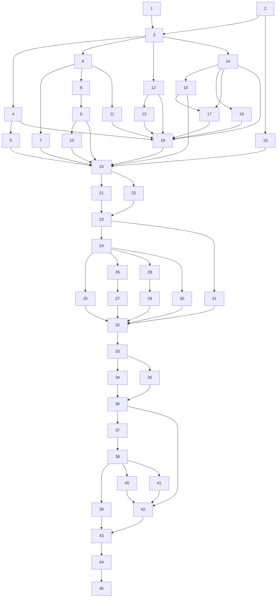

# Implementation Plan

## Overview

任务按 design.md 的 Part A → Part B → Part C 顺序执行；每个检查点都要保持 `cargo build --offline -p readmd-kernel` 与 `cargo test --offline -p readmd-kernel` 通过。
前端纯逻辑测试放在 `tests/frontend/*.test.mjs`，用 `node --test tests/frontend/` 运行；随机化测试统一使用固定种子的 `splitmix64`（`READMD_PBT_ITERS` 可调，默认 500 次），不引入新的测试 crate。

## Tasks

### Part A：核心编辑、渲染、转换与导出

- [x] 1. 编写 Bug Condition 探索测试（Property 1，修复前运行，预期失败）
  - **Property 1: Bug Condition** - Part A 核心编辑/渲染/转换/导出缺陷
  - **CRITICAL**：这些测试在未修复的代码上必须失败，失败即证明缺陷存在
  - **不要在测试失败时修改测试或代码**；测试编码的是期望行为，修复后通过即验证修复
  - **Scoped PBT Approach**：确定性缺陷把属性限定在具体失败用例上，保证可复现
  - Rust 用例放在对应模块的 `#[cfg(test)]` 或 `rust/readmd-kernel/tests/`；前端用例放在 `tests/frontend/`
  - 逐项记录反例（输入、实际输出、期望输出）；如果某个反例与 A.3 的根因表不符，先更新 design.md A.3，再进入修复任务
  - [x] 1.1 编码保存丢失
    - 写入 GB18030 字节 → `/api/file`（断言返回 `encoding` 且内容正确解码）→ `/api/save`（`encoding:"gb18030"`）→ 断言读回字节与原字节相同
    - **EXPECTED OUTCOME**：在 F 上失败（未返回 `encoding`、内容乱码、保存后字节改变）
    - _Requirements: 1.1_
  - [x] 1.2 `.txt` 未结构化
    - 通过 `/api/file` 打开含标题式行/列表式行的 `.txt`，断言响应含 `structured:true`、结构化 `content` 与原文 `original`
    - **EXPECTED OUTCOME**：在 F 上失败（按纯文本原样返回）
    - _Requirements: 1.2_
  - [x] 1.3 DOCX 缺样式/图片/列表
    - 导出含 H5、有序列表、嵌套列表、任务列表、斜体、删除线、链接、对齐表格与本地图片的文档；解压后断言 `document.xml` 中存在 `w:numPr`、`w:strike`、`w:hyperlink`、`w:drawing`、`w:jc`，`word/styles.xml` 存在，`word/media/` 非空
    - **EXPECTED OUTCOME**：在 F 上失败
    - _Requirements: 1.3_
  - [x] 1.4 LaTeX 中文后加粗 panic 与无 CJK 支持
    - 经 `dispatch` 调用 `/api/export`（`format:"tex"`、`content:"中文**粗**"`），用 `catch_unwind` 包住，断言不 panic 且返回 200；断言输出导言区含 `% !TEX program = xelatex` 与 `ctex`
    - **EXPECTED OUTCOME**：在 F 上失败（字节切片 panic；无 CJK 宏包）
    - _Requirements: 1.4, 1.5_
  - [x] 1.5 EPUB 图片缺失与无保存对话框
    - 带 `baseDir` 与本地图片导出 EPUB，断言 ZIP 中存在 `OEBPS/images/*` 且 OPF manifest 引用该图片
    - 断言未给 `out_path` 时导出走保存对话框路径（对话框函数可注入/打桩），而不是写入固定位置
    - **EXPECTED OUTCOME**：在 F 上失败
    - _Requirements: 1.6, 1.27_
  - [x] 1.6 PDF 非嵌入字体、公式源码、`lang`/`aligns` 丢失
    - 导出"中文한국어"，用 `lopdf` 解析输出，断言存在 `FontFile2` 或 `FontFile3`
    - 对同一文档比较 `md_ast::to_render_json` 与 `md_block_to_ast`：断言代码块 `lang` 非空、表格带 `aligns`；断言含公式的文档不以 `$...$` 源码形式出现在 PDF 文本中
    - **EXPECTED OUTCOME**：在 F 上失败（base-14 非嵌入字体；`lang == ""`，无 `aligns`）
    - _Requirements: 1.7, 1.8_
  - [x] 1.7 HTML/XLS/PPT/MOBI 转换
    - 在测试中用字节构造最小夹具（HTML 文档、BIFF8 工作簿、PPT 记录流、PalmDOC 记录），断言返回原生 engine 与预期 Markdown 内容
    - **EXPECTED OUTCOME**：在 F 上失败（依赖 Python 或不支持）
    - _Requirements: 1.9, 1.10, 1.11_
  - [x] 1.8 OCR 无引擎与 Python 文案
    - 非 Windows 上调用 `/api/ocr`，断言返回 `error_code:"ocr_no_engine"` 且错误信息不提及 Python/pip；Windows 上断言走原生 OCR 路径
    - **EXPECTED OUTCOME**：在 F 上失败
    - _Requirements: 1.12, 1.13_
  - [x] 1.9 open-path/reveal 假成功
    - 对不存在的路径调用 `/api/system/open-path` 与 `/api/system/reveal-path`，断言 `ok:false`、`error_code:"path_not_found"`（不真正启动进程）
    - **EXPECTED OUTCOME**：在 F 上失败（返回 `ok:true`）
    - _Requirements: 1.33_
  - [x] 1.10 另存为非原子
    - 在另存为目标写入过程中注入失败（如目标目录只读或写入中途报错），断言原目标文件字节不变且无残留半写文件
    - **EXPECTED OUTCOME**：在 F 上失败
    - _Requirements: 1.34_
  - [x] 1.11 工具栏变换（Node）
    - 在 `tests/frontend/toolbar.test.mjs` 中把 F 的逻辑抽取成可比较的纯函数：`computeSyntaxEdit("abc def", 3, 3, "h2")` 期望在行首加 `## `，而非得到 `abc## def`
    - `cmInsertSyntax('hr')` 作用于 `"文字"` 末尾，期望前面补空行，避免形成 setext 标题
    - **EXPECTED OUTCOME**：在 F 上失败
    - _Requirements: 1.35_

- [x] 2. 编写 Preservation 测试（Property 2，修复前运行，预期通过）
  - **Property 2: Preservation** - Part A 非缺陷输入的既有行为
  - **IMPORTANT**：遵循先观察后断言的方法：先在未修复的 F 上运行生成器，把输出固化为 golden 快照（提交到 `rust/readmd-kernel/tests/golden/`），再写断言
  - 覆盖 isBugCondition_A 为假的输入；随机化测试使用 `splitmix64` 固定种子
  - **EXPECTED OUTCOME**：全部测试在 F 上通过（确认要保留的基线）
  - [x] 2.1 UTF-8 保存语义与授权
    - 随机 UTF-8 文本（含 BOM 与不含 BOM）经 `/api/save` 保存，断言写入字节、`.bak` 生成时机、409 冲突与响应键集合与 F 相同
    - 断言未授权路径仍返回 403
    - _Requirements: 3.1, 3.2_
  - [x] 2.2 HTML 导出快照
    - 对一组代表性 Markdown 文档固化 HTML 导出 golden，断言输出逐字节一致
    - _Requirements: 3.4_
  - [x] 2.3 纯 WinAnsi 无公式 PDF 快照
    - 随机生成只含 WinAnsi 字符、无公式的文档（标题、列表、引用、表格、本地图片），断言页数、每页 `pdf-extract` 文本、字体资源（仅 base-14）和响应结构与 golden 一致
    - _Requirements: 3.6_
  - [x] 2.4 原生转换格式夹具
    - 对现有全部原生转换夹具断言内容与 engine 与 F 相同（现有测试 + golden 快照）
    - _Requirements: 3.7_
  - [x] 2.5 Windows 对话框脚本文本
    - 断言默认参数下生成的 PowerShell 对话框脚本文本与 F 相同（纯字符串比较，不启动进程）
    - _Requirements: 3.8_
  - [x] 2.6 `assets_candidates` 优先级
    - 断言便携布局、开发布局与设置 `READMD_ASSETS_DIR` 时候选列表前几项顺序与 F 相同
    - _Requirements: 3.9_
  - [x] 2.7 `ROUTES` 只增不减与错误形态
    - 把 F 的 `ROUTES` 集合固化为快照，断言 F' 是其超集
    - 对 `/api/save`、`/api/file`、`/api/ocr`、`/api/export` 的错误响应断言原有键仍存在（允许新增键）
    - _Requirements: 3.10_

- [x] 3. HTTP 处理器 panic 兜底（A.4.1）
  - [x] 3.1 连接级 panic 兜底
    - `server.rs` 的 `handle_connection` 用 `catch_unwind` 包住处理器调用；panic 时返回 500 `{ok:false,error_code:"internal_error"}`，设置 `keep_alive=false`，并 `log::error!` 记录路径与 panic 信息
    - 单元测试：注册一个会 panic 的测试路由，断言返回 500 JSON 而不是连接中断
    - _Bug_Condition: 处理器 panic 导致连接中断（isBugCondition_A 中的 panic 分支）_
    - _Expected_Behavior: 任何处理器 panic 都转为 500 internal_error 响应_
    - _Preservation: 非 panic 请求的响应与 ROUTES 不变（3.10）_
    - _Requirements: 2.5, 3.10_
  - [x] 3.2 批量转换 worker 每项兜底
    - batch2 的 `start_convert_job` worker 对每一项用 `catch_unwind` 包住；单项 panic 记为该项失败（`internal_error`），其余项继续处理，任务状态正常结束
    - 单元测试：构造一项会 panic 的输入，断言任务完成且只有该项失败
    - _Requirements: 2.5, 3.10_

- [x] 4. 保留编码的打开与保存（A.4.2）
  - [x] 4.1 引入 encoding_rs
    - `rust/readmd-kernel/Cargo.toml` 加 `encoding_rs = "=0.8.41"`；确认 `Cargo.lock` 的 `[[package]]` 条目数量不增加（已作为传递依赖存在），`cargo build --offline` 通过
    - _Requirements: 2.1_
  - [x] 4.2 新增 `text_encoding.rs`
    - 实现 `detect_and_decode(bytes) -> (String, EncodingInfo)`（BOM 检测、别名归一）与 `encode(text, encoding) -> Result<Vec<u8>, EncodeError>`
    - 不做静默替换：遇到不可表示字符返回 `Unrepresentable { position, ch }`；未知编码名返回 `Unknown`
    - 单元测试：各编码 BOM 检测、别名归一、不可表示字符位置、未知编码
    - _Bug_Condition: 非 UTF-8 文件打开/保存时编码丢失_
    - _Expected_Behavior: 保存后字节按原编码写回_
    - _Requirements: 1.1, 2.1_
  - [x] 4.3 打开与保存接入编码
    - `content::describe` 返回新增 `encoding` 字段
    - `h_save` 与 `py_save_text_atomic` 接收 `encoding`；不可表示时在创建 `.bak` 之前返回 422 `encoding_unrepresentable`（含位置信息），未知编码返回 `encoding_unknown`，目标文件字节不变
    - UTF-8（含 BOM）路径的字节、`.bak` 时机、409 冲突、403 授权与响应键保持不变
    - _Preservation: UTF-8 保存语义与授权（3.1、3.2）_
    - _Requirements: 1.1, 2.1, 3.1, 3.2_
  - [x] 4.4 删除旧的对齐实现并迁移测试
    - 删除 `save_text_atomic_parity` 与 `encode_for`，把其中仍然有效的测试迁移到 `text_encoding` / `h_save` 的测试中
    - _Requirements: 2.1, 3.1_
  - [x] 4.5 前端处理不可表示编码
    - `assets/preview.js` 在保存收到 `encoding_unrepresentable` 时弹出确认（说明哪个字符无法表示），确认后以 `encoding:"utf-8"` 重试，取消则保持未保存状态
    - 在 `tests/frontend/` 中为重试决策逻辑编写纯函数测试
    - _Requirements: 2.1_
  - [x] 4.6 编码往返属性测试
    - **Property 1: Expected Behavior** - 编码往返（T-A2）
    - 对每种编码 E，用 `splitmix64` 从 E 可表示的字符集生成随机文本 t，断言 `decode(encode(t, E)) = t`，且对编码后字节 `detect_and_decode` 再按检测到的 E' 编码等于原字节
    - 对含 E 不可表示字符的文本，断言返回 `Unrepresentable` 且目标文件字节不变
    - _Requirements: 1.1, 2.1, 3.1_

- [x] 5. `.txt` 结构化（A.4.3）
  - [x] 5.1 `content::describe` 的 `.txt` 分支
    - 调用 `convert::txt_to_markdown` 生成结构化内容，响应返回 `content`（结构化 Markdown）、`original`（原文）与 `structured:true`
    - _Bug_Condition: 打开 `.txt` 时未结构化_
    - _Expected_Behavior: 结构化预览 + 原文可编辑_
    - _Requirements: 1.2, 2.2_
  - [x] 5.2 编辑与保存写回纯文本
    - 编辑器对结构化 `.txt` 编辑 `original`；保存写回纯文本（沿用任务 4 的编码逻辑），不把结构化 Markdown 写进 `.txt`
    - 集成测试：打开 `.txt` 后不修改直接保存，原文字节不变
    - _Preservation: 保存语义不变（3.1）_
    - _Requirements: 2.2, 3.1_
  - [x] 5.3 更新 PENDING 声明
    - 从 `PENDING` 中删除 `/api/file.txt-md-structuring`，并按 3.11 更新 `p1_pending_surface_is_declared_and_nonempty`
    - _Requirements: 3.11_

- [x] 6. 共享 md_ast 与 DOCX 导出（A.4.4）
  - [x] 6.1 新增 `md_ast.rs`
    - 基于 `pulldown-cmark` 0.13.4 定义 `Block` / `Inline` 类型；剥离 front matter；数学定界规则与预览一致（`$`、`$$`）
    - `to_render_json` 补齐 `lang`、`aligns`、`task`、`level` 字段
    - 单元测试：front matter 剥离、`$` 定界、嵌套列表、任务项、表格对齐、分页标记
    - _Requirements: 1.3, 2.3_
  - [x] 6.2 重写 `mdexport::export_docx` 与 `docx_writer` 子模块
    - 生成 `styles.xml`、`numbering.xml`、`settings.xml`、rels、`word/media/`、`docProps/core.xml`
    - 覆盖：页面几何（尺寸、边距 twip 换算）、排版、标题书签、表格样式与列对齐、代码块高亮 run、引用、链接（`w:hyperlink`）、hr、页眉页脚 `PAGE` 域、嵌套/有序/任务列表（每个有序列表重新开始编号实例）、OMML 公式（`m:oMath`）、本地图片嵌入（`w:drawing`，EMU 尺寸并受页面宽度约束）
    - 响应返回 `warns` / `warn_items`（如图片缺失、公式无法转换）
    - _Bug_Condition: DOCX 缺样式/图片/列表_
    - _Expected_Behavior: DOCX 结构完整保留 md_ast 结构_
    - _Requirements: 1.3, 2.3_
  - [x] 6.3 DOCX 单元测试
    - twip 换算、图片 EMU 尺寸、编号实例重启、页眉页脚域、警告项
    - _Requirements: 2.3_
  - [x] 6.4 DOCX 结构保持属性测试
    - **Property 1: Expected Behavior** - DOCX 结构 ⊇ md_ast 结构（T-A3）
    - 用 `splitmix64` 随机生成 md_ast 树（标题 1–6 级、深度 ≤ 3 的列表、引用、带语言代码块、带对齐表格、公式、本地图片夹具、链接），序列化后导出
    - 断言 `w:pStyle=HeadingN`、`w:numPr` 段落数、`w:tbl` 与每列 `w:jc`、`w:drawing`、`m:oMath`、`w:hyperlink` 的数量与 AST 统计一致
    - _Requirements: 1.3, 2.3_

- [x] 7. LaTeX 导出（A.4.5）
  - [x] 7.1 改用 `texmd::md_to_latex`
    - `export_tex` 改用 `texmd::md_to_latex`；删除 `format_inline_latex` 与 `escape_latex`（按字符而非字节处理）
    - _Bug_Condition: 中文后加粗导致字节切片 panic_
    - _Expected_Behavior: 任意 UTF-8 输入不 panic，输出合法 LaTeX_
    - _Requirements: 1.4, 2.4, 2.5_
  - [x] 7.2 重写 `build_latex_template`
    - 首行 `% !TEX program = xelatex`；用 `iftex` 条件加载 `inputenc`；正文含 CJK 时自动启用 `ctex`（修正 `use_ctex` 默认值）
    - 补齐 `adjustbox`、`ulem` 等宏包；新增"正文用到的命令都有对应宏包"测试
    - _Requirements: 1.5, 2.4_
  - [x] 7.3 本地图片复制
    - 本地图片复制到 `<输出名>.assets/`，`\includegraphics` 使用相对路径；图片缺失时产生警告
    - _Requirements: 2.4_
  - [x] 7.4 LaTeX 不 panic 属性测试
    - **Property 1: Expected Behavior** - UTF-8 字符边界安全（T-A1，LaTeX 部分）
    - 用 `splitmix64` 从 CJK / emoji / 组合字符 / 零宽字符 / Markdown 定界符字母表生成随机行内标记，`catch_unwind` 断言 `export_tex` 与经 `dispatch` 的 `/api/export` 均不 panic
    - _Requirements: 1.4, 2.4, 2.5_

- [x] 8. PDF 解析、代码高亮、表格对齐（A.4.6）
  - [x] 8.1 PDF 改用共享 AST
    - `export_pdf` 改用 `md_ast::to_render_json`，保留 `lang`、`aligns`、`task`
    - _Bug_Condition: 解析阶段丢失 `lang` / `aligns`_
    - _Expected_Behavior: 渲染 JSON 保留全部字段_
    - _Requirements: 1.8, 2.8_
  - [x] 8.2 新增 `code_highlight.rs`
    - 基于规则的词法器，使用 `char_indices` 保证字符边界安全；输出 token 序列（关键字、字符串、注释、数字等）
    - 单元测试：常见语言的 token 划分、多字节字符不 panic
    - _Requirements: 2.8_
  - [x] 8.3 `pdf_render` 着色与对齐
    - 代码块按 token 着色；表格列按 `aligns` 对齐
    - `pdf_math_fallback_warns` 只对真正渲染失败的公式告警
    - 纯 WinAnsi、无公式、无代码高亮差异的文档输出与 golden 一致
    - _Preservation: 纯 WinAnsi 无公式 PDF 快照（3.6）_
    - _Requirements: 1.8, 2.8, 3.6_

- [x] 9. PDF 字体子集嵌入（A.4.7）
  - [x] 9.1 引入 ttf-parser
    - `rust/readmd-kernel/Cargo.toml` 加 `ttf-parser = "=0.25.1"`，`cargo build --offline` 通过
    - _Requirements: 2.7_
  - [x] 9.2 新增 `pdf_fonts.rs`
    - 字体发现与各平台候选/回退链；TTC 的 face 选择；字形路由（WinAnsi 字符仍走 base-14）
    - glyf 子集化并保持 GID（复合字形闭包、loca 重建、`checkSumAdjustment`）
    - 输出 `CIDFontType2` + `Identity-H` + `/W` 数组 + `ToUnicode` + 子集前缀名
    - CFF 字体 ≤ 12 MiB 时整体以 `FontFile3` 嵌入，超出走回退路径
    - 新增 `Face::Embedded(u16)`；用 `hmtx` 真实字宽参与换行
    - 找不到字体时回退 `STSong` 并产生警告
    - _Bug_Condition: CJK/非 WinAnsi 文本使用非嵌入字体_
    - _Expected_Behavior: 输出含 `FontFile2` 或 `FontFile3` 的嵌入子集字体_
    - _Requirements: 1.7, 2.7_
  - [x] 9.3 字体测试
    - 子集字体能被 `ttf-parser` 重新解析；`ToUnicode` 往返正确；`/W` 数组与 hmtx 一致
    - 纯 WinAnsi 文档输出与 golden 不变
    - 依赖系统字体的测试在字体不存在时跳过并打印原因
    - _Preservation: 纯 WinAnsi 无公式 PDF 快照（3.6）_
    - _Requirements: 1.7, 2.7, 3.6_

- [x] 10. PDF 公式矢量排版（A.4.8）
  - [x] 10.1 新增 `math_layout.rs`：OMML 解析与盒模型
    - 解析 `latex2omml::latex_to_omml` 输出（`m:f`、`sSup`/`sSub`/`sSubSup`、`rad`、`nary`、`d`、`m`、`eqArr`、`acc`、`bar`、`func`、`limLow`/`limUpp`、`groupChr`、`box`、`r`/`t`）为盒树
    - 简化 TeX 盒模型：display / text / script / scriptscript 四种样式；分式、上下标、根号、大运算符上下限、可伸缩定界符（MATH 表 variants / assembly）、矩阵
    - 排版常量取自 OpenType MATH 表（`ttf_parser` math）
    - _Bug_Condition: 含公式文档在 PDF 中以 `$...$` 源码输出_
    - _Expected_Behavior: 支持的公式以矢量字形排版_
    - _Requirements: 1.8, 2.8_
  - [x] 10.2 PDF 绘制与数学字体发现
    - 字形轮廓经 `OutlineBuilder` 绘制为 PDF 路径，分式线/根号线绘制为矩形；每个公式包在 `/Span <</ActualText (LaTeX)>> BDC … EMC` 中
    - 行内公式作为 Atom 按基线对齐，display 公式居中
    - 数学字体候选：Windows `cambria.ttc`（Cambria Math）；macOS `STIXTwoMath.otf`；Linux `latinmodern-math.otf` / STIXTwoMath / `texgyre*-math`
    - `\text{中文}` 通过 `pdf_fonts` 的 CJK 轮廓绘制
    - _Requirements: 2.8_
  - [x] 10.3 逐公式回退
    - 某个公式解析或排版失败时，仅该公式回退为文本并产生既有警告；其余公式照常矢量排版
    - 纯 WinAnsi、无公式文档输出与 golden 一致
    - _Preservation: 纯 WinAnsi 无公式 PDF 快照（3.6）_
    - _Requirements: 2.8, 3.6_
  - [x] 10.4 公式排版测试
    - 分式、上标、根号的盒尺寸（宽/高/深）；输出含 `ActualText`；支持的公式不再以 `$` 源码出现在 PDF 文本中
    - 不支持的公式只对该公式产生回退警告
    - 系统无数学字体时跳过并打印原因
    - _Requirements: 1.8, 2.8, 3.6_

- [x] 11. EPUB 图片打包、保存对话框与演示文稿文件导出（A.4.9）
  - [x] 11.1 `epub_build_bytes` 打包图片
    - 新增 `base_dir` 参数；本地与 `data:` 图片打包为 `OEBPS/images/img_N.ext`，写入 manifest 并改写 `src`，相同图片去重
    - 远程图片与缺失图片产生警告
    - 单元测试：manifest 条目、`src` 改写、去重、警告
    - _Bug_Condition: EPUB 导出丢失图片_
    - _Expected_Behavior: 图片打包进 EPUB 且被 manifest 引用_
    - _Requirements: 1.6, 2.6_
  - [x] 11.2 `h_export_epub` 与 `h_export` 后端
    - `batch2::h_export_epub` 接收可选 `baseDir` 并返回 `warns`；显式 `out_path` 保留 409 `output_exists` / `overwrite` 语义；`out_path` 为空时仍写入 `DATA_DIR/exports` 以兼容旧 API
    - `server.rs::h_export` 的 epub 分支使用 `base_dir` 与 `options.epub` 元数据
    - `h_export` 新增 `presentation` 格式（过滤器"演示文稿 *.html"）：`render_presentation_html(standalone=true)`，本地图片内联为 data URI，`write_bytes_atomic` 写入，返回 `{ok,path,size,warns,error,canceled}`
    - _Preservation: `/api/export/presentation` 应用内行为与 HTML 导出不变（3.5）_
    - _Requirements: 1.26, 1.27, 2.26, 2.27, 3.5_
  - [x] 11.3 前端导出入口
    - `export.js` 的 EPUB 分支与新增"演示文稿（HTML）"标签页都走 `py.export_doc` / `/api/export` 的保存对话框，默认文件名 `<doc>.epub` / `<doc>.html`
    - 用户取消时返回 `canceled:true`，不写文件
    - _Requirements: 1.6, 1.26, 1.27, 2.6, 2.26, 2.27_
  - [x] 11.4 导出测试
    - 演示文稿导出为自包含 HTML（无外链本地图片）；取消不产生文件；显式 `out_path` 已存在时返回 409
    - _Requirements: 2.6, 2.26, 2.27, 3.5_

- [x] 12. HTML / XLS / PPT / MOBI 转换（A.4.10）
  - [x] 12.1 HTML 转换
    - `convert_triple` 处理 `.html` / `.htm`：`read_text_smart` 读取，按 `meta charset` 重新解码 → `headless_renderer::html_to_markdown` → `sanitize_markdown` → `normalize_markdown`
    - 剥离 `script`、`style`、`form`、`iframe`；engine 为 `"html"`
    - _Bug_Condition: HTML 转换依赖 Python 或不支持_
    - _Expected_Behavior: 原生转换并返回原生 engine_
    - _Requirements: 1.9, 2.9_
  - [x] 12.2 新增 `xls_biff.rs`
    - 基于 `ole2::extract_ole2_streams(["Workbook","Book"])` 解析 BIFF8 记录：BOF/EOF、BOUNDSHEET、CODEPAGE、SST+CONTINUE、LABELSST、LABEL、NUMBER、RK、MULRK、BOOLERR、FORMULA+STRING、MERGEDCELLS，日期格式经 FORMAT/XF 判断
    - 每个工作表输出 `## 表名` + GFM 表格（与 `xlsx_to_md` 格式一致）；BIFF5 按 codepage 解码；engine 为 `"xls"`
    - _Requirements: 1.10, 2.10_
  - [x] 12.3 新增 `ppt_binary.rs` 与旧版 Office 错误文案
    - 遍历 `PowerPoint Document` 流记录：SlideListWithText / SlidePersistAtom、TextCharsAtom（UTF-16LE）、TextBytesAtom（cp1252）、TextHeaderAtom 区分标题/正文，输出备注部分；engine 为 `"ppt"`
    - 解析失败返回 `legacy_office_parse_failed`，错误信息不含任何 Python 包名
    - 从 `legacy_markitdown_failure` 中删除 MarkItDown 字样；docx/xlsx/pptx 的内容与 engine 不变
    - _Preservation: 原生转换格式夹具内容与 engine 不变（3.7）_
    - _Requirements: 1.10, 2.10, 3.7_
  - [x] 12.4 新增 `mobi.rs`
    - 解析 PalmDB、PalmDOC 头（压缩 1 / 2 / 17480、加密）、MOBI 头（`text_encoding`、`extra_data_flags`、`first_image_index`）与 trailing entries；LZ77 解压带越界检查；处理 pagebreak
    - `recindex` 图片导出到 `<src>.assets/`，再经 `html_to_markdown` 输出；engine 为 `"mobi"`
    - DRM 返回 `unsupported_format`（reason `mobi_drm`），HUFF/CDIC 压缩返回 reason `mobi_huffcdic`
    - 所有解析器有界：记录长度 ≤ 流长度，输出 ≤ 64 MiB
    - _Requirements: 1.11, 2.11_
  - [x] 12.5 解析器健壮性随机化测试
    - 用 `splitmix64` 对 XLS / PPT / MOBI 解析器输入随机字节与截断的合法夹具，`catch_unwind` 断言从不 panic，输出不超过 64 MiB 限制
    - 夹具测试：最小 HTML、BIFF8、PPT 记录流、PalmDOC 记录各自返回预期 Markdown 与 engine
    - _Requirements: 1.9, 1.10, 1.11, 2.9, 2.10, 2.11, 3.7_

- [x] 13. Windows OCR 与转写降级文案（A.4.11）
  - [x] 13.1 引入 windows crate
    - 在 `cfg(windows)` 下加 `windows = "=0.62.2"`，features：`Foundation`、`Foundation_Collections`、`Globalization`、`Graphics_Imaging`、`Media_Ocr`、`Storage`、`Storage_Streams`、`Data_Pdf`、`Win32_System_WinRT`
    - 确认 `cargo build --offline` 通过且 `Cargo.lock` 不新增 `[[package]]`
    - _Requirements: 2.12_
  - [x] 13.2 新增 `ocr_winrt.rs`
    - `pick_engine`：`TryCreateFromUserProfileLanguages` → `zh-Hans` → `en-US`
    - `ocr_bytes`：`RoInitialize`（MTA）→ `InMemoryRandomAccessStream` → `BitmapDecoder` → `SoftwareBitmap`，按 `MaxImageDimension` 缩放 → `RecognizeAsync`；`OcrWord` 矩形转 `LayoutItem` → `xy_cut_lines` → `normalize_ocr_text`
    - 扫描 PDF 页通过 `Windows.Data.Pdf` 以约 200 DPI 渲染后 OCR，每页检查取消标志
    - _Bug_Condition: OCR 依赖 Python 引擎_
    - _Expected_Behavior: Windows 上走原生 OCR_
    - _Requirements: 1.12, 2.12_
  - [x] 13.3 非 Windows 降级与转写提示
    - 非 Windows 返回 `error_code:"ocr_no_engine"`、信息"当前平台暂无可用的 OCR 引擎"，不含 Python 字样
    - `transcribe::make_whisper_notice` 删除 pip / 插件中心段落，新增 `note_code:"transcribe_unavailable"`
    - 测试：非 Windows 错误码与文案；转写提示不含 pip / Python
    - _Requirements: 1.12, 1.13, 2.12, 2.13_

- [x] 14. 跨平台对话框、打开/显示、另存为与资源目录（A.4.12）
  - [x] 14.1 新增 `native_dialogs.rs`（Windows 部分）
    - 从 `win_dialogs.rs` 抽取 `DialogShape`、`DialogRequest { title, filters }`、`DialogOutcome` 与 `run(req)`
    - Windows 保留 PowerShell 脚本，传入 title / filters；`'` 转义为 `''`；拒绝含 `|`、换行或控制字符的标签
    - `h_dialog_*`、`h_export`、`h_dialog_save_as` 改用 `native_dialogs::run`；`Unavailable` 映射为 `canceled` + `error_code:"dialog_unavailable"`；前端按界面语言传入可选 title / filters
    - _Preservation: 默认参数下 PowerShell 脚本文本不变（3.8）_
    - _Requirements: 1.14, 2.14, 3.8_
  - [x] 14.2 macOS 与 Linux 对话框
    - macOS：`cfg(macos)` 下加 `objc2 = "=0.6.4"`、`objc2-foundation = "=0.3.2"`、`objc2-app-kit = "=0.3.2"`（features `NSOpenPanel`、`NSSavePanel`、`NSPanel`、`NSWindow`、`NSResponder`、`NSApplication`）与 `dispatch2 = "=0.3.1"`；经 `dispatch2` 在主队列运行 NSOpenPanel / NSSavePanel，无 NSApp 时返回 `Unavailable`
    - Linux：`cfg(linux)` 下加 `gtk = "=0.18.2"`；经 glib `MainContext` invoke + mpsc 运行 `gtk::FileChooserNative`，启用覆盖确认；失败时通过 argv 回退 zenity / kdialog，否则 `Unavailable`
    - _Bug_Condition: macOS / Linux 无原生对话框_
    - _Expected_Behavior: 各平台弹出原生对话框或明确返回 dialog_unavailable_
    - _Requirements: 1.14, 2.14_
  - [x] 14.3 新增 `native_system.rs`
    - `open_path` / `reveal_path`：路径不存在返回 `path_not_found`；Windows 使用现有函数并返回 bool；macOS `open` / `open -R`；Linux `xdg-open`，reveal 先用 gdbus `FileManager1.ShowItems`，失败再 `xdg-open` 父目录；一律 `Command::arg` 传参，5 秒超时
    - 失败返回 `{ok:false,error_code}`；确认 `lan_guard` 仍对局域网客户端拦截 `/api/system/*` 与 `/api/dialog/*`
    - _Bug_Condition: open-path / reveal 对失败返回 ok:true_
    - _Expected_Behavior: 失败如实返回 ok:false 与 error_code_
    - _Requirements: 1.33, 2.33_
  - [x] 14.4 `h_dialog_save_as` 原子写入
    - 原子写入（按任务 4 的编码逻辑）；目标已存在且无 `.bak` 时生成 `.bak`
    - 资源复制失败时保留原引用并产生 `warns {name,error}`；调用 `remember_authorized_save`；响应新增 `backup`、`mtime`、`warns`
    - 测试：写入中途失败时原目标字节不变且无残留临时文件
    - _Requirements: 1.34, 2.34_
  - [x] 14.5 `paths::assets_dir` 候选列表
    - `lib.rs` 抽出纯函数 `assets_candidates(exe_dir, env, cwd)`；在 `exe/assets` 之后插入 `exe/../share/readmd/assets` 与 `exe/../Resources/assets`
    - `READMD_ASSETS_DIR` 与 `exe/assets` 的优先级不变
    - _Preservation: 便携/开发布局与环境变量下候选顺序不变（3.9）_
    - _Requirements: 1.15, 2.15, 3.9_

- [x] 15. WRY 原生拖放（A.4.13）
  - [x] 15.1 `main.rs` 拖放处理
    - `build_webview` 使用 `with_drag_drop_handler`：`Enter{paths}` 非空时显示遮罩，`Leave` 隐藏；`Drop{paths}` 经 `dunce::simplified` 转为字符串，推入 `NATIVE_DROPS: Mutex<VecDeque<Vec<String>>>`，再用 `EventLoopProxy::send_event` 唤醒 `ControlFlow::Wait` 循环
    - 仅当 paths 非空时返回 `true`（标签页拖动仍走 DOM）
    - `Event::UserEvent` 中用 `serde_json` 序列化载荷调用 `window.__readmdNativeDrop(...)`（不拼接字符串）
    - _Bug_Condition: 桌面端拖放文件拿不到原始路径_
    - _Expected_Behavior: 拖放打开原文件并可写回_
    - _Requirements: 1.32, 2.32_
  - [x] 15.2 `dragdrop.js` 重构
    - 抽出 `handleDroppedEntries(entries)`，条目为 `{name, path?, file?}`；`__readmdNativeDrop` 构造带 path 的条目
    - 文本/Markdown 通过 `/api/file` 的 `loadFile(path)` 打开（获得保存授权）；文档转换输出到源文件旁；ZIP 走 `extract_zip_batch(path)`
    - 桌面端无 path 的 DOM 拖放仍走上传；浏览器模式不变
    - _Preservation: 保存授权与浏览器模式拖放行为不变（3.1、3.2、3.20）_
    - _Requirements: 2.32, 3.1, 3.2, 3.20_
  - [x] 15.3 拖放路由 Node 测试
    - `tests/frontend/dragdrop.test.mjs`：对带 path / 不带 path 的文本、文档、ZIP 条目断言 `handleDroppedEntries` 分派到正确处理函数
    - _Requirements: 2.32, 3.20_

- [x] 16. 导出预设与警告列表（A.4.14）
  - [x] 16.1 新增 `/api/export/presets` 路由
    - 在 `server.rs` 与 `ROUTES` 中新增 KERNEL BRIDGE 路由；GET 返回 `{defaults: export_styles::default_style(), presets: {minimal, classic, business}, custom, last}`
    - POST `{custom?, last?}` 经过清洗；与 `preset_names()` 重名返回 409 `preset_name_conflict`；自定义预设 ≤ 100 个，请求体 ≤ 1 MiB；原子写入 `DATA_DIR/export_presets.json`
    - `main.rs` shim 的 `get_export_presets` / `save_export_presets` 调用该路由
    - _Bug_Condition: 导出预设无法持久化/各端不一致_
    - _Expected_Behavior: 预设统一经内核路由读写并持久化_
    - _Requirements: 1.24, 2.24, 3.10_
  - [x] 16.2 前端预设与警告列表
    - `export.js` 的 `loadExportPresets` 在浏览器模式下也用同一路由；`applyExportOptionsToDom` 对缺失键回退默认值；预设名经 `getExportPresetNames()` 本地化；处理 409 冲突提示
    - 可折叠警告列表：用 `_t('exportWarn.'+code, params)` 渲染 `warn_items`，缺失时回退原文；保留打开/显示按钮
    - _Requirements: 1.25, 2.25_
  - [x] 16.3 预设测试
    - 409 名称冲突、清洗生效、保存后重新读取往返一致
    - _Requirements: 2.24, 3.10_

- [x] 17. 转换流程（A.4.15）
  - [x] 17.1 后端 `on_exists` 参数
    - `batch2::h_convert`、`convert_txt_lane`、`autosave_md` 接收 `on_exists=skip|overwrite|rename`（默认 skip；`overwrite=1` 等同 overwrite）
    - rename 使用 `convert::batch_output_paths` 并排除磁盘上已有名称，生成 `report (1).md`；响应新增 `out_exists`
    - 上传目录中的文件仍自动覆盖（`is_upload_path`）
    - _Bug_Condition: 转换静默覆盖已有输出_
    - _Expected_Behavior: 已存在时按 on_exists 处理，默认跳过_
    - _Preservation: 原有参数与响应键保留（3.10）_
    - _Requirements: 1.28, 2.28, 3.10_
  - [x] 17.2 前端单文件与多文件转换
    - `render.js` 单文件转换去掉 `&overwrite=1`；收到 `skipped:true` 时弹出三选一：覆盖（`on_exists=overwrite`）/ 另存为新文件名（`rename`）/ 仅预览（`renderVirtual`）
    - 多文档拖放使用 `$('convert-overwrite').checked`（默认不勾选），被跳过的行显示"已跳过"
    - _Requirements: 1.28, 2.28_
  - [x] 17.3 OCR 保存与批量 OCR
    - `/api/ocr` 支持可选 `save=1` + `on_exists`，写入 `convert::md_output_path(src)`；响应新增 `out`、`saved`、`skipped`、`empty`；无文字时返回 `note_code:"ocr_no_text"` 且不写文件
    - `batch.js` 的 `runBatchOcrLane` 传 `save=1&on_exists`，设置 `dataset.out`，点击行打开结果，空结果标记"无文字"
    - _Requirements: 1.29, 2.29_
  - [x] 17.4 打开输出目录与 ZIP 失败提示
    - 至少有一个输出时显示 `#convert-open-dir`：文件夹批量 → 所选目录；否则取最长公共父目录；再否则取第一个输出所在目录；点击调用 `/api/system/open-path`，按 `error_code` 提示
    - `dragdrop.js` 的 ZIP 失败（catch 与 `res.ok===false`）显示本地化 `batch.zipFailed`，带文件名与类别 `zip_corrupt` / `zip_too_large` / `zip_unsupported` / `server_error`，并继续处理其余文件
    - _Requirements: 1.30, 1.31, 2.30, 2.31_
  - [x] 17.5 输出冲突属性测试
    - **Property 1: Expected Behavior** - 转换输出冲突处理（T-A5）
    - 用 `splitmix64` 随机生成已存在/不存在的输出组合，断言 skip 从不修改已有文件，rename 生成的名称从不与已有文件或同批其他输出冲突
    - _Requirements: 1.28, 2.28, 3.10_

- [x] 18. 编辑器工具栏与主题（A.4.16）
  - [x] 18.1 新增 `assets/js/editor/md-transforms.js`
    - 纯函数 `computeSyntaxEdit(doc, from, to, kind) -> {changes, selection}`，带 `module.exports` 守卫供 Node 使用；加入 boot bundle，顺序在 `editor.js` 之前（Part B 的打包工具就绪前沿用现有打包步骤）
    - 块级 `h2` / `quote` / `list` / `ordered` / `task` 扩展到整行；所有行已有相同前缀时取消；保留缩进；有序列表编号 1..n；替换其他列表前缀
    - `hr` / `codeblock` 确保前后空行（文档开头/结尾除外），围栏独占一行
    - 行内 `bold` / `italic` / `strike` / `code`：选区内侧或紧邻外侧已包裹时取消；italic 不匹配 `**`
    - _Bug_Condition: 工具栏在光标处插入语法而非作用于整行/选区_
    - _Expected_Behavior: 按语法类型正确变换并可切换_
    - _Requirements: 1.35, 2.35_
  - [x] 18.2 `editor.js` 单次撤销
    - `cmInsertSyntax` 使用一次 `cmView.dispatch({changes, selection, userEvent:'input.syntax'})`，一次撤销即可还原
    - _Preservation: 其他编辑行为与快捷键不变（3.17）_
    - _Requirements: 2.35, 3.17_
  - [x] 18.3 主题切换
    - `settings.js`：监听 `matchMedia('(prefers-color-scheme: dark)')` 变化，`state.theme==='auto'` 时重新应用；`toggleTheme` 循环 auto → light → dark → sepia → auto（`state.theme` 仍存 `'auto'`）；四个图标；`aria-label` / `title` 为 `_t('theme.current', {name: _t('theme.'+state.theme)})`
    - `editor.js` 的 `applyCmTheme` 按 body 实际 `data-theme` 选择 light / dark / sepia CodeMirror 主题；sepia 通过基于 CSS 变量的 `EditorView.theme` 实现（vendor 包装缺少时导出 `EditorView.theme`）
    - _Preservation: 已保存的主题设置含义不变（3.18）_
    - _Requirements: 1.36, 2.36, 3.18_
  - [x] 18.4 工具栏变换属性测试
    - **Property 1: Expected Behavior** - 工具栏变换不变量（T-A4）
    - `tests/frontend/toolbar.test.mjs`：用 `splitmix64` 随机生成文档与选区，断言块级切换两次复原、每个被选中的行都获得前缀、`hr` 从不形成 setext 标题、围栏总独占一行
    - _Requirements: 1.35, 2.35, 3.17_

- [x] 19. 错误码、提示码与 i18n（A.4.17）
  - [x] 19.1 新增 `api_codes.rs`
    - 集中定义常量：`error_code`（`file_not_found`，加到 `/api/ocr` 与 `/api/file` 的 404 LegacyError；`conversion_failed`、`unsupported_format`+reason、`legacy_office_parse_failed`、`ocr_failed`、`ocr_no_engine`、`encoding_unrepresentable`、`encoding_unknown`、`dialog_unavailable`、`path_not_found`、`open_failed`、`preset_name_conflict`、`internal_error`、`zip_*`）
    - `note_code`（`convert_no_text`、`ocr_no_text`、`transcribe_unavailable`）；`warn_items [{code, params, text}]`（`image_missing`、`image_remote`、`image_unsupported`、`font_fallback`、`glyph_missing`、`formula_fallback`、`asset_copy_failed`）
    - 保留原有中文 `error` / `note` / `warns` 字段
    - _Bug_Condition: 错误与提示只有硬编码中文，前端无法本地化_
    - _Expected_Behavior: 响应带稳定代码，前端按代码本地化_
    - _Preservation: 原有错误键仍存在（3.19）_
    - _Requirements: 1.37, 2.37, 3.19_
  - [x] 19.2 前端 `apiMessage` 与硬编码文案
    - 新增 `apiMessage(d, fallbackKey)`，顺序 `error.<code>` → `note.<code>` → `d.error` → `_t(fallbackKey)`；转换、OCR、导出、保存失败统一使用
    - 替换硬编码字符串：`editor.js`（图片保存失败）、`render.js`（正在打开文档、`title="双链跳转"`）、`pet-batch.js`（正在下载更新）
    - _Requirements: 2.37_
  - [x] 19.3 补齐 46 个语言文件
    - 在 `assets/i18n/` 全部 46 个语言文件中加入新键；zh / en 以外填英文
    - _Requirements: 2.37, 3.19_
  - [x] 19.4 新增 `tools/check-i18n.mjs`
    - 零依赖脚本（Part B 接入 CI）：`api_codes.rs` 中每个代码在 `en.json` 与 zh-CN 中都有键；46 个语言文件键集合一致；`showToast(`、`title=`、`aria-label` 中无未翻译的中文字面量（`_t(k) || '回退'` 除外）
    - 运行脚本通过
    - _Requirements: 1.37, 2.37, 3.19_

- [x] 20. Part A 检查点
  - [x] 20.1 重新运行 Bug Condition 探索测试
    - **Property 1: Expected Behavior** - Part A 核心编辑/渲染/转换/导出缺陷
    - **IMPORTANT**：重新运行任务 1 中的同一组测试，不要编写新测试
    - **EXPECTED OUTCOME**：全部通过（确认缺陷已修复）
    - _Requirements: 2.1, 2.2, 2.3, 2.4, 2.5, 2.6, 2.7, 2.8, 2.9, 2.10, 2.11, 2.12, 2.13, 2.27, 2.33, 2.34, 2.35_
  - [x] 20.2 重新运行 Preservation 测试
    - **Property 2: Preservation** - Part A 非缺陷输入的既有行为
    - **IMPORTANT**：重新运行任务 2 中的同一组测试，不要编写新测试
    - **EXPECTED OUTCOME**：全部仍然通过（确认无回归）
    - _Requirements: 3.1, 3.2, 3.4, 3.6, 3.7, 3.8, 3.9, 3.10_
  - [x] 20.3 构建与全量测试
    - 运行 `cargo build --offline -p readmd-kernel`、`cargo test --offline -p readmd-kernel`、`node --test tests/frontend/`，全部通过
    - 确认 `Cargo.lock` 的 `[[package]]` 集合不变
    - _Requirements: 3.10_
  - [ ] 20.4 手动验证（需要真实窗口系统，标注为手动）
    - macOS / Linux 原生对话框：打开、另存为、导出
    - WRY 原生拖放打开原文件并写回
    - Windows 10/11 真机 OCR（图片与扫描 PDF）
    - PDF 在多个阅读器中的 CJK 与公式显示
    - 有疑问时询问用户
    - _Requirements: 2.7, 2.8, 2.12, 2.14, 2.32_

### Part B：Python 依赖移除

Part B 的每个检查点都要保持 `cargo build --offline --workspace`、`cargo test --offline -p readmd-kernel -p xtask`、`node --test tests/frontend tests/repo` 通过，且 `node tools/check-no-python.mjs --report` 的命中数不增加（任务 32 起改为阻断模式）。

- [x] 21. 编写 Part B Bug Condition 探索测试（Property 10，修复前运行，预期失败）
  - **Property 10: Bug Condition** - 构建、CI、发行产物与运行时仍依赖 Python
  - **CRITICAL**：这些测试在未修复的代码上必须失败，失败即证明缺陷存在
  - **不要在测试失败时修改测试或代码**；测试编码的是期望行为，修复后通过即验证修复
  - **Scoped PBT Approach**：确定性缺陷把属性限定在 B.3 列出的具体入口上
  - 在无 Python 的容器中运行（`node:20-bookworm-slim` + rustup 1.85），前置断言 `command -v python3` 输出为空；用例放在 `tests/repo/python-free.test.mjs` 与对应 Rust 测试
  - 逐项记录反例（命令、实际输出、期望输出）；若发现 B.3/B.5 未列出的 Python 调用，先更新 design.md B.3/B.5，再进入修复任务
  - [x] 21.1 T-B1 仓库扫描
    - 运行 `node tools/check-no-python.mjs --report`，断言零命中；该脚本在任务 23/24 中落地，脚本一出现就立即运行此用例
    - **EXPECTED OUTCOME**：在 F 上失败（B.3 全部位置均命中，其中约 90 个已跟踪 `.py`）
    - _Requirements: 1.23_
  - [x] 21.2 T-B2 boot bundle 再生成
    - 在无 Python 环境下尝试重新生成 `readmd.boot.js` 并同步版本号，断言成功
    - **EXPECTED OUTCOME**：在 F 上失败（只能通过 `tools/sync_version.py` 生成）
    - _Requirements: 1.16_
  - [x] 21.3 T-B3 MCP 服务器
    - 运行 `readmd --mcp`，断言进入 stdio MCP 会话；运行 Python MCP 服务器，记录其失败形态
    - **EXPECTED OUTCOME**：在 F 上失败（`readmd --mcp` 以退出码 2 报未识别选项；Python 服务器报 `ModuleNotFoundError: src`）
    - _Requirements: 1.17_
  - [x] 21.4 T-B4 / T-B5 VS Code 扩展与 Docker
    - 在 `packages/vscode-extension` 运行 `npm run package`，断言成功；运行 `docker build .`，断言成功
    - **EXPECTED OUTCOME**：在 F 上失败（`stage-core.mjs` 失败；Docker 在 `COPY readmd.py` 失败）
    - _Requirements: 1.18, 1.19_
  - [x] 21.5 T-B6 / T-B7 / T-B8 官网、Playwright 与插件中心
    - 运行 `npm --prefix website run verify`，断言成功；启动 Playwright `webServer`，断言服务就绪；调用 `/api/plugins/install`，断言不以 `pip_unavailable` 结束
    - **EXPECTED OUTCOME**：在 F 上失败（找不到 python；找不到 `tools/ui_server.py`；任务以 `pip_unavailable` 结束）
    - _Requirements: 1.20, 1.21, 1.22_

- [x] 22. 编写 Part B Preservation 基线（Property 14，修复前运行，预期通过）
  - **Property 14: Preservation** - Part B 非缺陷行为保持不变
  - **IMPORTANT**：遵循先观察后断言的方法：在当前提交上（Python 仍可用一次）记录基线快照并提交，再写断言
  - **EXPECTED OUTCOME**：全部测试在 F 上通过（确认要保留的基线）
  - [x] 22.1 bundle-boot / sync-version 基线
    - 在当前提交上运行 `tools/sync_version.py`，固化 `readmd.boot.js` 与被改写文件的字节快照，供任务 23 做字节级比较
    - _Requirements: 3.16_
  - [x] 22.2 MCP `tools/list` 快照
    - 从 Python MCP 服务器声明的工具中提取每个工具的 `name` 与 `inputSchema`，在删除前固化为快照（`tests/repo/fixtures/mcp-tools.json`）
    - _Requirements: 3.10_
  - [x] 22.3 官网与发布契约快照
    - 固化 `website/dist` 相对路径列表快照
    - `tests/repo/release-contract.test.mjs`：固化 `release.yml` 的产物名称与平台矩阵
    - _Requirements: 3.16_
  - [x] 22.4 代码块运行与上游技能包
    - 在装有 Python 的开发机上，`/api/code/run` 的 Python 代码块用例仍通过
    - 导入 `assets/upstream` 中含 `.py` 的技能包，断言显示内容不变且不启动任何子进程
    - _Requirements: 3.12, 3.13_
  - [x] 22.5 路由与插件列表形态
    - 断言 `ROUTES` 是 Part A 快照的超集；固化 `/api/plugins/list` 的顶层键集合
    - _Requirements: 3.10_

- [x] 23. xtask 骨架、bundle-boot、sync-version（B.4.1）
  - [x] 23.1 xtask 骨架
    - 新建 `rust/xtask/{Cargo.toml, src/main.rs, src/boot.rs, src/version.rs, src/release_sync.rs, src/hashes.rs, src/pet_package.rs}`；`rust/Cargo.toml` 设 `members = ["readmd-kernel", "xtask"]`；`rust/.cargo/config.toml` 加别名 `xtask = "run --offline -q -p xtask --"`
    - 依赖仅限 `regex = "=1.11.1"`、`serde_json = "=1.0.151"`、`sha2 = "=0.10.9"`（CSP 哈希用手写 base64）；确认 `Cargo.lock` 只新增本地 `xtask` 路径包，不新增任何 registry 包
    - _Requirements: 1.16, 2.16_
  - [x] 23.2 `bundle-boot` 与 `sync-version`
    - `bundle-boot` 的拼接结果与 `tools/sync_version.py` 字节一致，支持 `--check`（有差异时报告偏移并非零退出）
    - `sync-version` 实现全部规则：`must_hit`、忽略 `BUILD_DATE`、CSP 哈希、`index.html` 中全部 `?v=`；支持 `--check`
    - 一次性比较：两个 worktree 分别运行 `cargo xtask sync-version 9.9.9-rc.1` 与 `python tools/sync_version.py 9.9.9-rc.1`，diff 必须为空（结果记录在 PR 中）
    - _Bug_Condition: 无 Python 时无法再生成 boot bundle 与同步版本（1.16）_
    - _Expected_Behavior: `cargo xtask bundle-boot` / `sync-version` 产出与 Python 版字节一致（2.16）_
    - _Preservation: 与任务 22.1 快照逐字节一致（3.16）_
    - _Requirements: 1.16, 2.16, 3.16_
  - [x] 23.3 单元测试
    - 源文件缺失、CRLF、空文件、末尾换行、`--check` 差异偏移；每条 Rule 在夹具上的命中与未命中
    - _Requirements: 2.16_
  - [x] 23.4 bundle 与版本同步属性测试
    - **Property 11: Expected Behavior** - boot bundle 与版本同步字节一致（T-B-P1、T-B-P4）
    - T-B-P1：用 `splitmix64` 随机生成源文件集合，断言 `bundle-boot` 输出等于参考拼接模型
    - T-B-P4：随机版本号下 `sync-version` 幂等（运行两次与一次结果相同，第二次 `--check` 通过）
    - _Requirements: 2.16, 3.16_

- [x] 24. Node 校验脚本、官网流程与 repo-quality workflow（B.4.2）
  - [x] 24.1 `website/scripts/validate-website.mjs`
    - 移植 `validate_website.py` 的全部检查，错误文本相同；保留 `--release` 语义；`--pinned` 合并 `validate_website_pinned.py`；用正则/子串策略，不引入 HTML 库
    - 一次性比较：在共享负例夹具上，`validate-website.mjs` 与 `validate_website.py` 报告的错误集合相同（在删除 Python 版之前完成）
    - _Bug_Condition: 官网校验依赖 python（1.20）_
    - _Expected_Behavior: 官网校验只用 Node（2.20）_
    - _Preservation: `website/dist` 路径列表与错误文本不变（3.16）_
    - _Requirements: 1.20, 2.20, 3.16_
  - [x] 24.2 仓库工具脚本
    - 新增 `tools/i18n-sync.mjs`、`tools/privacy-scan.mjs`、`tools/check-assets.mjs`、`tools/check-no-python.mjs`：零依赖，导出纯函数，CLI 负责设置退出码
    - 单元测试覆盖各脚本的纯函数
    - _Requirements: 2.20, 2.23_
  - [x] 24.3 官网 workflow 切换
    - `website/package.json` 的 `verify` / `verify:release` 改为 node；`website-cloudflare.yml` 与 `website-github-pages.yml` 切换命令并同步 path filter
    - _Requirements: 1.20, 2.20, 3.16_
  - [x] 24.4 新增 `.github/workflows/repo-quality.yml`
    - push/PR 触发，ubuntu，不使用 `setup-python`；依次运行 `cargo xtask bundle-boot --check`、`cargo xtask sync-version --check`、`cargo test --offline -p xtask`、`node tools/check-i18n.mjs`、`node tools/i18n-sync.mjs --check`、`node tools/check-assets.mjs --check`、`node tools/privacy-scan.mjs`、`node tools/check-no-python.mjs --report`、`node --test tests/frontend tests/repo`
    - _Requirements: 2.20, 2.23_

- [x] 25. xtask release-asset-sync 与 hashes（B.4.3）
  - [x] 25.1 移植 `release_asset_sync.py`
    - `xtask release-asset-sync` 实现 `expected_assets`、`payload_assets`、`prepare_assets`、`clean_commit` / `staging_prefix`、`upload_staged_assets`、`swap_staged_assets`；参数 `--assets-dir --tag --commit [--repo]`，`--repo` 默认读 `GH_REPO`
    - `release-sync.yml` 改为调用 `cargo xtask release-asset-sync`
    - _Bug_Condition: 发布资产同步依赖 python（1.20）_
    - _Expected_Behavior: 发布同步只用 Rust xtask（2.20）_
    - _Preservation: 产物名称与平台矩阵不变（3.16）_
    - _Requirements: 1.20, 2.20_
  - [x] 25.2 `xtask hashes`
    - 替代 `compute_hashes.py`，输出格式为 `sha256  name`
    - _Requirements: 1.20, 2.20_
  - [x] 25.3 假 Runner 测试
    - 移植 Python 用例：404 → 新建 release、staged 前缀、先上传后交换、资产不匹配时中止
    - _Requirements: 2.20_

- [x] 26. `readmd --mcp` stdio MCP 服务器（B.4.4）
  - [x] 26.1 命令行选项
    - `main.rs` Action 表加 `--mcp`（`takes_value: false`，`dest: mcp`），与 `--browser`、`--startup-probe`、`--selftest`、`--webview-selftest`、`--share` 互斥（冲突时退出码 2）
    - 注意 `--m` 由原来的 `--mods` 变为歧义前缀；按 3.11 更新长选项列表测试
    - _Requirements: 1.17, 2.17, 3.11_
  - [x] 26.2 JSON-RPC 2.0 与 MCP 协议
    - 手写 stdio JSON-RPC 2.0：`initialize`（版本协商）、`notifications/initialized`、`ping`、`tools/list`、`tools/call`、`resources/list` / `resources/read`；stdout 只输出协议消息，日志写 stderr
    - 约 20 个工具映射到内核函数；新增 `md_fix.rs`（移植 `fixes.js`，与前端共享差分夹具）与 `pdf_tools.rs`（audit/edit/rollback，`.bak` 从不覆盖）；需要栅格化的功能如实报告不可用；破坏性工具要求 `confirm: true`；AI 工具响应不包含密钥
    - _Bug_Condition: MCP 只能通过 Python 服务器提供，且该服务器已无法运行（1.17）_
    - _Expected_Behavior: `readmd --mcp` 提供协议正确的 MCP 服务，工具面与快照一致（2.17）_
    - _Preservation: tools/list 与任务 22.2 快照一致；HTTP 路由不变（3.10）_
    - _Requirements: 1.17, 2.17, 3.10_
  - [x] 26.3 客户端配置与文档
    - `packages/mcp-server/mcp_config_templates.json` 改为 `"command": "readmd", "args": ["--mcp"]`，并提供 Windows/macOS 绝对路径变体；重写 `packages/mcp-server/README*.md`
    - _Requirements: 2.17_
  - [x] 26.4 单元测试
    - 错误码 `-32700` / `-32600` / `-32601` / `-32602` / `-32603`；通知不产生响应
    - _Requirements: 2.17_
  - [x] 26.5 MCP 协议属性测试与端到端测试
    - **Property 12: Expected Behavior** - MCP 协议正确且工具面不变（T-B-P2）
    - 用 `splitmix64` 生成随机 JSON-RPC 会话（合法/非法请求、通知、批量顺序），断言每个带 id 的请求恰好一个响应、通知无响应、错误码正确
    - 断言 `tools/list` 等于任务 22.2 快照；`tools/call` 结果与直接调用对应 HTTP 路由的 JSON 相同
    - 用真实二进制端到端：initialize → initialized → tools/list → tools/call（`generate_toc`、`fix_markdown`、`export_document` DOCX、`pdf_audit`）→ resources/list → 关闭 stdin → 退出码 0
    - _Requirements: 2.17, 3.10_

- [x] 27. VS Code 扩展改用 Rust 二进制（B.4.5）
  - [x] 27.1 新增 `src/binaryFinder.ts`
    - 查找顺序：设置 `readmd.executablePath` → PATH 中的 `readmd` / `readmd.exe` → 平台默认路径（Windows `%LOCALAPPDATA%\Programs\ReadMD\readmd.exe`、`%ProgramFiles%\ReadMD\readmd.exe`；Linux `/usr/bin/readmd`、`/opt/readmd/readmd`；macOS `/Applications/ReadMD.app/Contents/MacOS/readmd`）
    - 纯函数 `candidates(platform, env, config)`；用 `readmd --version` 探测（3 s 超时）；找不到时显示本地化通知与"下载 ReadMD" / "设置路径"按钮，不崩溃
    - _Bug_Condition: 扩展打包与运行依赖 Python 核心（1.18）_
    - _Expected_Behavior: 扩展定位 Rust 二进制并通过 `readmd --mcp` 连接（2.18）_
    - _Preservation: 代码块语言标签 `python` 保留（3.12）_
    - _Requirements: 1.18, 2.18, 3.12_
  - [x] 27.2 桥接与打包清理
    - `bridge.ts` 启动 `readmd --mcp`；移除 `readmd.pythonPath` 设置（由 `readmd.executablePath` 取代）；删除 `pythonFinder.ts` 与 `scripts/stage-core.mjs`，不再打包 `core/`
    - _Requirements: 1.18, 2.18_
  - [x] 27.3 测试
    - `candidates()` 按平台的单元测试；在无 Python 容器中 `npm ci && npm run package` 成功
    - _Requirements: 2.18_

- [x] 28. desktop feature 与 Docker 多阶段构建（B.4.6）
  - [x] 28.1 `desktop` feature
    - `readmd-kernel/Cargo.toml`：`[features] default = ["desktop"]`，`desktop = ["dep:tao", "dep:wry"]`，`tao` / `wry` 设为 optional；`main.rs` 的窗口/WebView 代码置于 `cfg(feature = "desktop")`
    - 未启用该 feature 时直接启动等同 `--browser`，并在 stderr 给出提示；`release.yml` 保持默认 features；`repo-quality.yml` 增加 `cargo build --offline -p readmd-kernel --no-default-features`
    - _Requirements: 2.19, 3.16_
  - [x] 28.2 Dockerfile 多阶段构建
    - Rust builder 阶段（镜像 digest 固定，先用占位符）→ `debian:bookworm-slim` 运行阶段；入口 `readmd --browser --port 8080 --share`（先核实真实选项；仅当内核没有等价机制时才新增 `--host 0.0.0.0` / `READMD_NO_OPEN` / `READMD_HOME`）
    - `docker-compose.yml` 去掉 `PYTHONUNBUFFERED`；README 的 Docker 小节加安全说明：`--share` 会暴露 API，`lan_guard` 仍阻止敏感路由，使用基于 token 的共享，仅在可信网络中使用
    - _Bug_Condition: Docker 构建在 `COPY readmd.py` 失败（1.19）_
    - _Expected_Behavior: 镜像只含 Rust 二进制，浏览器/LAN 模式可用（2.19）_
    - _Preservation: 发行产物与默认 features 不变（3.16）_
    - _Requirements: 1.19, 2.19, 3.16_
  - [x] 28.3 Docker 冒烟测试
    - `docker run --rm --entrypoint sh <image> -c '! command -v python3 && ! command -v python'` 成功；容器启动后 HTTP 健康检查通过
    - _Requirements: 2.19_

- [x] 29. Playwright 测试服务器与录制脚本（B.4.7）
  - [x] 29.1 webServer 改用 Rust 内核
    - `ui-tests/playwright.config.js` 与 `showcase/playwright.config.js`：设置了 `READMD_BIN` 时用预构建二进制，否则运行 `cargo run --release --manifest-path ../rust/Cargo.toml -p readmd-kernel -- --browser --port <p>`
    - _Bug_Condition: webServer 找不到 `tools/ui_server.py`（1.21）_
    - _Expected_Behavior: Playwright 启动 Rust 服务器（2.21）_
    - _Preservation: 现有 spec 行为不变_
    - _Requirements: 1.21, 2.21_
  - [x] 29.2 录制脚本清理
    - 录制脚本改为通过内核 HTTP API 获取转换输出，不再调用 `python -c "from src.readmd_modules..."`；删除 `showcase/package.json` 中的 `audit:capture` 与 `film-frames`；`showcase/scripts/publish_approved_latest.ps1` 删除或去掉 Python 调用（目标脚本按 B.5 已废弃）
    - _Requirements: 1.21, 2.21_
  - [x] 29.3 冒烟测试
    - `npx playwright test` 启动 Rust 服务器，冒烟 spec 成功加载应用
    - _Requirements: 2.21_

- [x] 30. 插件中心真实能力目录（B.4.8）
  - [x] 30.1 `CAPABILITIES` 表
    - `plugin_manager.rs` 用 `CAPABILITIES` 表取代 `PLUGIN_SPECS`：`id`、`kind`（`builtin` | `external`）、能力分组（沿用现有激活规则）、external 的 `detect`、`i18n_key`、`homepage`；保留 `plugin_catalog.extend_catalog`
    - external 检测：java + PlantUML、node、antiword、pdftotext、ffmpeg（argv 形式、带超时）
    - _Bug_Condition: 插件安装走 pip 并以 `pip_unavailable` 结束（1.22）_
    - _Expected_Behavior: 插件中心如实报告内置/外部能力状态，从不调用 pip（2.22）_
    - _Preservation: 既有路由与 `/api/plugins/list` 顶层键不变（3.10、3.14）_
    - _Requirements: 1.22, 2.22, 3.10, 3.14_
  - [x] 30.2 路由语义与前端
    - install / toggle / uninstall 返回 `plugin_builtin` / `plugin_external_manual`；忽略旧的 pip 条目；前端插件中心显示真实状态，i18n 键补齐全部 46 个语言
    - 按 3.11 更新测试 `install_reports_pythons_pip_unavailable_task_state`
    - _Requirements: 2.22, 3.10, 3.14_
  - [x] 30.3 单元测试与能力检测属性测试
    - **Property 13: Expected Behavior** - 插件中心如实报告可用性（T-B-P5）
    - 用 `splitmix64` 随机组合假 PATH 桩（存在 / 不存在 / 超时 / 失败），断言每项状态与桩一致，且从不启动 `pip`
    - _Requirements: 2.22, 3.14_

- [x] 31. 桌宠打包、文档与注释（B.4.9）
  - [x] 31.1 `xtask pet-package`
    - 取代 `packages/readmd-pet-rust/scripts/build-package.py`：运行 `cargo build --release --manifest-path packages/readmd-pet-rust/Cargo.toml`，输出布局与文件名不变
    - 一次性比较文件列表与 SHA-256，只允许 manifest 中的时间戳字段不同
    - _Bug_Condition: 桌宠打包依赖 python（1.23）_
    - _Expected_Behavior: 桌宠打包只用 xtask（2.23）_
    - _Preservation: 打包布局与文件名不变（3.15）_
    - _Requirements: 1.23, 2.23, 3.15_
  - [x] 31.2 文档与注释
    - 更新 README*、CONTRIBUTING 与 docs 中描述 "Python PetRuntimeOrchestrator" 的内容为 Rust 架构；修正 `rust/readmd-kernel/Cargo.toml:49` 引用 `src/readmd_modules/crypto.py` 的注释
    - 保留 `scripts/windows/uninstall.bat:14` 的旧注册表清理，并登记到 B.6 允许列表
    - _Requirements: 2.23, 3.15_

- [x] 32. 删除遗留 Python 文件并启用阻断检查（B.5、B.6）
  - [x] 32.1 删除遗留 `.py`
    - 按 design B.5 表删除全部已跟踪 `.py`（`packages/mcp-server/readmd_mcp_server.py`、`packages/readmd-pet-rust/scripts/build-package.py`、`release/release.py`、`rust/tools/*.py`、`showcase/scripts/*.py`、`tests/**/*.py`、`tools/*.py`）；每个文件只在任务 23–31 中的替代实现已合并并在 CI 运行后删除，已废弃文件按 B.5 的理由删除
    - 保留 `assets/upstream/**`（3.13）；告知开发者本地被 gitignore 的 `docs/dev/**`、`packages/vscode-extension/core/**`、`tools/migration/` 可手动删除
    - _Bug_Condition: 仓库仍跟踪 Python 源文件与调用（1.23）_
    - _Expected_Behavior: 允许列表之外无 Python 文件与调用（2.23）_
    - _Preservation: 上游技能包与代码块运行器保持不变（3.12、3.13）_
    - _Requirements: 1.23, 2.23, 3.12, 3.13_
  - [x] 32.2 `tools/check-no-python.mjs` 规则与阻断
    - 纯函数 `scan(files, allow)`，输入来自 `git ls-files -z`；R1：`assets/upstream/` 与 `assets/skills/` 之外的已跟踪 `.py`；R2：workflow、`package.json` scripts、Dockerfile/compose、sh/ps1/bat、Node/TS spawn、Rust `Command::new`、MCP 配置中的 `python` / `python3` / `py -` / `pip` / `pip3` / 执行 `*.py` / `import src.`
    - 按行的允许列表（代码块运行器的解释器查找 3.12、`uninstall.bat` 旧清理、用户内容语言标签），失效条目本身报错；`repo-quality.yml` 从 `--report` 切换为阻断模式
    - _Requirements: 2.23, 3.12, 3.13_
  - [x] 32.3 单元测试与检查器完备性属性测试
    - 按上下文编写正例/反例单元测试
    - **Property 10: Expected Behavior** - 检查器完备性（T-B-P3）
    - 用 `splitmix64` 随机生成 Python 调用形式，断言在受检上下文中总会命中；出现在 Markdown 文档或允许列表行中时从不命中
    - 验证：一个添加 `run: python x.py` 的分支会使 workflow 失败
    - _Requirements: 2.23, 3.12_

- [x] 33. Part B 检查点
  - [x] 33.1 重新运行 Part B Bug Condition 探索测试
    - **Property 10: Expected Behavior** - 构建、CI、发行产物与运行时不再依赖 Python
    - **IMPORTANT**：重新运行任务 21 中的同一组测试，不要编写新测试
    - **EXPECTED OUTCOME**：全部通过（确认缺陷已修复）
    - _Requirements: 2.16, 2.17, 2.18, 2.19, 2.20, 2.21, 2.22, 2.23_
  - [x] 33.2 重新运行 Part B Preservation 测试
    - **Property 14: Preservation** - Part B 非缺陷行为保持不变
    - **IMPORTANT**：重新运行任务 22 中的同一组测试，不要编写新测试
    - **EXPECTED OUTCOME**：全部仍然通过（确认无回归）
    - _Requirements: 3.10, 3.12, 3.13, 3.16_
  - [x] 33.3 构建与全量测试
    - 运行 `cargo build --offline --workspace`、`cargo build --offline -p readmd-kernel --no-default-features`、`cargo test --offline -p readmd-kernel -p xtask`、`node --test tests/frontend tests/repo`、`npm --prefix website run build && npm --prefix website run verify`、`npm --prefix packages/vscode-extension run package`、`node tools/check-no-python.mjs`（阻断模式），全部通过
    - 确认 `Cargo.lock` 的 registry 包集合不变
    - _Requirements: 2.16, 2.20, 2.23, 3.16_
  - [ ] 33.4 手动验证
    - Docker 镜像在浏览器/LAN 模式下可用；在无 Python 的机器上 VS Code 扩展通过 `readmd --mcp` 连接；MCP 客户端（如 Claude Desktop / Kiro）能列出并调用工具
    - 有疑问时询问用户
    - _Requirements: 2.17, 2.18, 2.19_

### Part C：UI/UX 设计系统与可访问性

Part C 的每一步都要保持 `cargo build --offline` / `cargo test --offline` 通过、`cargo xtask bundle-boot --check` 通过，且相关 Node 与 Playwright 测试通过；新增 JS 模块放在 xtask boot bundle 顺序中 `core/` 段的开头。

- [x] 34. 编写 Part C Bug Condition 探索测试（Property 15，修复前运行，预期失败）
  - **Property 15: Bug Condition** - 样式无令牌约束、模态框焦点失控、任务无反馈、控件接线断裂、窄屏溢出
  - **CRITICAL**：这些测试在未修复的代码上必须失败，失败即证明缺陷存在
  - **不要在测试失败时修改测试或代码**；测试编码的是期望行为，修复后通过即验证修复
  - **Scoped PBT Approach**：确定性缺陷把属性限定在 C.5.2 列出的具体界面与操作上
  - 检查脚本在任务 36 中落地，脚本一出现就立即运行 34.1 与 34.4；逐项记录反例（操作、实际结果、期望结果）
  - [x] 34.1 T-C1 样式扫描
    - 运行 `node tools/check-styles.mjs --report`，断言计数与 bugfix.md 一致（98 个 hex 颜色、129 个 `!important`、17 处 px 字号、14 组断点），且列出 `.theme-dark` 死选择器
    - **EXPECTED OUTCOME**：在 F 上失败（期望零违规）
    - _Requirements: 1.38_
  - [x] 34.2 T-C2 / T-C3 模态框焦点与 Esc
    - 打开 export-modal，连按 Tab 12 次，断言 `document.activeElement` 始终在模态框内
    - 打开导出面板，点击遮罩内的非交互区域后按 Esc，断言模态框关闭
    - **EXPECTED OUTCOME**：在 F 上失败（焦点离开模态框；Esc 后模态框仍可见）
    - _Requirements: 1.39_
  - [x] 34.3 T-C4 任务重复提交
    - 拦截批量转换路由并延迟 5 s，双击触发按钮，断言服务端只收到 1 个请求
    - **EXPECTED OUTCOME**：在 F 上失败（服务端收到 2 个请求）
    - _Requirements: 1.40_
  - [x] 34.4 T-C5 / T-C6 接线与窄屏
    - 运行 `node tools/check-wiring.mjs --report`，断言零命中；在 360×640 下打开导出面板，断言 `scrollWidth <= clientWidth`
    - **EXPECTED OUTCOME**：在 F 上失败（报告列出 `#batch-file-input`；导出面板横向溢出）
    - _Requirements: 1.38, 1.41_

- [x] 35. 编写 Part C Preservation 测试（Property 16，修复前录制，预期通过）
  - **Property 16: Preservation** - Part C 非缺陷行为保持不变
  - **IMPORTANT**：遵循先观察后断言的方法：在当前提交上录制基线并提交，再写断言
  - **EXPECTED OUTCOME**：全部测试在 F 上通过（确认要保留的基线）
  - [x] 35.1 渲染语义快照
    - 夹具含标题、嵌套列表、表格、代码块、KaTeX、Mermaid、脚注、任务列表、中英混排、长 URL；快照记录标签树、`id`、`href` 与现有 class，剔除 `style` 与 `rm-*` class
    - _Requirements: 3.3_
  - [x] 35.2 快捷键与编辑器内容
    - 3.17 列出的每个快捷键：比较文档文本与选区；模态框打开时按下这些快捷键，断言编辑器内容不变
    - _Requirements: 3.17_
  - [x] 35.3 设置与主题
    - 记录设置键集合；切换 4 种主题并重新加载，键集合不变；`theme:'auto'` 持久化，`data-theme` 跟随模拟的 `prefers-color-scheme`
    - _Requirements: 3.18_
  - [x] 35.4 i18n 与 API 响应形态
    - `node tools/check-i18n.mjs`：46 个语言键集合相同，F 的键集合 ⊆ F' 的键集合
    - 不带 `task_id` 的导出/转换请求响应字段不变；现有 job 状态字段不变
    - _Requirements: 3.10, 3.19_

- [x] 36. 样式与接线检查脚本（C.4.0 第 1 步，C.4.4，C.4.7）
  - [x] 36.1 `tools/check-styles.mjs`
    - 零依赖，扫描 `assets/**/*.css`，排除 `assets/upstream/**` 与 vendor；规则 S1–S9：`tokens.css` 之外的 hex/颜色字面量、令牌之外的 px 字号、允许列表之外的 `!important`（`.hidden`、`@media print`、`prefers-reduced-motion`、CodeMirror/KaTeX/Mermaid 第三方覆盖）、3 个命名断点与特性查询允许列表之外的断点、`.theme-dark` / `.dark` 死主题选择器、`outline:none` 只允许出现在 `:focus:not(:focus-visible)` 中等
    - S9：每个声明的主题配色对做 WCAG 对比度检查，从第一天起即阻断
    - 按文件 × 规则的严格棘轮基线：高于或低于基线都失败，`--update-baseline` 更新
    - _Bug_Condition: 样式散落硬编码颜色、`!important`、px 字号与零散断点（1.38）_
    - _Expected_Behavior: 所有样式只经令牌取值且主题配色满足对比度（2.38）_
    - _Preservation: 不改变渲染语义（3.3）_
    - _Requirements: 1.38, 2.38_
  - [x] 36.2 `tools/check-wiring.mjs`
    - 枚举 `index.html` 与 JS 模板中的 `id`、`data-action`、`data-md`、`data-fmt`、`data-pv`、`aria-labelledby`，断言绑定存在并反向检查死链；纯图标按钮必须带 `data-i18n-aria`；允许列表条目至少匹配一次；基线 `tools/wiring-baseline.json`
    - `repo-quality.yml` 接入 `node tools/check-styles.mjs`、`node tools/check-wiring.mjs`、`node --test tools/test/`
    - _Bug_Condition: 存在无绑定或死链的控件（1.41）_
    - _Expected_Behavior: 每个控件都有可达绑定（2.41）_
    - _Requirements: 1.41, 2.41_
  - [x] 36.3 单元测试
    - `tools/test/check-styles.test.mjs`：对比度已知值 `#000`/`#fff` = 21.00、`#767676`/`#fff` ≈ 4.54、`#2f5fe8`/`#fcfcfb` ≈ 5.21；S1–S8 正例/反例；棘轮行为；C.4.1 中每个配色对通过 S9
    - `tools/test/check-wiring.test.mjs`：每种绑定形式、反向死链、未匹配的允许列表条目失败、无法解析的 `aria-labelledby` 失败
    - _Requirements: 2.38, 2.41_
  - [x] 36.4 令牌样式与对比度属性测试
    - **Property 17: Expected Behavior** - 只用令牌取值且主题配色满足对比度
    - 随机生成 CSS 规则，断言 check-styles 的判定等于参考谓词；随机主题 × 声明配色对满足阈值（固定种子 mulberry32，200 例）
    - _Requirements: 2.38_

- [x] 37. 设计令牌 `tokens.css`（C.4.1）
  - [x] 37.1 新建并加载 `assets/css/tokens.css`
    - 在 `index.html` 中最先加载，位于 `style.css` / `workspace-ui.css` / `skill-workbench.css` 之前，使用相同的 `?v=`；确认 `xtask sync-version` 覆盖该行，并为其加一条 `sync-version --check` 断言
    - 若内核内嵌资源，加 cargo 测试：`GET /assets/css/tokens.css` → 200
    - _Requirements: 2.38_
  - [x] 37.2 令牌迁移与别名
    - 移除 `style.css` 第 5 行的令牌块与第 1394 行的第二个 `:root`；旧令牌名保留为别名，声明在 `:root, body` 上（主题位于 `body[data-theme]`，别名必须按主题重新求值）；更新 `style.css` 头部注释
    - _Bug_Condition: 令牌重复定义且主题选择器失效（1.38）_
    - _Expected_Behavior: 单一令牌源，按主题正确求值（2.38）_
    - _Preservation: 设置键与主题持久化不变（3.18）_
    - _Requirements: 1.38, 2.38, 3.18_
  - [x] 37.3 语义颜色
    - light / dark / sepia 三套：bg、surface、surface-raised、surface-sunken、fg、fg-muted、fg-subtle、border、border-strong、accent、accent-hover、accent-soft、accent-fg、success、warning、danger、info、focus-ring、overlay、selection、code-bg、quote-bg、hl；对比度与 design C.4.1 记录的值一致
    - _Requirements: 2.38, 3.18_
  - [x] 37.4 排版、间距与其余令牌
    - 4px 间距刻度；不超过 8 级的 rem 字号刻度及行高；字体栈 `--font-ui` / `--font-reading` / `--font-reading-serif`（通过 `[data-reading-font="serif"]` 钩子，不接入设置）/ `--font-code`，不使用 Web 字体；阅读区在 `@supports` 中启用 `text-autospace` / `text-spacing-trim`，`line-break: strict`，`overflow-wrap: anywhere`
    - 圆角、按主题的阴影、z-index 层级、动效令牌 + `prefers-reduced-motion`；控件高度 `--control-h-sm` 32px / `--control-h-md` 36px，`pointer: coarse` 下 44px；`--touch-target` 移入 `tokens.css`
    - _Requirements: 2.38, 3.3_

- [x] 38. 组件原语与焦点环（C.4.2）
  - [x] 38.1 基础控件原语
    - 在 `style.css` 顶部新增只引用令牌的 `rm-` 前缀原语：`.rm-btn`（primary / secondary / ghost）、`.rm-icon-btn`（方形，图标 16px / coarse 下 20px，本地化 `aria-label` + `title`）、`.rm-input` / `.rm-select` / `.rm-textarea`（错误态 + `aria-describedby`）、`.rm-check` / `.rm-radio` / `.rm-switch`（`accent-color`，命中区域 ≥ 控件高度）
    - _Bug_Condition: 控件样式各自为政且无统一焦点指示（1.38、1.39）_
    - _Expected_Behavior: 控件由令牌化原语组成（2.38、2.39）_
    - _Preservation: 渲染语义不变（3.3）_
    - _Requirements: 2.38, 2.39_
  - [x] 38.2 复合原语
    - `.rm-seg`（radiogroup，用于 4 态主题选择与紧凑布局的编辑/预览切换）、`.rm-tabs` / `.rm-tab`（tablist / tab / tabpanel，2px accent 下划线）、`.rm-panel` / `.rm-list-row`、`.rm-progress`（`--indeterminate`）、`.rm-toast` / `.rm-badge` / `.rm-kbd`、模态框原语
    - _Requirements: 2.38, 2.39_
  - [x] 38.3 焦点环与阅读排版
    - 全局 `:focus-visible { outline: 2px solid var(--color-focus-ring); outline-offset: 2px }`；`forced-colors` 下使用 `Highlight`
    - 预览容器阅读排版：沿用现有 class 名，只改取值
    - _Requirements: 2.39, 3.3_

- [x] 39. 断点与响应式布局（C.4.3）
  - [x] 39.1 三个固定断点
    - `<640` compact / `640–1023` medium / `≥1024` wide，写入文档并由 check-styles 允许列表强制；按 design 的映射合并旧断点
    - _Requirements: 1.38, 2.38_
  - [x] 39.2 各界面布局
    - 编辑/预览分栏在 compact 下改为堆叠，并用 `.rm-seg` 切换 编辑/预览；导出面板在 wide 下选项/预览并排、medium 下堆叠、compact 下为全屏页面并带 选项/预览 标签页；转换/批量工作台为列表/详情布局
    - 360px 下文档级无横向滚动，只有代码块、表格包装器、工具栏"更多"菜单内部滚动
    - _Bug_Condition: 窄屏下导出面板等横向溢出（1.38）_
    - _Expected_Behavior: 任意视口下无文档级横向滚动（2.38）_
    - _Preservation: 渲染语义不变（3.3）_
    - _Requirements: 1.38, 2.38, 3.3_
  - [x] 39.3 响应式属性测试
    - **Property 21: Expected Behavior** - 任意视口无横向溢出且触控目标足够大
    - 随机宽度 ∈ [320, 1920]、高度 ∈ [480, 1200]、主题、界面，断言无文档级横向滚动；模拟 `pointer: coarse` 时每个可交互元素的包围盒 ≥ 44×44
    - _Requirements: 2.38_

- [x] 40. 模态框与键盘导航（C.4.5）
  - [x] 40.1 `assets/js/core/modal.js`
    - `openModal` / `closeModal` / `pushLayer`；背景 `inert` 引用计数；全局 Esc 栈（无论焦点在哪都关闭最顶层，IME 组字期间的 Esc 忽略）；初始焦点规则，关闭后焦点回到触发元素
    - _Bug_Condition: 焦点可离开模态框、Esc 在遮罩点击后失效（1.39）_
    - _Expected_Behavior: 焦点限制在栈顶层，Esc 只弹出一层并归还焦点（2.39）_
    - _Preservation: 快捷键与编辑器内容行为不变（3.17）_
    - _Requirements: 1.39, 2.39, 3.17_
  - [x] 40.2 迁移 27 个模态框
    - 分三批迁移：pet-settings、ai-settings、ai-history、history、img、formula、tpl、skill-create、share、url、close-confirm、save-conflict、confirm、continuous、fix、export、export-preview、convert、plugin、update、lang、table、style-custom、code-chunk、diagram、doc-import、frontmatter
    - _Requirements: 1.39, 2.39, 3.17_
  - [x] 40.3 `assets/js/core/roving.js` 与无障碍名称
    - 工具栏、菜单、导出格式标签页、主题分段控件的 roving tabindex（方向键 / Home / End，`aria-selected` / `aria-expanded`）
    - 纯图标按钮使用 `data-i18n-aria`，键补齐全部 46 个语言
    - _Requirements: 2.39, 3.19_
  - [x] 40.4 模块测试与模态框焦点属性测试
    - 在空白 Playwright 页面中做模块测试（不用 jsdom）
    - **Property 18: Expected Behavior** - 模态框焦点不变式
    - 随机操作序列（打开模态框 / 打开图层 / Tab / Shift+Tab / Esc / 点击遮罩 / `closeModal`），断言焦点始终在栈顶层内、栈外全部 `inert`、Esc 恰好弹出一层、栈空时焦点回到最初的触发元素且无残留 `inert`
    - _Requirements: 2.39_

- [x] 41. 任务反馈与取消接口（C.4.6）
  - [x] 41.1 `assets/js/core/task-feedback.js`
    - 状态机 idle → running → succeeded / failed / cancelled；界面内进度（导出阶段 prepare / render / write；批量与多页 OCR 显示确定进度 n/total）；运行中禁用触发按钮
    - 结果面板：路径、打开 / 在文件夹中显示（复用 A.4.15）、警告列表（A.4.14 `warn_items`，经 A.4.17 本地化）；失败通过 `error_code` 本地化并提供 重试 与可折叠的 详情；取消显示"已取消（已完成 n / total）"；120 s 无进度时显示停滞提示
    - _Bug_Condition: 长任务无反馈且可重复提交（1.40）_
    - _Expected_Behavior: 任务有进度、结果、失败与取消反馈，运行中不可重复触发（2.40）_
    - _Preservation: 不带 `task_id` 的请求响应不变（3.10）_
    - _Requirements: 1.40, 2.40, 3.10_
  - [x] 41.2 Rust 取消接口
    - 共享 `CancelRegistry`（仅用 `std::sync::atomic`）；新增 `POST /api/task/cancel`；导出/转换/OCR/批量请求新增可选 `task_id` 字段；`api_codes.rs` 新增 `cancelled`
    - 导出先写 `.readmd-part` 临时文件，单次 rename 为唯一提交点（提交前取消不留文件）；批量与 OCR 在文件/页之间检查取消标志；单文件多页 OCR 迁到 job 机制，保留旧的同步路由
    - _Requirements: 2.40, 3.10_
  - [x] 41.3 i18n 与界面迁移
    - 新增 `task.stage.prepare/render/write`、`task.progress`、`task.cancel`、`task.cancelled`、`task.stalled`、`task.retry`、`task.open`、`task.reveal`、`task.details`，补齐全部 46 个语言
    - 按顺序迁移导出、单文件转换、OCR、批量流程
    - _Requirements: 2.40, 3.19_
  - [x] 41.4 Rust 测试与任务反馈属性测试
    - Rust：`CancelRegistry` 注册/取消/移除；提交前取消 → 目标不存在且临时文件已删除；提交后取消 → 结果为 finished；批量在 k 个文件后取消 → 恰好 k 个输出
    - **Property 19: Expected Behavior** - 任务反馈不变式
    - 随机交错的进度 / 时钟推进 / 取消 / 成功 / 失败 / 迟到事件，断言：触发按钮禁用当且仅当 running；恰好一个终态；进度单调且 done ≤ total；停滞提示当且仅当 running 且距上次进度 ≥ 120 s（用 Playwright `page.clock`）
    - _Requirements: 2.40, 3.10_

- [x] 42. 接线清理（C.4.7，C.4.0 第 6 步）
  - [x] 42.1 删除死控件并扩大检查范围
    - 删除 `#batch-file-input`；检查范围纳入导出演示入口（A.4.9）、`#convert-open-dir`（A.4.15）与插件中心（Part B）
    - _Bug_Condition: 存在无绑定的控件（1.41）_
    - _Expected_Behavior: 每个控件都有可达绑定或已删除（2.41）_
    - _Requirements: 1.41, 2.41_
  - [x] 42.2 基线归零并切换为阻断
    - 将 check-wiring 基线降为零，删除 `tools/wiring-baseline.json`，`repo-quality.yml` 切换为阻断模式
    - **Property 20: Expected Behavior** - 接线完备性：`index.html` 与 JS 模板中的每个控件都有可达绑定或已删除（check-wiring 阻断模式通过）
    - _Requirements: 1.41, 2.41_

- [x] 43. 按界面迁移样式并收敛基线（C.4.4，C.4.0 第 7–8 步）
  - [x] 43.1 逐界面迁移
    - 按 design 顺序：编辑/预览 → 导出面板 → 转换/批量工作台 → 设置 → 插件中心 → 模态框 → 打印与其余规则；加 `rm-*` class 并删除旧规则，而不是原地重写；每迁完一个界面就降低 check-styles 基线
    - _Bug_Condition: 样式违规遍布各界面（1.38）_
    - _Expected_Behavior: 各界面只用令牌与原语（2.38）_
    - _Preservation: 渲染语义快照不变（3.3）_
    - _Requirements: 1.38, 2.38, 3.3_
  - [x] 43.2 清理别名并切换为阻断
    - 删除旧别名前 grep `assets/js/**` 中的 `getPropertyValue('--` 与 `var(--`，保留 JS 仍在读取的别名
    - 基线归零后删除基线文件与未使用的别名，check-styles 切换为阻断模式
    - _Requirements: 1.38, 2.38_

- [x] 44. UI 集成测试（C.5.7）
  - [x] 44.1 依赖与截图
    - `ui-tests/package.json` devDependencies 加 `"@axe-core/playwright": "4.10.2"`（精确版本；一次性联网 `npm install` 并更新 lockfile，不属于 Rust 离线构建）
    - 截图矩阵：360×640 / 768×1024 / 1280×800 × light / dark / sepia，覆盖编辑/预览、导出面板、转换工作台、设置、插件中心与一个模态框；每张都断言 `documentElement.scrollWidth <= clientWidth`；基线在每个界面迁移后生成，用于守护新设计
    - _Requirements: 2.38, 3.3_
  - [ ] 44.2 axe 无障碍扫描
    - 使用 wcag2a / wcag2aa / wcag21aa 规则，每个界面、每个模态框、每种主题 0 个 serious / critical
    - _Requirements: 2.38, 2.39_
  - [x] 44.3 键盘脚本
    - 每个模态框：初始焦点、Tab（数量 + 1）后仍在内部、Shift+Tab 回绕；导出面板上叠加 confirm 模态框时，Esc 先只关 confirm 再关导出面板，焦点回到 导出 按钮；IME 组字期间 Esc 被忽略
    - 工具栏/菜单/导出标签页：方向键 / Home / End 与 `aria-selected` / `aria-expanded`
    - _Requirements: 2.39_
  - [x] 44.4 全量点击冒烟测试
    - 可见且启用的按钮、`[role=menuitem]`、`[data-action]`，每个从全新状态点击一次；零 `pageerror` / `console.error`；每个都有可观察效果（DOM 变更 / 网络请求 / 焦点变化 / 模态框或图层 / 下载或剪贴板）；确实无效果的控件（如退出）列入允许列表并注明理由
    - _Requirements: 2.40, 2.41_

- [x] 45. Part C 与全局最终检查点
  - [x] 45.1 重新运行 Part C Bug Condition 探索测试
    - **Property 15: Expected Behavior** - 样式令牌化、模态框焦点受控、任务有反馈、接线完整、窄屏无溢出
    - **IMPORTANT**：重新运行任务 34 中的同一组测试，不要编写新测试
    - **EXPECTED OUTCOME**：全部通过（确认缺陷已修复）
    - _Requirements: 2.38, 2.39, 2.40, 2.41_
  - [x] 45.2 重新运行 Part C Preservation 测试
    - **Property 16: Preservation** - Part C 非缺陷行为保持不变
    - **IMPORTANT**：重新运行任务 35 中的同一组测试，不要编写新测试
    - **EXPECTED OUTCOME**：全部仍然通过（确认无回归）
    - _Requirements: 3.3, 3.10, 3.17, 3.18, 3.19_
  - [x] 45.3 回归 Part A 与 Part B
    - **Property 1: Expected Behavior**、**Property 2: Preservation**、**Property 10: Expected Behavior**、**Property 14: Preservation** - 重新运行任务 1 / 2 / 21 / 22 的测试，确认无回归
    - _Requirements: 3.3, 3.10, 3.16_
  - [x] 45.4 全量门禁
    - 运行 `cargo build --offline --workspace`、`cargo build --offline -p readmd-kernel --no-default-features`、`cargo test --offline -p readmd-kernel -p xtask`、`cargo xtask bundle-boot --check`、`cargo xtask sync-version --check`、`node --test tests/frontend tests/repo tools/test/`、`node tools/check-i18n.mjs`、`node tools/check-styles.mjs`、`node tools/check-wiring.mjs`、`node tools/check-no-python.mjs`（全部为阻断模式）、`ui-tests` 中的 `npx playwright test`、官网 build + verify、VSIX 打包，全部通过
    - 确认 `Cargo.lock` 的 registry 包集合不变
    - _Requirements: 2.23, 2.38, 2.41, 3.16_
  - [ ] 45.5 手动验证
    - 在真实桌面窗口（Windows / macOS / Linux）中目视检查三种主题；在导出面板与一个模态框上用读屏器（NVDA 或 VoiceOver）抽查
    - 确保所有测试通过，有疑问时询问用户
    - _Requirements: 2.38, 2.39_

## Task Dependency Graph

```json
{
  "waves": [
    { "id": 0, "tasks": ["1", "2"] },
    { "id": 1, "tasks": ["3", "18"] },
    { "id": 2, "tasks": ["4", "6", "12", "14"] },
    { "id": 3, "tasks": ["5", "7", "8", "11", "13", "15", "16"] },
    { "id": 4, "tasks": ["9", "17"] },
    { "id": 5, "tasks": ["10", "19"] },
    { "id": 6, "tasks": ["20"] },
    { "id": 7, "tasks": ["21", "22"] },
    { "id": 8, "tasks": ["23"] },
    { "id": 9, "tasks": ["24", "31"] },
    { "id": 10, "tasks": ["25", "26", "28", "30"] },
    { "id": 11, "tasks": ["27", "29"] },
    { "id": 12, "tasks": ["32"] },
    { "id": 13, "tasks": ["33"] },
    { "id": 14, "tasks": ["34", "35"] },
    { "id": 15, "tasks": ["36"] },
    { "id": 16, "tasks": ["37"] },
    { "id": 17, "tasks": ["38"] },
    { "id": 18, "tasks": ["39", "40", "41"] },
    { "id": 19, "tasks": ["42"] },
    { "id": 20, "tasks": ["43"] },
    { "id": 21, "tasks": ["44"] },
    { "id": 22, "tasks": ["45"] }
  ]
}
```



说明：「3–19 → 20」「23–31 → 32」「37–42 → 43」在图中只画出各区间的末端节点，其余节点经传递依赖覆盖。

## Notes

- 任务 1 / 21 / 34 是 Bug Condition 探索测试，在修复前运行，预期失败（失败即确认缺陷存在）。
- 任务 2 / 22 / 35 是 Preservation 测试，在修复前运行，预期通过（记录需保留的基线行为）。
- 仅能手动完成的检查集中在 20.4、33.4、45.5。
- 新增的联网开发依赖只有 `@axe-core/playwright` 4.10.2（固定版本）；Rust 侧不引入新的 registry crate。
