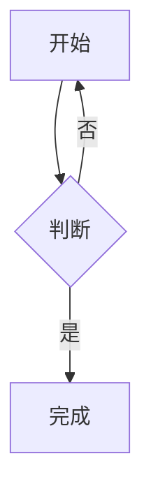
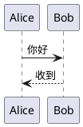
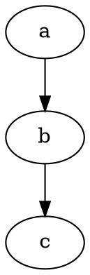

# 图表引擎自检

## mermaid



## plantuml



## tikz

```tikz
\begin{tikzpicture}
\draw[thick] (0,0) rectangle (2,1);
\node at (1,0.5) {Hello TikZ};
\end{tikzpicture}
```

## wavedrom

```wavedrom
{ signal: [
  { name: 'clk',  wave: 'p....' },
  { name: 'data', wave: 'x3.4.', data: ['A', 'B'] }
]}
```

## bitfield

```bitfield
{reg: [
  {bits: 4, name: 'mode'},
  {bits: 4, name: 'flag'}
]}
```

## dot



## vega-lite

```vega-lite
{
  "$schema": "https://vega.github.io/schema/vega-lite/v5.json",
  "mark": "bar",
  "data": {"values": [{"a": "A", "b": 28}, {"a": "B", "b": 55}]},
  "encoding": {"x": {"field": "a", "type": "ordinal"}, "y": {"field": "b", "type": "quantitative"}}
}
```

## chartjs

```chart
{
  "type": "bar",
  "data": {"labels": ["一", "二", "三"], "datasets": [{"label": "示例", "data": [5, 10, 15]}]}
}
```

## d2

```d2
a -> b
```

## ditaa

```ditaa
+---+
| A |
+---+
```

## vega

```vega
{
  "$schema": "https://vega.github.io/schema/vega/v5.json",
  "width": 200,
  "height": 100,
  "data": [{"name": "table", "values": [{"x": 1, "y": 2}]}],
  "marks": [{"type": "rect", "from": {"data": "table"}}]
}
```

## wsd

```wsd
Alice->Bob: Authentication Request
Bob-->Alice: Authentication Response
```

