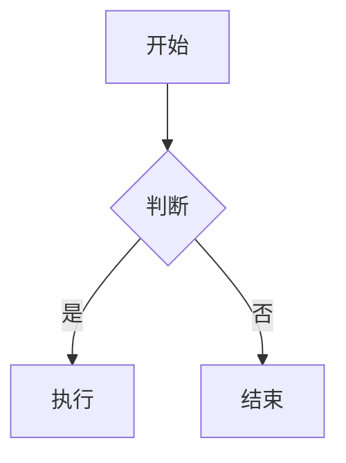
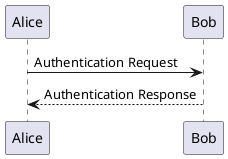

# Markdown Preview Enhanced (MPE) 全景功能与技术文档全集
> 经由 ReadMD (v2.3.4) 原生爬取、自愈修复与结构化管道生成

---


## 📄 页面文档：README.md

# Markdown Preview Enhanced

**Markdown Preview Enhanced*\* 是一款为 [Visual Studio Code](https://marketplace.visualstudio.com/items?itemName=shd101wyy.markdown-preview-enhanced) 编辑器编写的**超级强大的\*\* Markdown 插件。
这款插件意在让你拥有飘逸的 Markdown 写作体验。

## 特性全景
- 自动编辑器及预览滑动同步 (Scroll Sync)
- 导入外部文件 (@import File Imports)
- Code Chunk (就地运行代码块并绘图回填)
- Pandoc 文档格式转换与编译
- Prince XML 出版级 PDF 导出
- 电子书制作 (eBook: EPUB / MOBI / PDF)
- 幻灯片演说制作 (Reveal.js Presentation)
- 语法解析可扩展性 (Extend Parser)
- LaTeX 高精度数学公式 (KaTeX & MathJax)
- Puppeteer 导出高保真 PDF, PNG, JPEG
- 导出离线与移动端优化的漂亮 HTML
- 编译到 GitHub Flavored Markdown
- 自定义预览样式 (style.less & head.html)
- 自动 TOC 目录树生成
- 10+ 种图表原生渲染 (Mermaid, PlantUML, WaveDrom, Graphviz, Vega, D2, Ditaa)


---


## 📄 页面文档：usages.md

# 使用与快捷键

## 命令速查 (Command Palette)
在编辑器中按 `Ctrl+Shift+P` (macOS: `Cmd+Shift+P`):
- `Ctrl+Shift+P` (`Cmd+Shift+P`): 开/关 Markdown 实时预览
- `Ctrl+Shift+P`: 开关无干扰全屏写作模式
- `Ctrl+Shift+P`: 打开 `Cmd+Shift+P` 自定义样式
- `Ctrl+Shift+P`: 插入自动目录
- `Ctrl+Shift+P`: 切换编辑器与预览滑动同步
- `Ctrl+Shift+P` (`Cmd+Shift+P`): 立即对齐预览与光标位置
- `Ctrl+Shift+P`: 切换实时热更新或仅保存时重绘
- `Ctrl+Shift+P`: 切换单次回车换行或 CommonMark 双空格换行
- `Ctrl+Shift+P`: 插入 `Cmd+Shift+P` 幻灯片分页符
- `Ctrl+Shift+P`: 交互式插入表格
- `Ctrl+Shift+P`: 图床上传与本地图片管理


---


## 📄 页面文档：markdown-basics.md

# Markdown 基本要素

MPE 完整支持 CommonMark 与 GitHub Flavored Markdown (GFM) 标准：
- 标题: `# H1` 到 `###### H6`
- 强调: `# H1`, `###### H6`, `~~删除线~~`, `==高亮==`, `~下标~`, `^上标^`
- 列表: 无序列表 (`# H1`, `###### H6`), 有序列表 (`~~删除线~~`), 任务待办列表 (`==高亮==`, `~下标~`)
- 引用块: `# H1`
- 扩展属性: 支持带有 CSS 类与 ID 的自定义块标记


---


## 📄 页面文档：math.md

# 数学公式 (LaTeX Math)

MPE 内置 **KaTeX** 与 **MathJax (v2/v3)** 双渲染引擎：
- **行内公式**: `$...$` 或 `\(...\)`
- **块级公式**: `$...$`、`\(...\)` 或 ```math 代码块
- **引擎切换**: 设置 `$...$` 或 `\(...\)`
- **宏定义**: 支持通过 `$...$` 注入全局 `\(...\)` 学术简写宏


---


## 📄 页面文档：diagrams.md

# 图表与数据可视化矩阵 (Diagrams)

MPE 内部支持 10+ 种图表与矢量语法渲染：

## 1. Mermaid
支持流程图、时序图、类图、状态图、甘特图与饼图：


## 2. PlantUML (需 Java)
绘制 UML 架构、时序与用例图：


## 3. WaveDrom & Bitfield
硬件时序波形与寄存器位域图：
```wavedrom
{ "signal": [
  { "name": "clk",  "wave": "p....." },
  { "name": "data", "wave": "x.345x", "data": ["head", "body", "tail"] }
]}
```

## 4. Graphviz / Viz.js
dot 语言有向图与网络拓扑（支持 dot, neato, circo, twopi 布局）：
```viz
digraph G {
    node [shape=box];
    A -> B -> C;
}
```

## 5. Vega & Vega-Lite
声明式 JSON 数据可视化图表，支持 `{interactive=true}` 悬浮交互。

## 6. D2
声明式现代软件架构图：
```d2
x -> y: 消息通信
```


---


## 📄 页面文档：file-imports.md

# 文件导入系统 (@import)

MPE 独有的模块化嵌入语法 `@import "filepath"`：

1. **导入 Markdown 章节 (分章拼装书籍)**:
   `@import "filepath"`

2. **导入 CSV 数据并自动转为表格**:
   `@import "filepath"`

3. **导入局部源码行范围与高亮**:
   `@import "filepath"`

4. **导入图表文件与 PDF 页面**:
   `@import "filepath"`
   `@import "filepath"`


---


## 📄 页面文档：code-chunk.md

# 交互式代码块 (Code Chunk)

允许在预览中就地执行代码并回填图表与输出：

## 语法格式
```python {cmd=true id="plot1" matplotlib=true}
import matplotlib.pyplot as plt
import numpy as np

x = np.linspace(0, 10, 100)
plt.plot(x, np.sin(x))
plt.title("正弦波曲线")
plt.show()
```

## 核心控制属性
- `cmd=true`: 启用执行
- `cmd=true`: 隐藏源码，只展示结果
- `cmd=true`: 输出通道
- `cmd=true`: 会话延续（跨代码块共享变量）


---


## 📄 页面文档：presentation.md

# 幻灯片制作 (Reveal.js)

将 Markdown 快速编译为技术演说 PPT：

## 分页符
- `<!-- slide -->`: 横向下一页
- `<!-- slide -->`: 垂直下钻页

## Front-matter 配置
```yaml
---
presentation:
  theme: league.css
  transition: slide
  slideNumber: true
  enableSpeakerNotes: true
---
```

## 演讲者视图 (Speaker Notes)
在任意页面添加 `<!-- slide -->`，放映时按 `S` 键唤起独立演讲者计时窗口。


---


## 📄 页面文档：toc.md

# 目录生成 (TOC)

- 语法: 输入 `[TOC]` 或 `<!-- @import "[TOC]" -->`
- 选项: `[TOC]`
- 行为: 自动解析文档内 `[TOC]` 到 `<!-- @import "[TOC]" -->` 标题并生成锚点链接


---


## 📄 页面文档：export.md

# 导出全管道 (Export Pipelines)

1. **Puppeteer (Chrome Headless)**: 像素级高保真 PDF / PNG / JPEG 长图
2. **Prince XML**: 出版级双栏排版、页眉页脚与目录索引 PDF
3. **eBook (Calibre)**: 生成 EPUB / MOBI 电子书
4. **Pandoc**: 转换至 Word (.docx)、LaTeX、RTF
5. **HTML**: 导出单文件离线嵌入包与 CDN 轻量网页


---


## 📄 页面文档：customize-css.md

# 自定义样式与扩展

- **`style.less`**: 用户自定义 Less/CSS 样式表
- **`style.less`**: 注入外部 JavaScript 脚本、Web 字体或 Iconify 图标包
- **`style.less`**: 编写自定义 markdown-it 扩展插件


---
