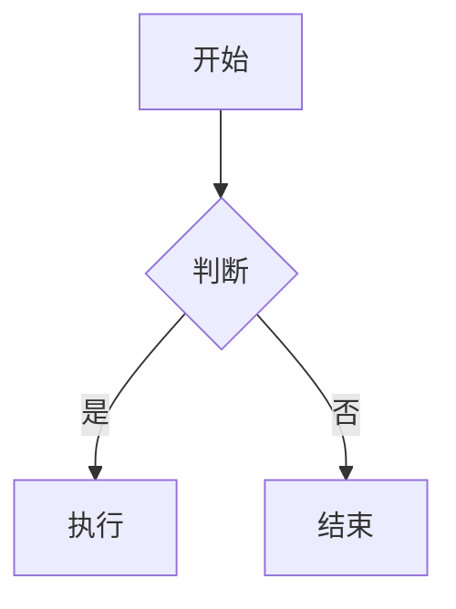
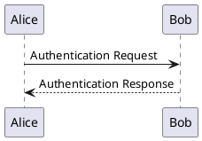

# 图表与数据可视化矩阵 (Diagrams)

MPE 内部支持 10+ 种图表与矢量语法渲染：

## 1. Mermaid
支持流程图、时序图、类图、状态图、甘特图与饼图：


## 2. PlantUML (需 Java)
绘制 UML 架构、时序与用例图：


## 3. WaveDrom & Bitfield
硬件时序波形与寄存器位域图：
```wavedrom
{ "signal": [
  { "name": "clk",  "wave": "p....." },
  { "name": "data", "wave": "x.345x", "data": ["head", "body", "tail"] }
]}
```

## 4. Graphviz / Viz.js
dot 语言有向图与网络拓扑（支持 dot, neato, circo, twopi 布局）：
```viz
digraph G {
    node [shape=box];
    A -> B -> C;
}
```

## 5. Vega & Vega-Lite
声明式 JSON 数据可视化图表，支持 `{interactive=true}` 悬浮交互。

## 6. D2
声明式现代软件架构图：
```d2
x -> y: 消息通信
```
