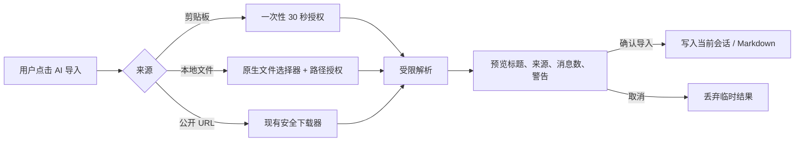

# ReadMD v2.2.4：AI 对话导入、按需加载与发布 UX 规格

## 用户计划（完整记录）

用户希望 ReadMD 保持免费的本地 Markdown 工具，并在 v2.2.4 完成以下工作：

1. 阅读窗口优先可用；转换、OCR、网页、AI 等重量模块只在用户使用对应功能时加载。提供启动 probe，报告只含版本和时间里程碑。
2. AI 面板可把用户明确提供的聊天内容导入为 Markdown：一次性授权的剪贴板、用户选择的本地导出文件，及公开 URL。导入先预览，用户确认后才写入当前会话/编辑区。
3. 已配置的 AI 连接在面板中保持可用，自动保存正常对话历史；无痕模式不得保存本次会话。
4. 导入要兼容常见 JSON、HTML、文本、Markdown 与 ZIP 导出，识别 ChatGPT、Claude、Gemini、ReadMD 历史和通用格式；保留用户/助手角色、可见文本和安全的来源元数据。
5. 保持 Windows 安装/升级/卸载的恢复安全：安装前检查、可解释错误、显式覆盖运行中进程；不影响用户 Markdown、配置和安装路径之外的文件。
6. 发布 v2.2.4：Windows 安装/便携、macOS x64/arm64 共四个资产，加 `SHA256SUMS.txt` 为第五资产；`main` 只产出 RC artifact，只有 `v2.2.4` tag 发布 Release。
7. 仅调研 v2.2.5 Markdown/LaTeX 往返，不在本版本加入依赖或入口。

## 导入流程与 UX

- 入口放在现有“更多”菜单与 AI 面板可发现位置，不弹出抢焦点窗口。
- 每个来源都说明会读取什么；剪贴板必须由按钮触发，不能页面加载时读取。
- 预览显示消息数、识别来源与警告，不能显示/记录不安全 HTML、原始 token 或本地绝对路径。
- 无痕勾选后，发送与导入内容不写 AI 历史；普通模式的保存错误应可见，不阻塞阅读。
- 加载中的可选功能应有“正在加载/稍后重试”反馈，入口不能假装立即可用或卡死阅读 UI。

## 安全边界与验收

| 边界 | 验收标准 |
| --- | --- |
| 剪贴板 | 令牌只可用一次、约 30 秒过期；未授权/过期返回安全错误；不记录剪贴板原文 |
| 本地文件 | 只能导入原生选择器刚授权的路径；约 60 秒过期；选择后若大小/mtime 改变则拒绝 |
| 输入大小 | 文本/HTML 请求 ≤10 MB；ZIP 压缩、解压、成员数、压缩比和成员名均有限制；超限不解压、不崩溃 |
| 内容 | 不执行 HTML、JavaScript、数据 URI、宏或远程附件；危险 URI 不进入输出；系统消息可忽略并提示 |
| URL | 仅沿用公开 HTTP(S) 下载与重定向/SSRF/DNS 重绑定防护；不绕过登录、验证码、私网限制或付费墙 |
| 隐私 | 日志、probe、错误与 Release 不包含聊天正文、剪贴板原文、API key、授权 token 或用户路径 |
| 保存 | 导入预览取消即丢弃；确认后由既有 AI/编辑保存语义决定；不得静默覆盖原 Markdown |
| 安装器 | 所有错误返回稳定代码和可执行建议；恢复不删除文档或应用数据；升级/卸载只清理其拥有的文件 |

## 性能与发布验收

- 首次打开本地 Markdown 时 `/api/modules` 只报告状态，不触发全部重量模块导入；单功能请求仅启动对应白名单模块，并发请求不重复导入。
- startup probe 只输出 `server_up`、`window_created`、`window_loaded`、`page_loaded`、`first_document` 与版本；无文档路径/内容；页面 ready 或超时后退出。
- Windows 必须通过新增回归、Playwright、常规 selftest、冻结 onedir/portable selftest、startup probe、安装器版本/资源与隐私扫描。
- macOS x64/arm64 必须通过解析/剪贴板桥接/selftest，以及 Info.plist 版本、native 架构、资源、排除 Windows 投影与隐私检查。
- Release job 必须确认四个文件非空、版本 `2.2.4`、两个 macOS 架构、Defuddle/chat-import 资源、隐私扫描和 SHA-256；上传四资产与 `SHA256SUMS.txt`，不增加签名验证或签名声明。

## 明确不做

- 不读取未经动作授权的剪贴板，不接受任意本地路径，不自动抓取私网/登录内容。
- 不把聊天导入做成云同步、账户系统或 provider 身份验证；AI API key 仍只在本机配置/环境变量中处理。
- 不声称 Windows/macOS 包已签名。未签名提示只提供 SmartScreen/Finder 右键打开和 SHA-256 完整性校验说明。
- 不在 v2.2.4 引入 Pandoc、pypandoc、LaTeX 引擎或 Markdown/LaTeX UI。
