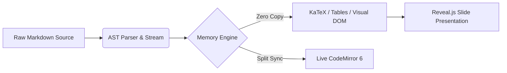

# ReadMD · 本地 Markdown 学术工作台

> **运行环境**: 本地离线优先 · **渲染管线**: 内存零改写 · **响应速度**: 毫秒级

## 1 核心特性矩阵

| 工作流特性 | ReadMD 本地工作台 | 传统云端笔记 | 纯文本编辑器 |
| :--- | :--- | :--- | :--- |
| **超长文档秒开** | **分片流式加载** (10万行零卡顿) | 需全量网络请求 | 易卡死/崩溃 |
| **LaTeX 复杂排版** | **KaTeX / MathJax 原生渲染** | 语法受限/需插件 | 仅源码展示 |
| **多源格式提取** | **PDF / DOCX / OCR 一键转 MD** | 需第三方收费转换 | 无内置提取 |
| **实时放映模式** | **Reveal.js 幻灯片同源放映** | 需二次导出 PPT | 不支持 |

---

## 2 深度学术数学排版 (LaTeX PRO)

多行对齐矩阵与变分自编码器损失函数原生渲染：

$$
\begin{aligned}
\mathcal{L}_{\mathrm{VAE}}(\theta, \phi; \mathbf{x}) &= \mathbb{E}_{q_\phi(\mathbf{z}|\mathbf{x})}\left[\log p_\theta(\mathbf{x}|\mathbf{z})\right] - D_{\mathrm{KL}}\left(q_\phi(\mathbf{z}|\mathbf{x}) \,\|\, p(\mathbf{z})\right) \\
\mathbf{H}^{(l+1)} &= \sigma\left(\mathbf{\tilde{D}}^{-\frac{1}{2}} \mathbf{\tilde{A}} \mathbf{\tilde{D}}^{-\frac{1}{2}} \mathbf{H}^{(l)} \mathbf{W}^{(l)}\right)
\end{aligned}
$$

> **高斯–马尔可夫定理 (Gauss-Markov Theorem)**
> 在所有线性无偏估计量中，普通最小二乘估计量（OLS）具备最小方差，是最佳线性无偏估计量（BLUE）。
>
> **代数推导与正定性**：设 $\hat{\beta}$ 为 OLS 估计量，$\tilde{\beta}=\mathbf{CY}$ 为任意线性无偏估计量。协方差矩阵满足 $\mathrm{Cov}(\tilde{\beta}) - \mathrm{Cov}(\hat{\beta}) \succeq 0$。

---

## 3 科学图表与硬件时序



```python
# 纯本地数据管道与零改写渲染
def render_pipeline(doc_path: Path) -> RenderResult:
    tokens = tokenize_safe(doc_path.read_bytes())
    return build_virtual_dom(tokens, memory_only=True)
```
