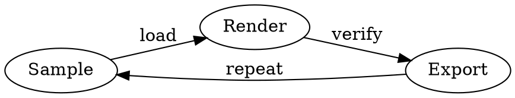

# 实验信号笔记

## 时序采样

```wavedrom
{
  signal: [
    { name: "CLK", wave: "p......" },
    { name: "DATA", wave: "x345x.", data: ["A0", "A1", "A2"] },
    { name: "ACK", wave: "0..1.0" }
  ]
}
```

## 状态转移



图表语法保存在原稿里，选择器只负责减少记忆负担。
