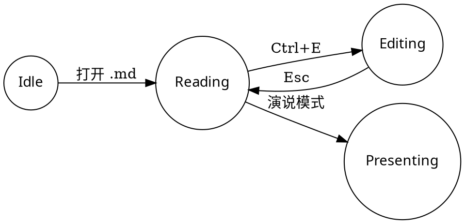

# ReadMD 研究笔记：本地 Markdown 工作台

> **项目**: ReadMD · **版本**: v2.3.7 · **模式**: 纯本地离线 · **许可**: MIT

[TOC]

---

## 1 一句话看懂 ReadMD

双击即读的本地 Markdown 阅读器与编辑器：渲染前自动修正常见语法错误，**只影响显示，绝不改写原文件**；冷启动 ≤1.5s，托盘唤起 <0.3s，覆盖 Windows / macOS / Linux / 信创 / 鸿蒙。

::: definition 设计原则
纯本地优先：文件不出电脑，离线可用；渲染管线全部发生在内存，原文件零修改。
:::

---

## 2 LaTeX PRO 学术排版

多行公式环境原生渲染，无需任何配置：

$$
\begin{aligned}
\mathcal{L}(\theta) &= \mathbb{E}_{(x,y)\sim\mathcal{D}}\left[-\sum_{i=1}^{K} y_i \log \hat{y}_i\right] + \lambda\|\theta\|_2^2 \\
\mathbf{H}^{(l+1)} &= \sigma\!\left(\tilde{\mathbf{D}}^{-\frac{1}{2}}\tilde{\mathbf{A}}\tilde{\mathbf{D}}^{-\frac{1}{2}}\mathbf{H}^{(l)}\mathbf{W}^{(l)}\right)
\end{aligned}
$$

::: theorem 高斯–马尔可夫定理
在所有线性无偏估计量中，普通最小二乘估计量（OLS）方差最小，是最佳线性无偏估计量（BLUE）。
:::

::: proof 证明思路
设 $\hat{\beta}$ 为 OLS 估计量，$\tilde{\beta}=\mathbf{CY}$ 为任意其他线性无偏估计量。由协方差矩阵的正定性可得 $\mathrm{Var}(\tilde{\beta})-\mathrm{Var}(\hat{\beta})\ge 0$，当且仅当 $\mathbf{C}$ 为仿射变换时取等号。
:::

---

## 3 科学图表直接写进文档

硬件时序波形（WaveDrom）：

```wavedrom
{
  signal: [
    { name: "CLK",  wave: "p......" },
    { name: "Data", wave: "x.345x.", data: ["head", "body", "tail"] },
    { name: "Req",  wave: "0.1..0." },
    { name: "Ack",  wave: "0..1.0." }
  ]
}
```

模块状态机（Graphviz）：



---

## 4 代码块就地运行

```python cmd=true
import numpy as np

# 阻尼振荡采样
t = np.linspace(0, 10, 500)
y = np.exp(-0.4 * t) * np.cos(2 * np.pi * t)
print(f"峰值: t={t[np.argmax(y)]:.2f}, y={np.max(y):.2f}")
```

---

## 5 实测体验数据（来自项目 README）

| 体验项 | ReadMD 实测 | 说明 |
| :--- | :--- | :--- |
| 冷启动 | ≤ 1.5 s | onedir 目录部署，免解压 |
| 二次唤起 | < 0.3 s | 托盘常驻 + 单实例通信 |
| 界面语言 | 46 种 | 自适应系统语言，支持 RTL |
| 超长文档 | > 10,000 行 | 智能语义分页，杜绝假死 |
| 自动化测试 | 340 项单元 + 25 项 E2E | 全部通过 |

---

## 6 演说模式：同一份文档直接上台

下面的分页标记会被演说模式识别为独立幻灯片：

<!-- slide -->

## 三年，从一个阅读器到一个工作台

- 阅读：秒开、分页、全文搜索
- 编辑：CodeMirror 6 补全 + 实时预览
- 转换：Word / PDF / Excel / HTML / LaTeX 一键转 MD

<!-- slide -->

## 这就是第 2 页

演说悬浮工具栏：11 款主题、6 种转场、字号三档、总览视图（O 键）、一键全屏（F11）。

<!-- note -->
这一页演示悬浮工具栏与转场效果。
