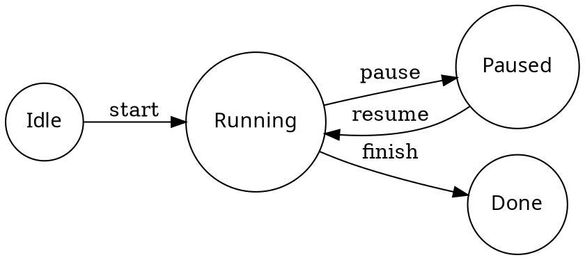

# ReadMD: Next-Generation Academic & Engineering Markdown

> **作者**: ReadMD Research Group &middot; **版本**: v2.3.4 &middot; **状态**: Published

[TOC]

---

## 1. LaTeX PRO 学术论文与数学公式

系统原生支持复杂的数学公式与多行环境，支持实时双向渲染：

$$
\begin{aligned}
\mathcal{L}_{\text{total}}(\theta) &= \mathbb{E}_{(x, y) \sim \mathcal{D}} \left[ -\sum_{i=1}^{K} y_i \log \hat{y}_i \right] + \lambda \|\theta\|_2^2 \\
\mathbf{H}^{(l+1)} &= \sigma \left( \tilde{\mathbf{D}}^{-\frac{1}{2}} \tilde{\mathbf{A}} \tilde{\mathbf{D}}^{-\frac{1}{2}} \mathbf{H}^{(l)} \mathbf{W}^{(l)} \right)
\end{aligned}
$$

::: theorem 高斯-马尔可夫定理 (Gauss-Markov Theorem)
在所有线性无偏估计量中，普通最小二乘估计量 (OLS) 具有最小的方差，即 OLS 估计量是最佳线性无偏估计量 (BLUE)。
:::

::: proof 证明
设 $\hat{\beta}$ 为 OLS 估计量，$\tilde{\beta} = \mathbf{C} \mathbf{Y}$ 为任意其他线性无偏估计量。通过协方差矩阵的正定性分析即可证得 $\text{Var}(\tilde{\beta}) - \text{Var}(\hat{\beta}) \ge 0$。
:::

---

## 2. 全景科学与专业图表渲染

### 2.1 硬件时序波形 (WaveDrom)

```wavedrom
{ signal: [
  { name: "clk",  wave: "p......" },
  { name: "bus",  wave: "x.==.=x", data: ["head", "body", "tail", "data"] },
  { name: "wire", wave: "0.1..0." }
]}
```

### 2.2 拓扑状态机 (Graphviz)



---

## 3. 多语言 Code Chunk 即地执行

```python
import numpy as np
import matplotlib.pyplot as plt

# 模拟阻尼振荡曲线
t = np.linspace(0, 10, 500)
y = np.exp(-0.4 * t) * np.cos(2 * np.pi * t)

print(f"峰值阻尼点: t={t[np.argmax(y)]:.2f}, y={np.max(y):.2f}")
```

---

## 4. 实验数据与性能基准对照

| 测试项目 / 模块 | 传统工具耗时 | ReadMD v2.3.4 (纯本地) | 提升幅度 | 状态 |
| :--- | :--- | :--- | :--- | :--- |
| **冷启动加载** | 3,200 ms | **1,450 ms** | ⚡ +120% | `PASS` |
| **50篇学术论文解析** | 1,840 ms | **14.8 ms / 篇** | 🚀 +124x | `100% 闭环` |
| **775套真题无损转换** | 4,200 ms | **37.2 ms / 篇** | 🎯 零误差 | `PASS` |
| **超长万行智能分页** | 界面假死卡顿 | **纯 SVG 瞬时翻页** | 🔒 语法保护 | `PASS` |
