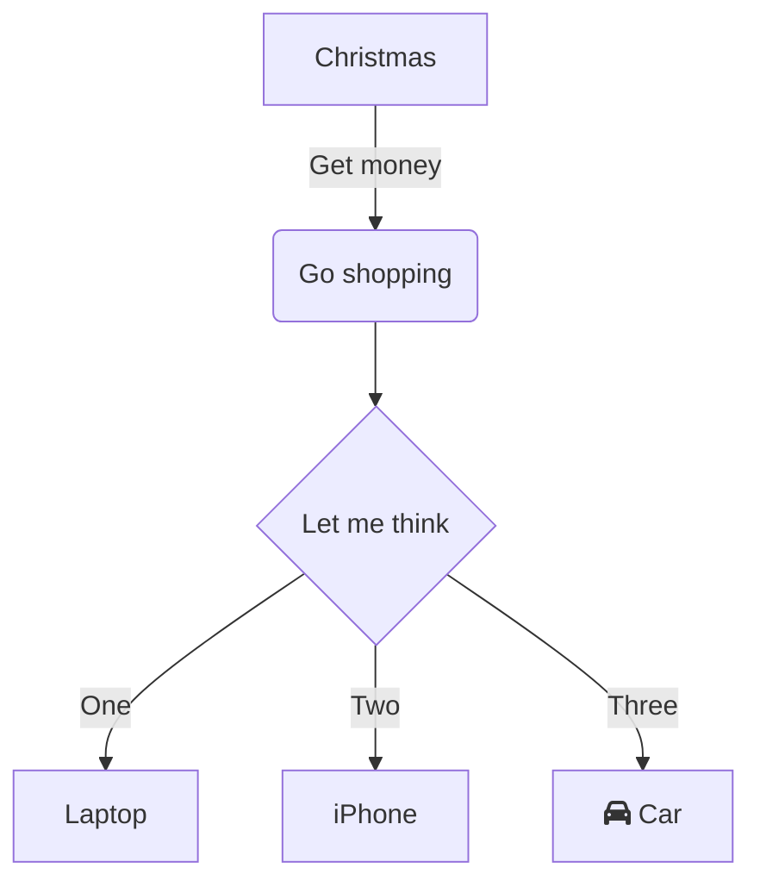
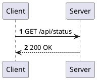
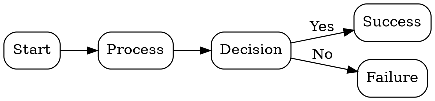

# Scientific Diagrams Test Document

## 1. Mermaid


## 2. PlantUML


## 3. WaveDrom
```wavedrom
{
  signal: [
    { name: "CLK",  wave: "p......" },
    { name: "Data", wave: "x.345x.", data: ["head", "body", "tail"] },
    { name: "Req",  wave: "0.1..0." },
    { name: "Ack",  wave: "0..1.0." }
  ]
}
```

## 4. Graphviz


## 5. Chart.js
```chart
{
  "type": "bar",
  "data": {
    "labels": ["A", "B", "C", "D"],
    "datasets": [{ "label": "ReadMD", "data": [28, 55, 43, 91] }]
  },
  "options": { "responsive": true, "plugins": { "legend": { "display": true } } }
}
```

## 6. Bitfield
```bitfield
{
  reg: [
    {bits: 8, name: "IPO", type: 8},
    {bits: 8, name: "Payload"},
    {bits: 16, name: "CRC32", type: 2}
  ]
}
```

## 7. Vega-Lite
```vega-lite
{
  "$schema": "https://vega.github.io/schema/vega-lite/v5.json",
  "description": "A simple bar chart with embedded data.",
  "data": {
    "values": [
      {"a": "A", "b": 28}, {"a": "B", "b": 55}, {"a": "C", "b": 43},
      {"a": "D", "b": 91}, {"a": "E", "b": 81}, {"a": "F", "b": 53},
      {"a": "G", "b": 19}, {"a": "H", "b": 87}, {"a": "I", "b": 52}
    ]
  },
  "mark": "bar",
  "encoding": {
    "x": {"field": "a", "type": "nominal", "axis": {"labelAngle": 0}},
    "y": {"field": "b", "type": "quantitative"}
  }
}
```

## 8. TikZ
```tikz
\begin{tikzpicture}
\draw[thick,->] (0,0) -- (4,0) node[anchor=north west] {x};
\draw[thick,->] (0,0) -- (0,3) node[anchor=south east] {y};
\draw[red,domain=0:3.5] plot (\x,{0.2*\x*\x}) node[right] {$f(x)=\frac{1}{5}x^2$};
\end{tikzpicture}
```
